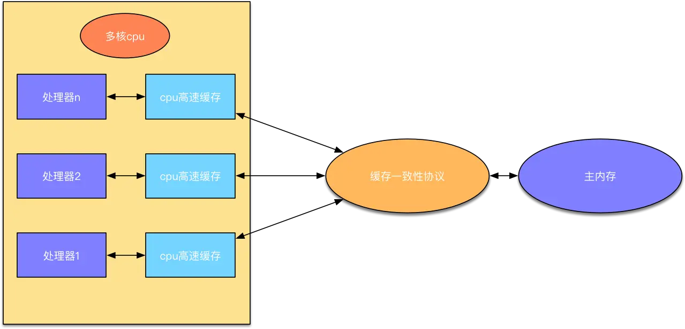

在了解volatile关键字之前，你需要提前了解：
1. 并发的基本概念：原子性、可见性、有序性
2. 内存模型

## 内存模型

CPU是计算机的核心部件，负责执行程序中的指令。然而，CPU的执行速度远快于内存的访问速度，这就导致了CPU与内存之间的速度不匹配问题。为了解决这个问题，计算机在CPU和内存之间引入了高速缓存（Cache）。

高速缓存位于CPU内部或附近，其访问速度远快于主内存。当CPU需要读取或写入数据时，它首先会查看高速缓存中是否已经有这些数据。如果数据已经在缓存中（缓存命中），那么CPU就可以直接从缓存中读取或写入数据，而无需访问主内存，从而大大提高了访问速度。如果数据不在缓存中（缓存未命中），那么CPU就会从主内存中读取或写入数据，并将相关数据块存入缓存中，以便将来能够快速访问。

内存（RAM）是计算机中的主要存储设备，用于存储程序和数据。当CPU需要执行程序时，它会将程序的一部分加载到高速缓存中，并从缓存中读取指令执行。当需要的数据不在缓存中时，CPU会向内存发出请求，将所需数据从内存中读取到缓存中。

总的来说，CPU、高速缓存和内存之间的交互是通过缓存命中、缓存未命中和数据读写操作来实现的。这种交互方式大大减少了CPU等待内存访问的时间，提高了计算机的整体性能。

## 并发与多线程
- 原子性（Atomicity）：指一个操作是不可分割的，要么全部执行成功，要么全部失败，不存在中间状态。在多线程环境下，原子操作是指不会被其他线程中断或同时执行的操作。例如，对于一个整型变量的赋值操作，在原子操作中要么完全成功完成赋值，要么完全不改变变量的值，不会出现部分赋值的情况。
- 可见性（Visibility）：指一个线程对共享变量的修改对其他线程是可见的。在多线程环境下，如果一个线程修改了共享变量的值，其他线程应该能够立即看到这个变化。否则，就可能出现由于缓存或优化等原因导致的数据不一致性问题。
- 有序性（Ordering）：指程序执行的顺序和代码编写的顺序一致。在多线程环境下，有序性要求程序按照代码的书写顺序执行，不会因为编译器或处理器的优化而改变代码的执行顺序。这样可以确保程序的逻辑正确性。

## volatile
### 作用
修饰变量，确保多线程环境下对该变量的读取和修改都是可见和有序的。可以用它来实现轻量级的同步机制。
#### 可见性
在没有同步机制的情况下，线程之间的共享变量可能会出现不一致的情况，这就是经典的线程安全问题之一。volatile关键字就是为了解决这个问题而设计的。

Java内存模型（JMM）通过“主内存”和“工作内存”的概念来抽象地描述多线程环境下的内存可见性问题。每个线程都有自己的工作内存，用于存储该线程对共享变量的副本。当线程需要读取或写入共享变量时，它首先会在自己的工作内存中操作这个变量的副本，然后再将结果同步回主内存或从主内存中更新副本。

对于volatile变量，JMM规定了特殊的访问规则：

写操作：当一个线程修改一个volatile变量的值时，JMM会立即将这个修改同步回主内存。
读操作：当一个线程读取一个volatile变量的值时，JMM会确保该线程的工作内存中不存在这个变量的副本，或者这个副本的值已经是最新的（即与主内存中的值一致）。因此，线程会直接从主内存中读取这个变量的值。

对volatile变量的读取：当一个线程读取一个volatile变量的值时，Java会确保该变量的最新值被从主内存中读取，而不是从线程的本地缓存中读取。这样就能够保证线程读取到的是最新的值。

对volatile变量的写入：当一个线程修改一个volatile变量的值时，Java会立即将这个新值刷新到主内存中，而不是在某个时刻后再刷新。这样就能够保证其他线程能够立即看到这个修改后的值。

因此，volatile关键字提供了一种比synchronized更轻量级的同步机制，适用于一些简单的并发场景。但需要注意的是，volatile关键字并不能保证原子性，也就是说，它不能解决多线程并发下的所有问题，例如复合操作的原子性问题需要其他的同步手段来保证。
#### 有序性
### 不能保证原子性
对于count++这样的操作，它实际上包含了读取、修改和写入三个步骤，而volatile只能确保这三个步骤的可见性，但不能确保它们作为一个整体是原子的。因此，在需要原子性保证的场景下，应该使用synchronized关键字或其他并发控制工具。

此外，volatile也不能解决线程间的顺序问题，即不能保证线程的执行顺序与代码顺序一致。如果需要确保顺序性，还需要结合其他同步措施。