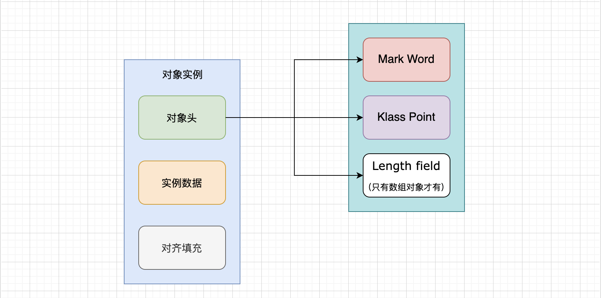
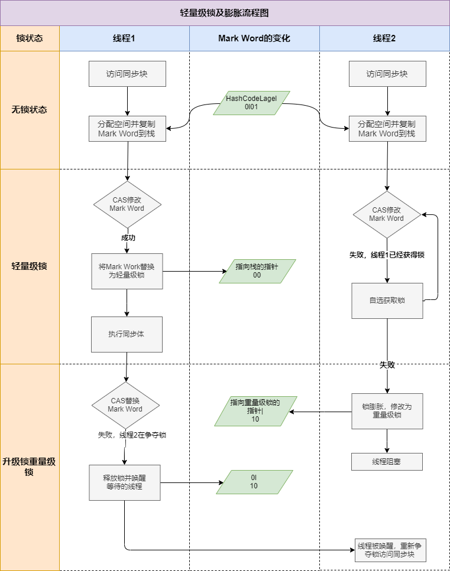

## 互斥同步（Mutual Exclusion & Synchronization）

同步是指在多个线程并发访问共享数据时，保证共享数据在同一个时刻只被一条（或者是一些，当使用信号量的时候）线程使用。而互斥是实现同步的一种手段，临界区（Critical Section）、互斥量（Mutex）和信号量（Semaphore）都是常见的互斥实现方式。因此在“互斥同步”这四个字里面，互斥是因，同步是果；互斥是方法，同步是目的。

## Java对象在内存中的布局

Java中通过new关键字创建一个类的实例对象，对象存于内存的堆中并给其分配一个内存地址，对象由以下三部分组成：

1. **对象头**（Object Header）。Hot Spot 虚拟机对象的对象头由两个**字**组成，包括两类信息：`Mark Word（标记字段） 和 Klass Pointer（类型指针）`。另外，如果对象是一个Java数组，那在对象头中还必须有一块用于记录数组长度的数据，因为虚拟机可以通过普通Java对象的元数据信息确定Java对象的大小，但是从数组的元数据中无法确定数组的大小。

    **Mark Word**：用于存储对象自身的运行时数据，如哈希码( Hash Code)、GC分代年龄、锁状态标志、线程持有的锁、偏向线程ID、偏向时间戳等，这部分数据的长度在32位和64位的虚拟机(未开启压缩指针)中分别为32个比特和64个比特，官方称它为“ Mark Word”。

    虽然它们在不同位数的JVM中长度不一样，但是基本组成内容是一致的。
    
    - 锁标志位（lock）：区分锁状态，11时表示对象待GC回收状态, 只有最后2位锁标识(11)有效。
    - biased_lock：是否偏向锁，由于无锁和偏向锁的锁标识都是 01，没办法区分，这里引入一位的偏向锁标识位。
    - 分代年龄（age）：表示对象被GC的次数，当该次数到达阈值的时候，对象就会转移到老年代。
    - 对象的hashcode（hash）：运行期间调用System.identityHashCode()来计算，延迟计算，并把结果赋值到这里。当对象加锁后，计算的结果31位不够表示，在偏向锁，轻量锁，重量锁，hashcode会被转移到Monitor中。
    - 偏向锁的线程ID（JavaThread）：偏向模式的时候，当某个线程持有对象的时候，对象这里就会被置为该线程的ID。 在后面的操作中，就无需再进行尝试获取锁的动作。
    - epoch：偏向锁在CAS锁操作过程中，偏向性标识，表示对象更偏向哪个锁。
    - ptr_to_lock_record：轻量级锁状态下，指向栈中锁记录的指针。当锁获取是无竞争的时，JVM使用原子操作而不是OS互斥。这种技术称为轻量级锁定。在轻量级锁定的情况下，JVM通过CAS操作在对象的标题字中设置指向锁记录的指针。
    - ptr_to_heavyweight_monitor：重量级锁状态下，指向对象监视器Monitor的指针。如果两个不同的线程同时在同一个对象上竞争，则必须将轻量级锁定升级到Monitor以管理等待的线程。在重量级锁定的情况下，JVM在对象ptr_to_heavyweight_monitor设置指向Monitor的指针。

    **Klass Point**：对象指向它的类元数据的指针，虚拟机通过这个指针来确定这个对象是哪个类的实例。

2. **实例数据**（Instance Data）。实例数据部分是对象真正存储的有效信息，即我们在程序代码里面所定义的各种类型的字段内容，无论是从父类继承下来的，还是在子类中定义的字段都必须记录起来。

3. **对齐填充**。并不是必然存在的，由于 Hotspot 虚拟机的自动内存管理系统要求对象起始地址必须是 8 字节的整数倍，如果对象实例数据部分没有对齐的话，就需要通过对齐填充来补全。

整体布局如下图所示

和锁相关的显然就是对象头里存储的那几个内容：

* 其中的重量级锁也就是通常说 synchronized 的对象锁，其中指针指向的是 monitor 对象（也称为管程或监视器锁）的起始地址。每个对象都存在着一个 monitor 与之关联，monitor 是由ObjectMonitor 实现的，C++实现。

## synchronized关键字

synchronized关键字经过Javac编译之后，会在同步块的前后分别形成monitorenter和monitorexit这两个字节码指令。这两个字节码指令都需要一个reference类型的参数来指明要锁定和解锁的对象。如果Java源码中的synchronized明确指定了对象参数，那就以这个对象的引用作为reference；如果没有明确指定，那将根据synchronized修饰的方法类型（如实例方法或类方法），来决定是取代码所在的对象实例还是取类型对应的Class对象来作为线程要持有的锁。

* 如果修饰的是`具体对象`：锁的是`对象`
* 如果修饰的是`成员方法`：那锁的就是 `this`
* 如果修饰的是`静态方法`：锁的就是这个`对象.class`

从功能上看，我们可以得出两个直接推论

1. 可重入：被synchronized修饰的同步块对同一条线程来说是可重入的。这意味着同一个线程反复进入同步块也不会出现自己把自己锁死的情况。
2. 被synchronized修饰的同步块在持有锁的线程执行完毕并释放锁之前，会无条件地阻塞后面其他线程的进入。这意味着无法像处理某些数据库中的锁那样，强制已获取锁的线程释放锁；也无法强制正在等待锁的线程中断等待或超时退出。

## ReentrantLock
* 可重入的互斥锁，
* ReentrantLock锁在同一个时间点只能被一个线程锁持有；可重入表示，ReentrantLock锁可以被同一个线程多次获取。

### 跟synchronized的区别
1. synchronized是独占锁，加锁和解锁的过程自动进行，易于操作，但不够灵活。ReentrantLock也是独占锁，加锁和解锁的过程需要手动进行，不易操作，但非常灵活。
2. synchronized可重入，因为加锁和解锁自动进行，不必担心最后是否释放锁；ReentrantLock也可重入，但加锁和解锁需要手动进行，且次数需一样，否则其他线程无法获得锁。
3. synchronized是非公平锁，不可响应中断，一个线程获取不到锁就一直等着；使用 ReentrantLock 可以响应中断并释放锁，从而解决死锁的问题
4. synchronized 是 JVM 层面通过监视器（Monitor）实现的，而 ReentrantLock 是通过 AQS（AbstractQueuedSynchronizer）程序级别的 API 实现。

## Synchronized的锁升级
按照下面顺序，锁的重量依次增加，锁可以升级但不能降级，目的是为了提高获得锁和释放锁的效率

1. 无锁：无锁的特点是修改操作会在循环内进行，线程会不断的尝试修改共享资源。如果没有冲突就修改成功并退出，否则就会继续循环尝试。如果有多个线程修改同一个值，必定会有一个线程能修改成功，而其他修改失败的线程会不断重试直到修改成功。**程序不会有锁的竞争**。
2. 偏向锁：这个锁会偏向于第一个获得它的线程，当这个线程再次请求锁的时候不需要进行任何同步操作，从而提高性能。那么处于偏向锁模式的时候，对象头的Mark Word 的结构会变为偏向锁结构。

    如果在运行过程中，同步锁只有一个线程访问，不存在多线程争用的情况，则线程是不需要触发同步的，这种情况下，就会给线程加一个偏向锁。线程第二次到达同步代码块时，会判断此时持有锁的线程是否就是自己，如果是则正常往下执行。由于之前没有释放锁，这里也就不需要重新加锁。如果自始至终使用锁的线程只有一个，很明显偏向锁几乎没有额外开销，性能极高。

    如果在运行过程中，遇到了其他线程抢占锁，则持有偏向锁的线程会被挂起，JVM会消除它身上的偏向锁，将锁恢复到标准的轻量级锁。偏向锁通过消除资源无竞争情况下的同步原语，进一步提高了程序的运行性能。一旦有第二个线程加入`锁竞争`，偏向锁就升级为轻量级锁（自旋锁）。升级为轻量级锁的时候需要撤销偏向锁，撤销偏向锁的时候会导致`STW(stop the word)`操作；

    > 锁竞争：如果多个线程轮流获取一个锁，但是每次获取锁的时候都很顺利，没有发生阻塞，那么就不存在锁竞争。只有当某线程尝试获取锁的时候，发现该锁已经被占用，只能等待其释放，这才发生了锁竞争。
    >
3. 轻量级锁（自旋锁）：当偏向锁的条件不满足，亦即的确有多线程并发争抢同一锁对象时，但并发数不大时，优先使用轻量级锁。一般只有两个线程争抢锁标记时，优先使用轻量级锁。其他线程会通过自旋的形式尝试获取锁，线程不会阻塞，从而提高性能。

    轻量级锁的获取主要由两种情况：
    ① 当关闭偏向锁功能时；
    ② 由于多个线程竞争偏向锁导致偏向锁升级为轻量级锁。

    自旋锁原理非常简单，如果持有锁的线程能在很短时间内释放锁资源，那么那些等待竞争锁的线程就不需要做内核态和用户态之间的切换进入阻塞挂起状态，它们只需要等一等（自旋），等持有锁的线程释放锁后即可立即获取锁，这样就避免用户线程和内核的切换的消耗。

    * 在轻量级锁状态下继续锁竞争，如果成功就成功获取轻量级锁。否则进入**锁膨胀**阶段，**没有抢到锁的线程将自旋**，即不停地循环判断锁是否能够被成功获取。长时间的自旋操作是非常消耗资源的，一个线程持有锁，其他线程就只能在原地空耗CPU，执行不了任何有效的任务，这种现象叫做**忙等（busy-waiting）** 。如果锁竞争情况严重，某个达到最大自旋次数的线程，会将轻量级锁升级为`重量级锁`。

    * 自旋锁:**竞争锁失败的线程**，并不会真实的在操作系统层面挂起等待，而是JVM会让线程做几个空循环(基于预测在不久的将来就能获得)，在经过若干次循环后，如果可以获得锁，那么进入临界区，如果还不能获得锁，才会真实的将线程在操作系统层面进行挂起。这样的好处就是快，坏处就是消耗cpu资源。
4. 重量级锁：当后续线程尝试获取锁时，发现被占用的锁是重量级锁，则直接将自己挂起，等待将来被唤醒。在JDK1.6之前，synchronized直接加重量级锁，很明显现在得到了很好的优化。

    > 重量级锁的特点：其他线程试图获取锁时，都会被阻塞，只有持有锁的线程释放锁之后才会唤醒这些线程。
    >

