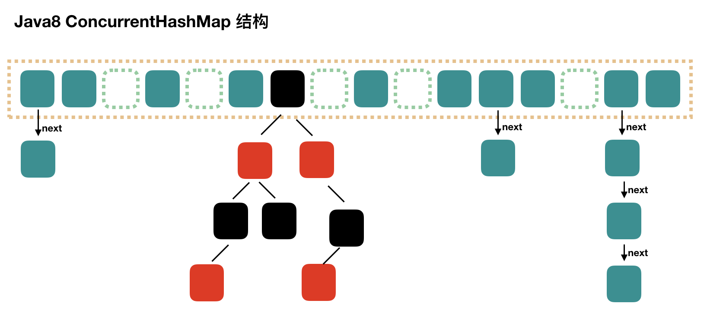

## 线程安全的Map
在多线程环境下，Java 提供了几种线程安全的 Map 实现，可以安全地进行并发操作：
1. ConcurrentHashMap: 这是一个线程安全的哈希表实现，它通过将数据分为多个段，每个段都有自己的锁，从而允许多个线程同时访问不同段的数据。在 Java 8 中，ConcurrentHashMap 还引入了红黑树来处理哈希冲突严重的情况，进一步提高了查找效率。
2. Collections.synchronizedMap(): 这是一个工具方法，可以将任何 Map 包装成一个线程安全的 Map。这个包装后的 Map 通过在所有方法上使用 synchronized 关键字来实现线程安全。但是，这种方法的并发性能可能不如 ConcurrentHashMap，因为它在任何时候只允许一个线程访问整个 Map。
3. Hashtable: 这是一个旧的线程安全的哈希表实现，它也通过在所有方法上使用 synchronized 关键字来实现线程安全。但是，由于其设计和性能问题，现在通常推荐使用 ConcurrentHashMap 或 Collections.synchronizedMap() 代替 Hashtable。

除了使用这些线程安全的 Map 实现外，还可以通过使用锁或其他并发控制机制（如 ReentrantLock、Semaphore、CountDownLatch 等）来手动同步对 Map 的访问。但是，这通常需要更多的编程工作，并且如果不正确地使用这些机制，可能会导致死锁或数据不一致的问题。

## 与Hashtable的区别是什么？

- Hashtable也是线程安全的，但每次要锁住整个结构，并发性低。相比之下，ConcurrentHashMap获取size时才锁整个对象。

- Hashtable对get/put/remove都使用了同步操作。ConcurrentHashMap只对put/remove同步。

- Hashtable是快速失败的，遍历时改变结构会报错ConcurrentModificationException。ConcurrentHashMap是安全失败，允许并发检索和更新。

## ConcurrentHashmap的数据结构
结构上和 Java8 的 HashMap 基本上一样，不过它要保证线程安全性，所以在源码上确实要复杂一些。


## JDK1.8中线程安全的体现
### get
ConcurrentHashMap的get方法无锁，通过volatile关键字来保证可见性，避免脏数据

get方法的实现主要是通过volatile关键字和Unsafe类来保证的。在ConcurrentHashMap中，Node数组和Node节点的value字段都是用volatile关键字修饰的，这可以保证线程间的可见性，也就是说，当一个线程修改了数据，其他线程可以立即看到修改后的值。另外，Unsafe类提供了一种低级别的、直接操作内存的方式，可以用来实现无锁的并发操作。
### put
ConcurrentHashMap 使用的是 CAS + volatile 或 synchronized 的方式来保证线程安全的：
```Java
    final V putVal(K key, V value, boolean onlyIfAbsent) { 
        if (key == null || value == null) 
            throw new NullPointerException();
        int hash = spread(key.hashCode());
        int binCount = 0;
        for (Node<K,V>[] tab = table;;) {
            Node<K,V> f; int n, i, fh; K fk; V fv;
            if (tab == null || (n = tab.length) == 0)
                tab = initTable();
            else if ((f = tabAt(tab, i = (n - 1) & hash)) == null) { // 节点为空
                // 利用 CAS 去进行无锁线程安全操作，如果 bin 是空的
                if (casTabAt(tab, i, null, new Node<K,V>(hash, key, value)))
                    break;
            }
            else if ((fh = f.hash) == MOVED)
                tab = helpTransfer(tab, f);
            else if (onlyIfAbsent
                    && fh == hash
                    && ((fk = f.key) == key || (fk != null && key.equals(fk)))
                    && (fv = f.val) != null)
                return fv;
            else {
                V oldVal = null;
                synchronized (f) {
                    // 细粒度的同步修改操作... 
                }
            }
            // 如果超过阈值，升级为红黑树
            if (binCount != 0) {
                if (binCount >= TREEIFY_THRESHOLD)
                    treeifyBin(tab, i);
                if (oldVal != null)
                    return oldVal;
                break;
            }
        }
    addCount(1L, binCount);
    return null;
}
```
添加元素时首先会判断容器是否为空，如果为空则使用 volatile 加 CAS 来初始化。

如果容器不为空则根据存储的元素计算该位置是否为空，如果为空则利用 CAS 设置该节点；

如果不为空则使用 synchronize 加锁，遍历桶中的数据，替换或新增节点到桶中，最后再判断是否需要转为红黑树，这样就能保证并发访问时的线程安全了。

我们把上述流程简化一下，我们可以简单的认为在 JDK 1.8 中，ConcurrentHashMap 是在头节点加锁来保证线程安全的，锁的粒度相比 Segment 来说更小了，发生冲突和加锁的频率降低了，并发操作的性能就提高了。而且 JDK 1.8 使用的是红黑树优化了之前的固定链表，那么当数据量比较大的时候，查询性能也得到了很大的提升，从之前的 O(n) 优化到了 O(logn) 的时间复杂度。

### 扩容
