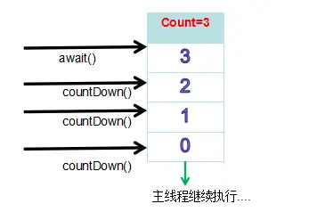

# 线程同步与线程通信
线程间通信模型：共享内存和消息传递，以下方式都是基于这两种模型实现的

线程同步工具类：
- 闭锁
- 信号量
- 栅栏
- 阻塞队列
## 1.synchronized和wait/notify机制
一个线程调用 Object 的 wait() 方法，使其线程被阻塞；另一线程调用 Object 的 notify()/notifyAll() 方法，wait() 阻塞的线程继续执行。

在执行 wait() 方法前，当前线程必须已获得对象锁。调用它时会阻塞当前线程，进入等待状态，在当前 wait() 处暂停线程。同时，wait() 方法执行后，会立即释放获得的对象锁。

同样，在执行 notify() 方法前，当前线程也必须已获得线程锁。调用 notify() 方法后，会通知一个执行了 wait() 方法的阻塞等待线程，使该等待线程重新获取到对象锁，然后继续执行 wait() 后面的代码。但是，与 wait() 方法不同，执行 notify() 后，不会立即释放对象锁，而需要执行完 synchronized 的代码块或方法才会释放锁，所以接收通知的线程也不会立即获得锁，也需要等待执行 notify() 方法的线程释放锁后再获取锁。
> 1. A线程获取锁，调用wait方法，释放锁
> 2. B线程获取锁，调用notify方法，继续执行完sychronized代码块，释放锁
> 3. A线程获取锁，继续wait方法后的代码执行
```Java
    public static void main(String[] args) {
        int[] nums = {1, 2, 3, 4, 5};

        Thread t1 = new Thread() {
            @Override
            public void run() {
                    synchronized (lock) {
                        try{
                            lock.wait();
                        } catch (Exception e){
                            e.printStackTrace();
                        }
                        System.out.println("t1 output:" + nums[index]);
                        index++;
                    }
            }
        };
        Thread t2 = new Thread() {
            @Override
            public void run() {
                    synchronized (lock) {
                        try{
                            lock.notify();
                        } catch (Exception e){
                            e.printStackTrace();
                        }
                        System.out.println("t2 output:" + nums[index]);
                        index++;
                    }
            }
        };
        t1.start();
        t2.start();
    }
```

线程状态说明：
- A线程调用wait方法，从RUNNING到WAITING
- B线程调用notify方法，如果B线程未执行完，A线程从WAITING到BLOCKED（synchronized的锁）
- B线程执行完，A线程从BLOCKED到RUNNING

## 2.volatile加while轮询
A线程操作临界资源的同时，B线程在while循环内不断判断volatile声明的临界资源是否满足操作条件

## 3.ReentrantLock和Condition
ReentrantLock使用Condition阻塞队列的await() signal() signal() 三个方法来实现线程阻塞和运行两个状态的切换

## CountDownLatch
CountDownLatch是具有synchronized机制的一个工具，目的是让一个或者多个线程等待，直到其他线程的一系列操作完成。

CountDownLatch初始化的时候，需要提供一个整形数字，数字代表着线程需要调用countDown()方法的次数，当计数为0时，线程才会继续执行await()方法后的其他内容。CountDownLatch(int count);
```Java
//返回当前的计数count值，
public long getCount()

//调用此方法后，会减少计数count的值。
//递减后如果为0，则会释放所有等待的线程
public void countDown()

//调用CountDownLatch对象的await方法后。
//会让当前线程阻塞，直到计数count递减至0。
public void await()

/**
同时await还提供一个带参数和返回值的方法。
如果计数count正常递减，返回0后，await方法会返回true并继续执行后续逻辑。
或是，尚未递减到0，而到达了指定的时间间隔后，方法返回false。
如果时间小于等于0，则此方法不执行等待。
**/
public boolean await(long timeout, TimeUnit unit)
```



自己编写一个例子：这里模拟一种情况：主线程 依赖 线程A初始化三个数据，才能继续加载后续逻辑。
```Java
public class CountDownArticle {
    /**
     * 模拟 主线程 依赖 线程A初始化一个数据，才能继续加载后续逻辑
     */
    public static void main(String[] args) throws InterruptedException {
        AtomicReference<String> key = new AtomicReference<>("");
        CountDownLatch countDownLatch = new CountDownLatch(3);
            Thread t = new Thread(() -> {
            try {

                //休眠5秒，模拟数据的初始化
                TimeUnit.SECONDS.sleep(5);

                key.set("核心秘钥123456");
                System.out.println("数据1初始化完毕");

                //释放---此处可以在任何位置调用，很灵活
                countDownLatch.countDown();

                System.out.println("数据2初始化完毕");
                countDownLatch.countDown();

                System.out.println("数据3初始化完毕");
                countDownLatch.countDown();

            } catch (InterruptedException e) {
                e.printStackTrace();
            }

        });
        t.start();

        //等待数据初始化，阻塞
        countDownLatch.await();
        System.out.println("key：" + key.get());
    }
}
```
打印内容如下：
> 数据1初始化完毕
> 
> 数据2初始化完毕
> 
> 数据3初始化完毕
> 
> key：核心秘钥123456

**原理**：AQS实现

CountDownLatch中的Sync会优先尝试修改state的值，来获取同步状态。例如，如果某个线程成功的将state的值从0修改为1，表示成功的获取了同步状态。 这个修改的过程是通过CAS完成的，所以可以保证线程安全。
## 4.LockSupport实现线程间通信和阻塞
使用需要知道线程的名字

## 5.通过Socket网络通信

## 6.信号量机制

## 7.管道通信