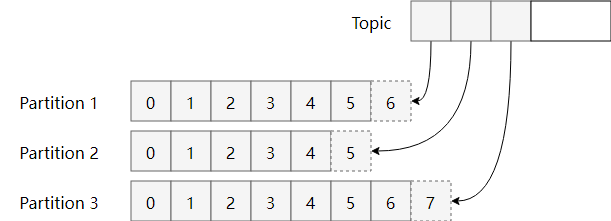
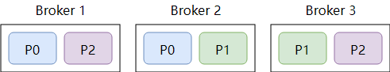

## 什么是Kafka

Kafka 是一种**分布式**的，基于发布 / 订阅的消息系统

优点：

* 高性能
* 低延时
* 可用性

缺点：

* 无法弹性扩容
* 扩容成本高
* 消费者新加入或退出触发rebalance
* partition过多会使得性能显著下降

问题：

> 基于消息的投递可靠（消息不丢）是优先级更高的，所以消息不重的任务就会转移到应用程序自我实现，这也是为什么RocketMQ的文档里强调的，消费逻辑需要自我实现幂等。背后的逻辑其实就是：不丢和不重是矛盾的（在分布式场景下），但消息重复是有解决方案的，而消息丢失是很麻烦的。

## Kafka为什么快

### 写入数据

#### 顺序写入

磁盘读写的快慢取决于你怎么使用它，也就是顺序读写或者随机读写。在顺序读写的情况下，磁盘的顺序读写速度和内存持平。

因为硬盘是机械结构，每次读写都会寻址->写入，其中寻址是一个“机械动作”，它是最耗时的。所以硬盘最讨厌随机I/O，最喜欢顺序I/O。为了提高读写硬盘的速度，Kafka就是使用顺序I/O。

而且Linux对于磁盘的读写优化也比较多，包括read-ahead和write-behind，磁盘缓存等。如果在内存做这些操作的时候，一个是JAVA对象的内存开销很大，另一个是随着堆内存数据的增多，JAVA的GC时间会变得很长，使用磁盘操作有以下几个好处：

1. 顺序写入磁盘顺序读写速度超过内存随机读写
2. 顺序写入JVM的GC效率低，内存占用大。使用磁盘可以避免这一问题
3. 顺序写入系统冷启动后，磁盘缓存依然可用

下图就展示了Kafka是如何写入数据的， 每一个Partition其实都是一个文件 ，收到消息后Kafka会把数据插入到文件末尾（虚框部分）：

这种方法有一个缺陷——没有办法删除数据 ，所以Kafka是不会删除数据的，它会把所有的数据都保留下来，每个消费者（Consumer）对每个Topic都有一个offset用来表示读取到了第几条数据

#### **Memory Mapped Files**

即便是顺序写入硬盘，硬盘的访问速度还是不可能追上内存。所以Kafka的数据并不是实时的写入硬盘 ，它充分利用了现代操作系统分页存储来利用内存提高I/O效率。

Memory Mapped Files(后面简称mmap)也被翻译成 内存映射文件 ，在64位操作系统中一般可以表示20G的数据文件，它的工作原理是直接利用操作系统的Page来实现文件到物理内存的直接映射。

完成映射之后你对物理内存的操作会被同步到硬盘上（操作系统在适当的时候）。

通过mmap，进程像读写硬盘一样读写内存（当然是虚拟机内存），也不必关心内存的大小有虚拟内存为我们兜底。

使用这种方式可以获取很大的I/O提升，省去了用户空间到内核空间复制的开销（调用文件的read会把数据先放到内核空间的内存中，然后再复制到用户空间的内存中。）

但也有一个很明显的缺陷——不可靠，写到mmap中的数据并没有被真正的写到硬盘，操作系统会在程序主动调用flush的时候才把数据真正的写到硬盘。

Kafka提供了一个参数——producer.type来控制是不是主动flush，如果Kafka写入到mmap之后就立即flush然后再返回Producer叫 同步 (sync)；写入mmap之后立即返回Producer不调用flush叫异步 (async)。

### **读取数据**

Kafka在读取磁盘时做了哪些优化？

#### **基于sendfile实现Zero Copy**

传统模式下，当需要对一个文件进行传输的时候，其具体流程细节如下：

1. 基于sendfile实现Zero Copy调用read函数，文件数据被copy到内核缓冲区

2. read函数返回，文件数据从内核缓冲区copy到用户缓冲区

3. write函数调用，将文件数据从用户缓冲区copy到内核与socket相关的缓冲区。

4. 数据从socket缓冲区copy到相关协议引擎。

以上细节是传统read/write方式进行网络文件传输的方式，我们可以看到，在这个过程当中，文件数据实际上是经过了四次copy操作：

> 硬盘—>内核buf—>用户buf—>socket相关缓冲区—>协议引擎

而sendfile系统调用则提供了一种减少以上多次copy，提升文件传输性能的方法。

在内核版本2.1中，引入了sendfile系统调用，以简化网络上和两个本地文件之间的数据传输。sendfile的引入不仅减少了数据复制，还减少了上下文切换。

> sendfile(socket, file, len);

运行流程如下：

1. sendfile系统调用，文件数据被copy至内核缓冲区

2. 再从内核缓冲区copy至内核中socket相关的缓冲区

3. 最后再socket相关的缓冲区copy到协议引擎

相较传统read/write方式，2.1版本内核引进的sendfile已经减少了内核缓冲区到user缓冲区，再由user缓冲区到socket相关缓冲区的文件copy，而在内核版本2.4之后，文件描述符结果被改变，sendfile实现了更简单的方式，再次减少了一次copy操作。

在Apache、Nginx、lighttpd等web服务器当中，都有一项sendfile相关的配置，使用sendfile可以大幅提升文件传输性能。

Kafka把所有的消息都存放在一个一个的文件中，当消费者需要数据的时候Kafka直接把文件发送给消费者，配合mmap作为文件读写方式，直接把它传给sendfile。

#### **批量压缩**

在很多情况下，系统的瓶颈不是CPU或磁盘，而是网络IO，对于需要在广域网上的数据中心之间发送消息的数据流水线尤其如此。进行数据压缩会消耗少量的CPU资源，不过对于kafka而言，网络IO更应该需要考虑。

1. 如果每个消息都压缩，但是压缩率相对很低，所以Kafka使用了批量压缩，即将多个消息一起压缩而不是单个消息压缩

2. Kafka允许使用递归的消息集合，批量的消息可以通过压缩的形式传输并且在日志中也可以保持压缩格式，直到被消费者解压缩

3. Kafka支持多种压缩协议，包括Gzip和Snappy压缩协议

### 总结

Kafka速度的秘诀在于，它把所有的消息都变成一个批量的文件，并且进行合理的批量压缩，减少网络IO损耗，通过mmap提高I/O速度，写入数据的时候由于单个Partion是末尾添加所以速度最优；读取数据的时候配合sendfile直接暴力输出。

## 关于topic与partition

> Topic是一个存储消息的**逻辑概念**，可认为为一个消息的集合。
>
> 物理上，不同Topic的消息分开存储，每个Topic可划分多个partition，同一个Topic下的不同的partition包含不同消息。每个消息被添加至分区时，分配唯一offset，以此保证partition内消息的顺序性。 
>
> Kafka以broker区分集群内服务器，同一个topic下，多个partition经hash到不同的broker。

一个 Topic（主题）对应一个消息队列。Kafka 支持多生产者，多消费者，对应下图：

多个生产者将数据发送到 Kafka 中，Kafka 将它们顺序存储，消费者的行为留到下面讨论。我们知道 Kafka 的目标是大数据，如果将消息存在一个“中心”队列中，势必缺少可伸缩性。无论是生产者/消费者数目的增加，还是消息数量的增加，都可能耗尽机器的性能或存储。

因此，Kafka 在概念上将一个 Topic 分成了多个 Partition，写入 topic 的消息会被（平均）分配到其中一个 Partition。Partition 中会为消息保存一个 Partition 内唯一的 ID ，一般称为偏移量(offset)。这样当性能/存储不足时 Kafka 就可以通过增加 Partition 实现横向扩展。

> Partition 中的消息可以被（不同的 Consumer Group）多次消费，那 Partition中被消费的消息是何时删除的？ Partition 又是如何知道一个 Consumer Group 当前消费的位置呢？

1. 无论消息是否被消费，除非消息到期 Partition 从不删除消息。例如设置保留时间为 2 天，则消息发布 2 天内任何 Group 都可以消费，2 天后，消息自动被删除。
2. Partition 会为每个 Consumer Group 保存一个偏移量，记录 Group 消费到的位置。如下图：

## 物理存储

上面提到的 Topic, Partition 都是抽象的概念。每个 Partition 最终都需要存储在物理机器上，在 Kafka 中一般把这样的物理机器称为 `Broker`，可以是一台物理机，也可以是一个集群。

在讲概念的时候我们没有考虑到物理机可能会损坏的问题，这会导致某个 Partition 失效，上面存储的消息丢失，那还说什么高可用？所以一般需要对数据做冗余 (replication)。换言之，需要存储多份 Partition 在不同的 Broker 上，并为它们的数据进行同步。那么从物理的视角：

上图中，某个 Topic 分成了 3 个 Partition，每个 Partition 保存了两个副本，副本平均分配到 3 个 Broker 上。图中即使有一个 Broker 挂了，剩余的两个 Broker 依旧能正常工作。这也是分布式系统的常用设计。

同一个 Partition 有多个副本，并分布在不同的 Broker 上，那么 Producer 应该写入到哪一个副本上呢？Consumer 又应该从哪个副本上读取呢？

1. Kafka 的各个 Broker 需要与 Zookeeper 进行通信，每个 Partition 的多个副本之间通过 Zookeeper 的 Leader 选举机制选出主副本。所有该 Partition 上的读写都通过这个主副本进行。
2. 其它的冗余副本会从主副本上同步新的消息。就像其它的 Consumer 一样。

# 生产

## 发布消息如何指定Partition

默认的分区策略

* 如果在发消息的时候指定了分区，则消息投递到指定的分区
* 如果没有指定分区，但是消息的key不为空，则基于key的哈希7值来选择一个分区
* 如果既没有指定分区，且消息的key也是空，则用轮询的方式选择一个分区

# 消费

## Partition如何分配给消费者

## 消费者组

> 同一个Partition内的消息只能被一个消费者消费，当消费者数量多于分区数量时，多余的消费者空闲

消费者与消费组这种模型可以让整体的消费能力具备横向伸缩性，我们可以增加（或减少）消费者的个数来提高（或降低）整体的消费能力。对于分区数固定的情况，一味地增加消费者并不会让消费能力一直得到提升，如果消费者过多，出现了消费者的个数大于分区个数的情况，就会有消费者分配不到任何分区

Consumer Group实现P2P与发布订阅

* 如果所有的消费者都隶属于同一个消费组，那么所有的消息都会被均衡地投递给每一个消费者，即每条消息只会被一个消费者处理，这就相当于点对点模式的应用。
* 如果所有的消费者都隶属于不同的消费组，那么所有的消息都会被广播给所有的消费者，即每条消息会被所有的消费者处理，这就相当于发布/订阅模式的应用。

## 关于提交

consumer调用poll方法后，offset何时发生变化？

> 为了保证调用`KafkaConsumer.poll()`方法时总能返回未被被消费者读取过的记录，消费者需要维护每个分区中已读消息对应的**偏移量**​`offset`。
> 一旦消费者发生崩溃或者有新的消费者加入群组，就会触发**再均衡**​`rebalance`，每个消费者可能分配到新的分区，而不是之前处理的那个。为了能够继续之前的工作，消费者需要知道每个分区的已读偏移量，然后从偏移量指定的地方继续处理。
> 为了保证这些信息不丢失，消费者需要定期向一个名为 `_consumer_offset` 的特殊主题发送消息，消息里包含每个分区的偏移量。Kafka 中将这一更新的操作称作**提交**​`commit`。

# 如何保证数据可靠性和数据一致性

当我们讨论**可靠性**的时候，我们总会提到**保证**这个词语。可靠性保证是基础，我们基于这些基础之上构建我们的应用。比如关系型数据库的可靠性保证是ACID，也就是原子性（Atomicity）、一致性（Consistency）、隔离性（Isolation）和持久性（Durability）。

Kafka 中的可靠性保证有如下四点：

* 对于一个分区来说，它的消息是有序的。如果一个生产者向一个分区先写入消息A，然后写入消息B，那么消费者会先读取消息A再读取消息B。
* 当消息写入所有in-sync状态的副本后，消息才会认为**已提交（committed）** 。这里的写入有可能只是写入到文件系统的缓存，不一定刷新到磁盘。生产者可以等待不同时机的确认，比如等待分区主副本写入即返回，后者等待所有in-sync状态副本写入才返回。
* 一旦消息已提交，那么只要有一个副本存活，数据不会丢失。
* 消费者只能读取到已提交的消息。

使用这些基础保证，我们构建一个可靠的系统，这时候需要考虑一个问题：究竟我们的应用需要多大程度的可靠性？可靠性不是无偿的，它与系统可用性、吞吐量、延迟和硬件价格息息相关，得此失彼。因此，我们往往需要做权衡，一味的追求可靠性并不实际。
3 
## ISR

分布式系统处理故障容错时，需要明确地定义节点是否处于存活状态。Kafka对节点的存活定义有两个条件：

1. 节点必须和ZK保持会话
2. 如果这个节点是某个分区的备份副本，它必须对分区主副本的写操作进行复制，并且复制的进度不能落后太多

满足这两个条件，叫作“正在同步中”（in-sync）。每个分区的主副本会跟踪正在同步中的备份副本节点（In Sync Replicas，即ISR）。如果一个备份副本挂掉、没有响应或者落后太多，主副本就会将其从同步副本集合中移除。反之，如果备份副本重新赶上主副本，它就会加入到主副本的同步集合中。

在Kafka中，一条消息只有被ISR集合的所有副本都运用到本地的日志文件，才会认为消息被成功提交了。任何时刻，只要ISR至少有一个副本是存活的，Kafka就可以保证“一条消息一旦被提交，就不会丢失”。只有已经提交的消息才能被消费者消费，因此消费者不用担心会看到因为主副本失败而丢失的消息。下面我们举例分析Kafka的消息提交机制如何保证消费者看到的数据是一致的。

## **1、ISR 是什么**

首先，ISR 的全称叫做：In-Sync Replicas （同步副本集）, 我们可以理解为和 leader 保持同步的所有副本的集合。

一个分区的所有副本集合叫做 AR（ Assigned Repllicas ） ，与 leader-replica 未能保持同步的副本集叫做 OSR（ Out-Sync Relipcas ）。

因此我们就能得到这么一个表示：AR = ISR + OSR，翻译一下就是一个分区的副本集分为同步集合和非同步集合两部分。

那么我们可以假设一个场景，一个分区的 AR 集合为【0,1,2,3,4,5】，其中 leader-replica 是 0，其中【1,2,3】作为 follower 和 leader 的数据保持同步，而【4,5】未能和 leader 保持同步。

那么此时，ISR=【0,1,2,3】，OSR=【4,5】

如果此时副本 4 追上了 leader-replica，也就是和 leader 保持到了同步 那么此时，ISR=【0,1,2,3,4】，OSR=【5】

从上面的场景我们就可以明白，ISR 动态维护了一个和 leader 副本保持同步副本集合，ISR 中的副本全部都和 leader 的数据保持同步