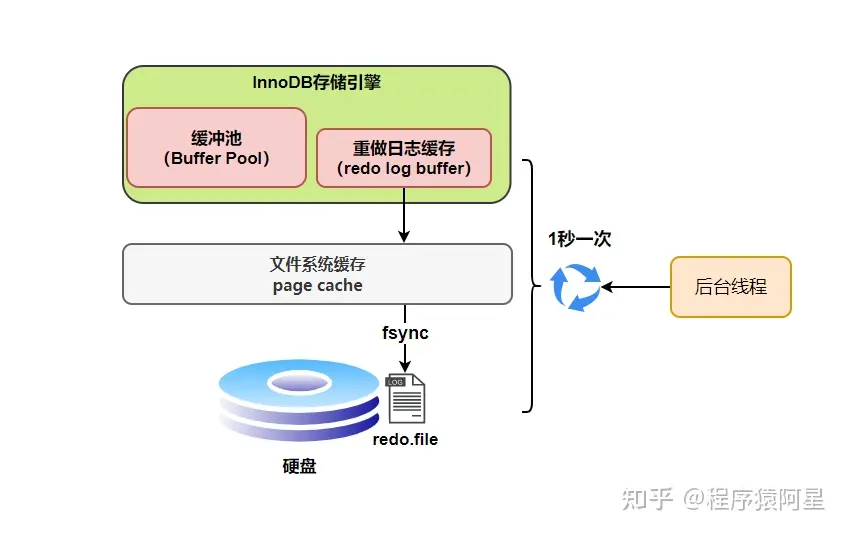
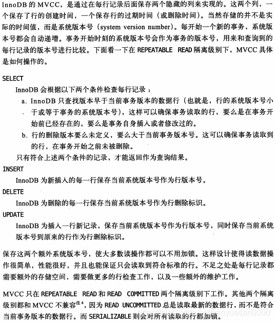
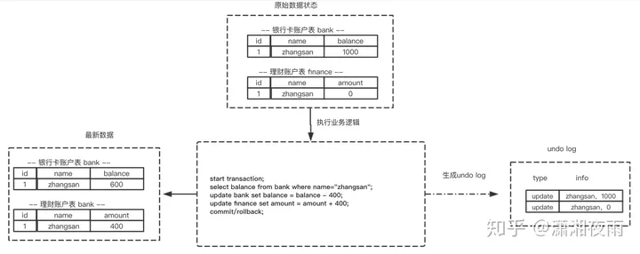
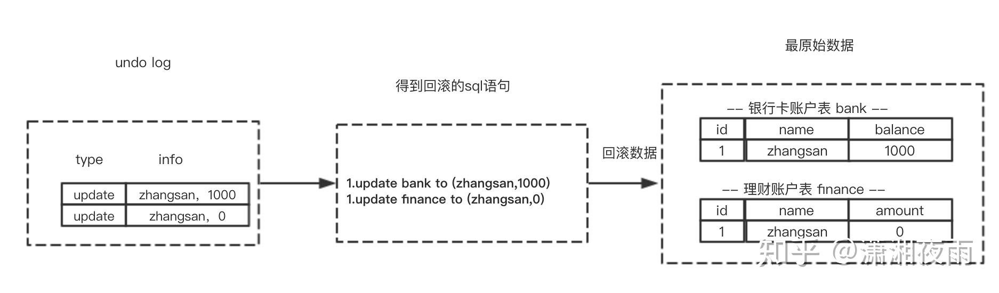
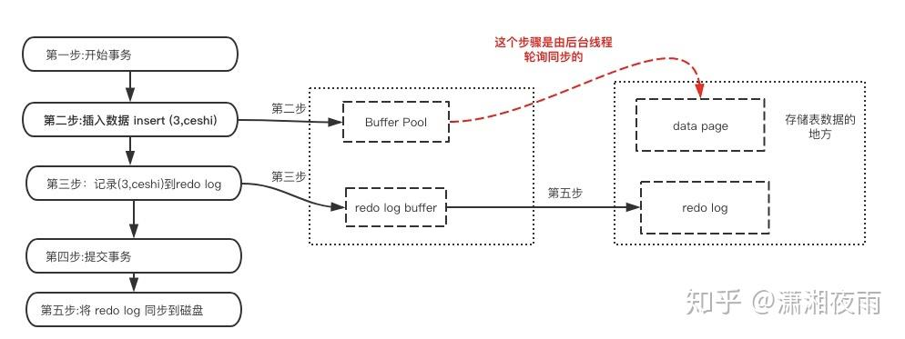
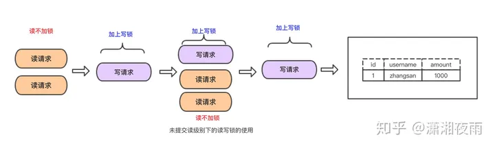
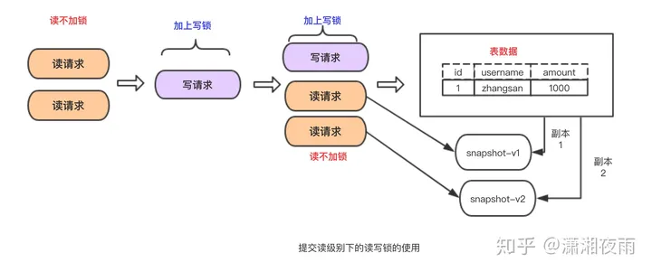
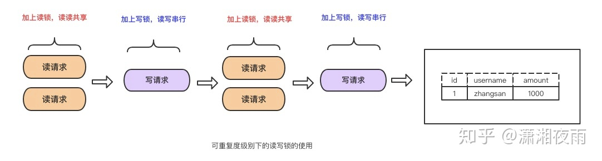
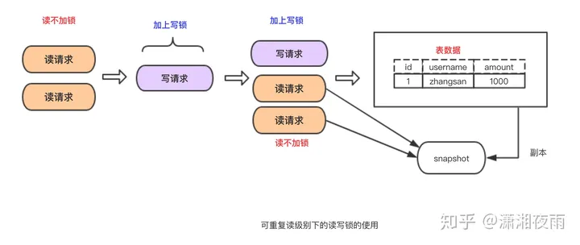
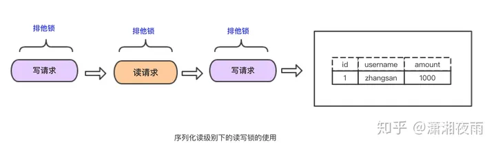

在 MySQL 中只有使用了 **Innodb** 数据库引擎的数据库或表才支持事务

`MySQL`中数据是以页为单位，你查询一条记录，会从硬盘把一页的数据加载出来，加载出来的数据叫数据页，会放入到`Buffer Pool`中。

后续的查询都是先从`Buffer Pool`中找，没有命中再去硬盘加载，减少硬盘`IO`开销，提升性能。

更新表数据的时候，也是如此，发现`Buffer Pool`里存在要更新的数据，就直接在`Buffer Pool`里更新。

理想情况，事务一提交就会进行刷盘操作，但实际上，刷盘的时机是根据策略来进行的。

### 刷盘时机

`InnoDB`存储引擎为`redo log`的刷盘策略提供了`innodb_flush_log_at_trx_commit`参数，它支持三种策略

* **设置为0的时候，表示每次事务提交时不进行刷盘操作**
* **设置为1的时候，表示每次事务提交时都将进行刷盘操作（默认值）**
* **设置为2的时候，表示每次事务提交时都只把redo log buffer内容写入page cache**

另外`InnoDB`存储引擎有一个后台线程，每隔`1`秒，就会把`redo log buffer`中的内容写到文件系统缓存（`page cache`），然后调用`fsync`刷盘。

> * 什么是page cache ？
>
> page cache，又称pcache，其中文名称为**页高速缓冲存储器**，简称页高缓。 page cache的大小为一页，通常为4K。 在linux读写文件时，它用于缓存文件的逻辑内容，从而加快对磁盘上映像和数据的访问。
>
> page 是内存管理分配的基本单位， Page Cache 由多个 page 构成。page 在操作系统中通常为 4KB 大小（32bits/64bits），而 Page Cache 的大小则为 4KB 的整数倍。
>
> Page Cache 的本质是由 Linux 内核管理的内存区域。我们通过 mmap 以及 buffered I/O 将文件读取到内存空间实际上都是读取到 Page Cache 中。
>
> * 什么是fsync ？
>
> 一般情况下，对硬盘（或者其他持久存储设备）文件的write操作，更新的只是内存中的页缓存（page cache），而脏页面不会立即更新到硬盘中，而是由操作系统统一调度，如由专门的flusher内核线程在满足一定条件时（如一定时间间隔、内存中的脏页达到一定比例）内将脏页面同步到硬盘上（放入设备的IO请求队列）。

## 事务要实现什么？

* 可靠性：数据库要保证当insert或update操作时抛异常或者数据库crash的时候需要保障数据的操作前后的一致，想要做到这个，我需要知道我修改之前和修改之后的状态，所以就有了undo log和redo log
* 并发处理：也就是说当多个并发请求过来，并且其中有一个请求是对数据修改操作的时候会有影响，为了避免读到脏数据，所以需要对事务之间的读写进行隔离，至于隔离到啥程度得看业务系统的场景了，实现这个就得用MySQL 的隔离级别

## 实现事务的三个技术

1. 日志文件 redo log（持久化） undo log （原子性）
2. 锁 （隔离性）
3. MVCC

### 1. redo log

redo log叫做重做日志，是用来实现事务的持久性。该日志文件由两部分组成：重做日志缓冲（redo log buffer）以及重做日志文件（redo log）,前者是在内存中，后者在磁盘中。当事务提交之后会把所有修改信息都会存到该日志中。假设有个表叫做tb1(id,username) 现在要插入数据（3，ceshi）：

mysql为了提升性能不会把每次的修改都实时同步到磁盘，而是会先存到Buffer Pool(缓冲池)里头，把这个当作缓存来用。然后使用后台线程去做缓冲池和磁盘之间的同步。

那么问题来了，如果还没来的同步的时候宕机或断电了怎么办？还没来得及执行上面图中红色的操作。这样会导致丢部分已提交事务的修改信息！

所以引入了redo log来记录已成功提交事务的修改信息，并且会把redo log持久化到磁盘，系统重启之后在读取redo log恢复最新数据。

总结：

redo log是用来恢复数据的 用于保障，已提交事务的**持久化**特性。

> redo log 也存在硬盘里，为什么不直接更新表数据？
>
> 因为表数据是以页的方式存在内存中，需要多次寻址消耗IO，redo log是顺序存储，效率高

### 2. undo log

undo log 叫做回滚日志，用于记录数据被**修改前的信息**。他正好跟前面所说的重做日志所记录的相反，重做日志记录数据被修改后的信息。undo log主要记录的是数据的逻辑变化，为了在发生错误时回滚之前的操作，需要将之前的操作都记录下来，然后在发生错误时才可以回滚。

每次写入数据或者修改数据之前都会把**修改前的信息**记录到 undo log。

undo log有什么作用？

undo log记录事务修改之前版本的数据信息，因此假如由于系统错误或者rollback操作而回滚的话可以根据undo log的信息来进行回滚到没被修改前的状态。

总结：

undo log是用来回滚数据的用于保障未提交事务的原子性。

### 3. 锁

当有多个请求来读取表中的数据时可以不采取任何操作，但是多个请求里有读请求，又有修改请求时必须有一种措施来进行并发控制。不然很有可能会造成不一致。

* 共享锁 share lock 读锁：读锁是可以共享的，或者说多个读请求可以共享一把锁读数据，不会造成阻塞。
* 排他锁 exclusive lock 写锁：写锁会排斥其他所有获取锁的请求，一直阻塞，直到写入完成释放锁。

### 4. MVCC

MVCC (MultiVersion Concurrency Control) 多版本并发控制

> *InnoDB的 MVCC ，是通过在每行记录的后面保存两个隐藏的列来实现的。这两个列，一个保存了行的创建时间，一个保存了行的过期时间，当然存储的并不是实际的时间值，而是系统版本号。*

以上片段摘自《高性能Mysql》这本书对MVCC的定义。他的主要实现思想是通过数据多版本来做到读写分离。从而实现不加锁读进而做到读写并行。

MVCC在mysql中的实现依赖的是undo log与read view：

* undo log :undo log 中记录某行数据的多个版本的数据。
* read view :用来判断当前版本数据的可见性。

> 什么是read view？
>
> ReadView 是一个保存事务ID的list列表。记录的是本事务执行时，MySQL还有哪些事务在执行，且还没有提交。(当前系统中还有哪些活跃的读写事务)
>
> 它主要包含这样几部分：
>
> * m_ids，当前有哪些事务正在执行，且还没有提交，这些事务的 id 就会存在这里；
> * min_trx_id，是指 m_ids 里最小的值；
> * max_trx_id，是指下一个要生成的事务 id。下一个要生成的事务 id 肯定比现在所有事务的 id 都大；
> * creator_trx_id，每开启一个事务都会生成一个 ReadView，而 creator_trx_id 就是这个开启的事务的 id。

#### **基本特征**

1. 每行数据都存在一个版本，每次数据更新时都更新该版本。
2. 修改时Copy出当前版本随意修改，各个事务之间无干扰。
3. 保存时比较版本号，如果成功（commit），则覆盖原记录；失败则放弃copy（rollback）。

#### 补充

1.MVCC手段只适用于Msyql隔离级别中的读已提交（Read committed）和可重复读（Repeatable Read）；

2.Read uncimmitted由于存在脏读，即能读到未提交事务的数据行，所以不适用MVCC；

原因是MVCC的创建版本和删除版本只要在事务提交后才会产生。

3.串行化由于是会对所涉及到的表加锁，并非行锁，自然也就不存在行的版本控制问题；

4.通过以上总结，可知，MVCC主要作用于事务性的，有行锁控制的数据库模型。

## 事务的实现

前面讲的重做日志，回滚日志以及锁技术就是实现事务的基础。

* 事务的原子性是通过 undo log 来实现的
* 事务的持久性性是通过 redo log 来实现的
* 事务的隔离性是通过 (读写锁+MVCC)来实现的

而事务的终极大 boss 一致性是通过原子性，持久性，隔离性来实现的。

原子性，持久性，隔离性折腾半天的目的也是为了保障数据的一致性！

总之，ACID只是个概念，事务最终目的是要保障数据的可靠性，一致性。

### **原子性的实现**

#### 什么是原子性

*一个事务必须被视为不可分割的最小工作单位，一个事务中的所有操作要么全部成功提交，要么全部失败回滚，对于一个事务来说不可能只执行其中的部分操作，这就是事务的原子性。*

上面这段话取自《高性能MySQL》这本书对原子性的定义，原子性可以概括为就是要实现要么全部失败，要么全部成功。

以上概念相信大家伙儿都了解，那么数据库是怎么实现的呢？ 就是通过回滚操作。

所谓回滚操作就是当发生错误异常或者显式的执行rollback语句时需要把数据还原到原先的模样，所以这时候就需要用到undo log来进行回滚，接下来看一下undo log在实现事务原子性时怎么发挥作用的。

#### **undo log 的生成**

假设有两个表 bank和finance，表中原始数据如图所示，当进行插入，删除以及更新操作时生成的undo log如下面图所示：

> A.事务开始
>
> B.查询数据
>
> C.进行update 操作 balance=balance-400
>
> D.记录(zhangsan,1000)到undo log 回滚时需要把这条更新过来
>
> E.进行update操作amount=amount+400
>
> F.记录(zhangsan,0)到undo log 回滚时需要把这条更新过来
> G.事务提交/回滚

从上图可以了解到数据的变更都伴随着回滚日志的产生：

(1) 产生了被修改前数据(zhangsan,1000) 的回滚日志；

(2) 产生了被修改前数据(zhangsan,0) 的回滚日志。

根据上面流程可以得出如下结论：

1. 每条数据变更(insert/update/delete)操作都伴随一条undo log的生成，并且回滚日志必须先于数据持久化到磁盘上；
2. 所谓的回滚就是根据回滚日志做逆向操作，比如delete的逆向操作为insert，insert的逆向操作为delete，update的逆向为update等。

**根据undo log 进行回滚**

为了做到同时成功或者失败，当系统发生错误或者执行rollback操作时需要根据undo log 进行回滚。

回滚操作就是要还原到原来的状态，undo log记录了数据被修改前的信息以及新增和被删除的数据信息，根据undo log生成回滚语句，比如：

(1) 如果在回滚日志里有新增数据记录，则生成删除该条的语句；

(2) 如果在回滚日志里有删除数据记录，则生成生成该条的语句；

(3) 如果在回滚日志里有修改数据记录，则生成修改到原先数据的语句。

### 持久性的实现

事务一旦提交，其所作做的修改会永久保存到数据库中，此时即使系统崩溃修改的数据也不会丢失。

先了解一下MySQL的数据存储机制，MySQL的表数据是存放在磁盘上的，因此想要存取的时候都要经历磁盘IO,然而即使是使用SSD磁盘IO也是非常消耗性能的。

为此，为了提升性能InnoDB提供了缓冲池(Buffer Pool)，Buffer Pool中包含了磁盘数据页的映射，可以当做缓存来使用：

读数据：会首先从缓冲池中读取，如果缓冲池中没有，则从磁盘读取在放入缓冲池；

写数据：会首先写入缓冲池，缓冲池中的数据会定期同步到磁盘中；

上面这种缓冲池的措施虽然在性能方面带来了质的飞跃，但是它也带来了新的问题，当MySQL系统宕机，断电的时候可能会丢数据！！！

因为我们的数据已经提交了，但此时是在缓冲池里头，还没来得及在磁盘持久化，所以我们急需一种机制需要存一下已提交事务的数据，为恢复数据使用。

于是 redo log就派上用场了。下面看下redo log是什么时候产生的：

既然redo log也需要存储，也涉及磁盘IO为啥还用它？

（1）redo log 的存储是顺序存储，而缓存同步是随机操作。

（2）缓存同步是以数据页为单位的，每次传输的数据大小大于redo log。

### **隔离性实现**

隔离性是事务ACID特性里最复杂的一个。在SQL标准里定义了四种隔离级别，每一种级别都规定一个事务中的修改，哪些是事务之间可见的，哪些是不可见的。

越低的隔离级别可以执行越高的并发，但同时实现复杂度以及开销也越大。

Mysql 隔离级别有以下四种（级别由低到高）：

* READ UNCOMMITED (未提交读)
* READ COMMITED (提交读)
* REPEATABLE READ (可重复读)
* SERIALIZABLE (可重复读)

只要彻底理解了隔离级别以及他的实现原理就相当于理解了ACID里的隔离性。前面说过原子性，隔离性，持久性的目的都是为了要做到一致性，但隔离型跟其他两个有所区别，原子性和持久性是为了要实现数据的可性保障靠，比如要做到宕机后的恢复，以及错误后的回滚。

那么隔离性是要做到什么呢？隔离性是要管理多个并发读写请求的访问顺序。 这种顺序包括串行或者是并行

说明一点，写请求不仅仅是指insert操作，又包括update操作

总之，从隔离性的实现可以看出这是一场数据的可靠性与性能之间的权衡

可靠性性高的，并发性能低(比如 Serializable)；

可靠性低的，并发性能高(比如 Read Uncommited)

#### **READ UNCOMMITTED**

在READ UNCOMMITTED隔离级别下，事务中的修改即使还没提交，对其他事务是可见的。事务可以读取未提交的数据，造成脏读。

因为读不会加任何锁，所以写操作在读的过程中修改数据，所以会造成脏读。好处是可以提升并发处理性能，能做到读写并行。

换句话说，读的操作不能排斥写请求。

优点：读写并行，性能高。

缺点：造成脏读。

#### **READ COMMITTED**

一个事务的修改在他提交之前的所有修改，对其他事务都是不可见的。其他事务能读到已提交的修改变化。在很多场景下这种逻辑是可以接受的。

InnoDB在 READ COMMITTED，使用排它锁，读取数据不加锁而是使用了MVCC机制。或者换句话说他采用了读写分离机制。

但是该级别会产生不可重读以及幻读问题。

为什么会产生不可重复读？

这跟 READ COMMITTED 级别下的MVCC机制有关系，在该隔离级别下每次 select的时候新生成一个版本号，所以每次select的时候读的不是一个副本而是不同的副本。

在每次select之间有其他事务更新了我们读取的数据并提交了，那就出现了不可重复读

> Innodb怎么解决不可重复读的？

#### **REPEATABLE READ(Mysql默认隔离级别)**

在一个事务内的多次读取的结果是一样的。这种级别下可以避免，脏读，不可重复读等查询问题。mysql 有两种机制可以达到这种隔离级别的效果，分别是采用读写锁以及MVCC。

##### **采用读写锁实现：**

为什么能可重复度？只要没释放读锁，在次读的时候还是可以读到第一次读的数据。

优点：实现起来简单。

缺点：无法做到读写并行。

##### **采用MVCC实现：**

为什么能可重复度？因为多次读取只生成一个版本，读到的自然是相同数据。

优点：读写并行 。

缺点：实现的复杂度高。

但是在该隔离级别下仍会存在幻读的问题

#### **SERIALIZABLE**

该隔离级别理解起来最简单，实现也最单。在隔离级别下除了不会造成数据不一致问题，没其他优点。

