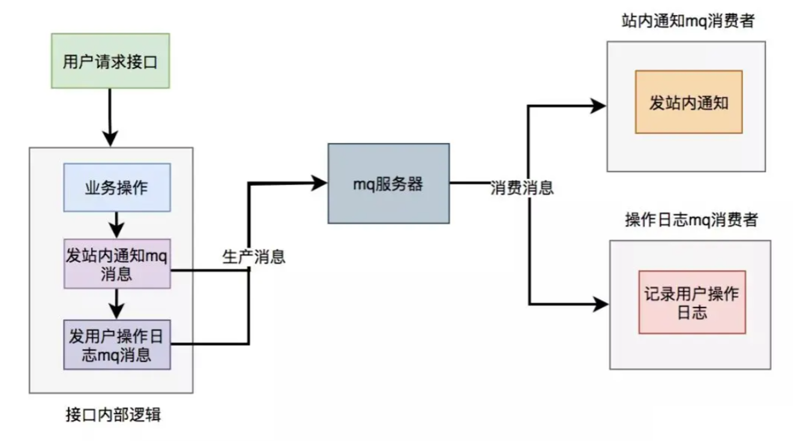

# 接口性能优化
## 1.批量思想
优化前：
```Java
//for循环单笔入库
for(TransDetail detail:transDetailList){
  insert(detail);  
}
```
优化后：
```Java
batchInsert(transDetailList);
```
大数据量：
```Java
List<List<TransDetail>> TransDetaillists = SplitList(transDetailList);// 将大批量分割成小批量
for(List<TransDetail> transDetailList : TransDetaillists){
    batchInsert(transDetailList);
}
```
这种方式同样适合调用类型，比如说如果是在某个接口中需要获取2000个用户的信息，它考虑的就需要更多一些。
## 2.异步思想
核心逻辑可以同步执行，同步写库。非核心逻辑，可以异步执行，异步写库。

异步的实现方式：线程池、消息队列

### 线程池

发送站内通知和用户操作日志的功能，被提交到了两个单独的线程池中。

这样接口中重点关注的是业务操作，把其他的逻辑交给线程异步执行，这样改造之后，让接口性能瞬间提升了。

> 如果服务器重启了，或者是需要被执行的功能出现异常了，无法重试，会丢数据，这个应该怎么处理呢？
>
> 1. 持久化数据： 在执行功能之前，将需要执行的数据进行持久化存储，比如写入到数据库中。当服务器重启后，可以从持久化存储中重新加载需要执行的数据，并进行处理。
> 2. 异常处理和重试机制： 在功能执行过程中，捕获可能出现的异常，并实现相应的重试机制。例如，可以在捕获到异常时将任务重新放回线程池队列中等待重新执行，直到执行成功为止。
> 3. 监控和报警系统： 建立监控系统，及时发现功能执行异常或服务器重启等情况，并通过报警系统通知相关人员进行处理。
> 4. 日志记录： 在功能执行过程中记录详细的日志信息，包括执行结果、异常信息等。当出现数据丢失时，可以通过日志进行故障排查和数据恢复。
> 5. 幂等性设计： 对于可能重复执行的操作，设计具有幂等性的功能。这样即使因重试或重复执行而导致数据重复，也不会产生业务上的影响。

### 消息队列

对于发站内通知和用户操作日志功能，在接口中并没真正实现，它只发送了mq消息到mq服务器。然后由mq消费者消费消息时，才真正的执行这两个功能。

这样改造之后，接口性能同样提升了，因为发送mq消息速度是很快的，我们只需关注业务操作的代码即可。

## 3.多线程思想
串行改并行

## 4.空间换时间思想：恰当使用缓存
**设计关键**

**什么时候更新缓存？如何保障更新的可靠性和实时性？**

更新缓存的策略，需要具体问题具体分析。基本的更新策略有两个：

1. 接收变更的消息，准实时更新。
2. 给每一个缓存数据设置5分钟的过期时间，过期后从DB加载再回设到DB。这个策略是对第一个策略的有力补充，解决了手动变更DB不发消息、接收消息更新程序临时出错等问题导致的第一个策略失效的问题。通过这种双保险机制，有效地保证了缓存数据的可靠性和实时性。

**缓存是否会满，缓存满了怎么办？**

对于一个缓存服务，理论上来说，随着缓存数据的日益增多，在容量有限的情况下，缓存肯定有一天会满的。如何应对？

1. 给缓存服务，选择合适的缓存逐出算法，比如最常见的LRU。
2. 针对当前设置的容量，设置适当的警戒值，比如10G的缓存，当缓存数据达到8G的时候，就开始发出报警，提前排查问题或者扩容。
3. 给一些没有必要长期保存的key，尽量设置过期时间。

**缓存是否允许丢失？丢失了怎么办？**

根据业务场景判断，是否允许丢失。如果不允许，就需要带持久化功能的缓存服务来支持，比如Redis。更细节的话，可以根据业务对丢失时间的容忍度，还可以选择更具体的持久化策略，比如Redis的RDB或者AOF。

**缓存问题**

缓存穿透

> 描述：缓存穿透是指缓存和数据库中都没有的数据，而用户不断发起请求，如发起为id为“-1”的数据或id为特别大不存在的数据。这时的用户很可能是攻击者，攻击会导致数据库压力过大。

解决方案：
1. 接口层增加校验，如用户鉴权校验，id做基础校验，id<=0的直接拦截。
2. 从缓存取不到的数据，在数据库中也没有取到，这时也可以将key-value对写为key-null，缓存有效时间可以设置短点，如30秒（设置太长会导致正常情况也没法使用），这样可以防止攻击用户反复用同一个id暴力攻击。

缓存击穿

>描述：缓存击穿是指缓存中没有但数据库中有的数据（一般是缓存时间到期），这时由于并发用户特别多，同时读缓存没读到数据，又同时去数据库去取数据，引起数据库压力瞬间增大，造成过大压力。

解决方案：
1. 设置热点数据永远不过期。
2. 加互斥锁，业界比较常用的做法，是使用mutex。简单地来说，就是在缓存失效的时候（判断拿出来的值为空），不是立即去load db，而是先使用缓存工具的某些带成功操作返回值的操作（比如Redis的SETNX）去set一个mutex key，当操作返回成功时，再进行load db的操作并回设缓存；否则，就重试整个get缓存的方法。类似下面的代码：

## 5.预取思想：提取初始化到缓存
对于访问量较低的接口来说，通常首次接口的响应时间较长。原因是JVM需要加载类、Spring Aop首次动态代理，以及新建连接等。这使得首次接口请求时间明显比后续请求耗时长。

然而在流量较低的接口中，这种影响会更大。用户可能尝试多次请求，但依然经常出现超时，严重影响了用户体验。每次服务发布完成后，接口超时失败率都会大量上升！

预取思想很容易理解，就是提前把要计算查询的数据，初始化到缓存。如果你在未来某个时间需要用到某个经过复杂计算的数据，才实时去计算的话，可能耗时比较大。这时候，我们可以采取预取思想，提前把将来可能需要的数据计算好，放到缓存中，等需要的时候，去缓存取就行。

场景举例：

- 例如地区数据或者一些数据字典数据，可以在项目启动时预加载到缓存中，在使用时从缓存获取，提升性能；
- 部分报表类数据，关联业务表很多，实时计算比较耗时，可以通过定时任务，在晚上业务不繁忙时，将数据生成好存放到ElasticSearch中，从Es中查询，提供性能。

在这里还有一个数据过期策略，其实也和该思想息息相关

参考阿里云社区文章，当一张表的数据量太大的情况下，如果不按照索引和日期进行部分扫描而出现全表扫描的情况，对DB的查询性能是非常有影响的，建议合理的设计数据过期策略，历史数据定期放入history表，或者备份到离线表中，减少线上大量数据的存储。