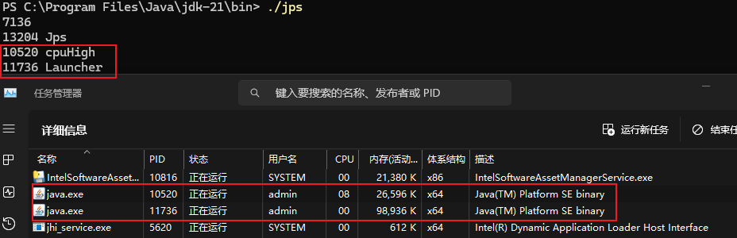
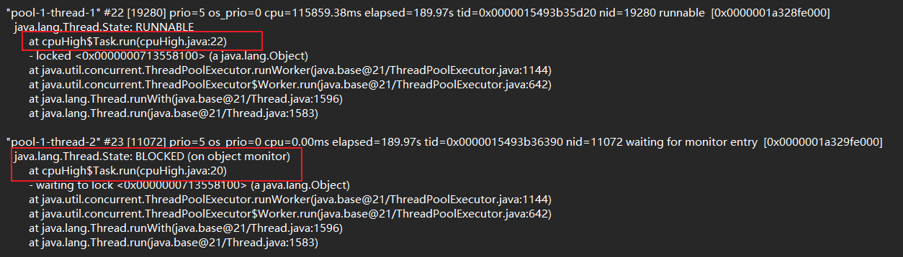

# CPU 100%分析

1. 找出消耗 CPU 最高的进程 PID
2. 然后再根据进程 PID 找出进程内消耗 CPU 最高的线程号 TID
3. 最后根据线程号 TID 找出对应的 Java 线程，进行排查处理

## 常见原因
1. 程序死循环：不合理的递归，循环操作
2. 大量计算
3. 大量IO，网络通信，读写文件
4. 大量线程创建销毁
5. 内存泄露导致JVM不断进行垃圾回收

## 排查步骤
Linux环境，可以使用top命令找出 CPU 占用最高的进程。
> top命令

使用jps命令查找活跃进程和Windows的控制台的进程

再使用命令 jstack 10520 打印具体的Java进程堆栈状态
> jstack pid > pid.tdump

命令查看进程的堆情况，发现年轻代中 Eden 和老年代已使用的内存占当前容量百分比很高，并且 GC 频繁。
>jstat -gcutil pid

命令导出堆文件，只导出 live 存活的对象。文件后缀名可以是任意的，因为它也是二进制的，不过通常以 hprof 结尾。
>jmap -dump:live,format=b,file=pid.hprof pid

最后使用 JDK 自带的工具，JAVA_HOME/bin/jvisualvm.exe工具分析快照。