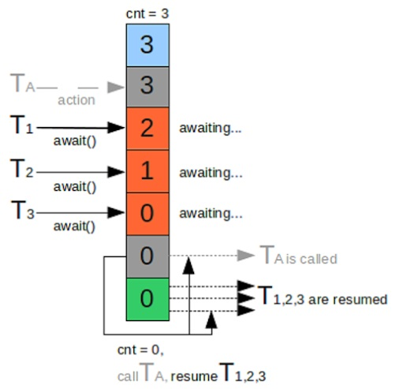

# JUC
即java.util.concurrent的缩写，包含：
1. Executor框架
2. AQS框架
3. Lock & Condition
4. Synchronizers同步器
5. 

## Executor框架
简单的说，就是一个任务的执行和调度框架，涉及的类如下图所示：


其中，最顶层是Executor接口，它的定义很简单，一个用于执行任务的execute方法，如下所示：
```Java
public interface Executor {
    void execute(Runnable command);
}
```
 另外，我们还可以看到一个Executors类，它是一个工具类（有点类似集合框架的Collections类），用于创建ExecutorService、ScheduledExecutorService、ThreadFactory 和 Callable对象。

**优点**

任务的提交过程与执行过程解耦，用户只需定义好任务提交，具体如何执行，什么时候执行不需要关心；

**典型步骤**

定义好任务（如Callable对象），把它提交给ExecutorService（如线程池）去执行，得到Future对象，然后调用Future的get方法等待执行结果即可。

**什么是任务**

实现Callable接口或Runnable接口的类，其实例就可以成为一个任务提交给ExecutorService去执行；

其中Callable任务可以返回执行结果，Runnable任务无返回结果；

**什么是线程池**

通过Executors工具类可以创建各种类型的线程池，如下为常见的四种：
- newCachedThreadPool ：大小不受限，当线程释放时，可重用该线程；
- newFixedThreadPool ：大小固定，无可用线程时，任务需等待，直到有可用线程；
- newSingleThreadExecutor ：创建一个单线程，任务会按顺序依次执行；
- newScheduledThreadPool：创建一个定时线程池，支持定时及周期性任务执行

## AQS框架（AbstractQueuedSynchronizer ）
AQS框架是J.U.C中实现锁及同步机制的基础，其底层是通过调用 LockSupport .unpark()和 LockSupport .park()实现线程的阻塞和唤醒。


AbstractQueuedSynchronizer是一个抽象类，主要是维护了一个int类型的state属性和一个非阻塞、先进先出的线程等待队列；其中state是用volatile修饰的，保证线程之间的可见性，队列的入队和出对操作都是无锁操作，基于自旋锁和CAS实现；另外AQS分为两种模式：独占模式和共享模式，像ReentrantLock是基于独占模式模式实现的，CountDownLatch、CyclicBarrier等是基于共享模式。

## Lock & Condition

先看一下Lock接口提供的主要方法，如下：
- lock()  等待获取锁
- lockInterruptibly()  可中断等待获取锁，synchronized无法实现可中断等待
- tryLock() 尝试获取锁，立即返回true或false
- tryLock(long time, TimeUnit unit)    指定时间内等待获取锁
- unlock()      释放锁
- newCondition()   返回一个绑定到此 Lock 实例上的 Condition 实例

关于Lock接口的实现，我们主要是关注以下两个类：
- ReentrantLock
- ReentrantReadWriteLock
### ReentrantLock

可重入锁，所谓的可重入锁，也叫递归锁，是指一个线程获取锁后，再次获取该锁时，不需要重新等待获取。ReentrantLock分为公平锁和非公平锁，公平锁指的是严格按照先来先得的顺序排队等待去获取锁，而非公平锁每次获取锁时，是先直接尝试获取锁，获取不到，再按照先来先得的顺序排队等待。

注意：ReentrantLock和synchronized都是可重入锁。

### ReentrantReadWriteLock

可重入读写锁，指的是没有线程进行写操作时，多个线程可同时进行读操作，当有线程进行写操作时，其它读写操作只能等待。即“读-读能共存，读-写不能共存，写-写不能共存”。

在读多于写的情况下，读写锁能够提供比排它锁更好的并发性和吞吐量。

### Condition
Condition对象是由Lock对象创建的，一个Lock对象可以创建多个Condition，其实Lock和Condition都是基于AQS实现的。

Condition对象主要用于线程的等待和唤醒，在JDK 5之前，线程的等待唤醒是用Object对象的wait/notify/notifyAll方法实现的，使用起来不是很方便；

在JDK5之后，J.U.C包提供了Condition，其中：

Condition.await对应于Object.wait；

Condition.signal 对应于 Object.notify；

Condition.signalAll 对应于 Object.notifyAll；

使用Condition对象有一个比较明显的好处是一个锁可以创建多个Condition对象，我们可以给某类线程分配一个Condition，然后就可以唤醒特定类的线程。

## Synchronizers 同步器
JUC中的同步器主要用于协助线程同步，有以下四种：
- 闭锁 CountDownLatch
- 栅栏 CyclicBarrier
- 信号量 Semaphore
- 交换器 Exchanger
### CountDownLatch
闭锁主要用于让一个主线程等待一组事件发生后继续执行，这里的事件其实就是指CountDownLatch对象的countDown方法。注意其它线程调用完countDown方法后，是会继续执行的，具体如下图所示：



在上图中，T1、T2、T3每调用一次await，计数减减，且在它们调用await方法的时候，如果计数不为0，会阻塞自己的线程；

另外，TA线程会在所有线程到达栅栏处（计数为0）的时候，才开始执行；

### 信号量Semaphore
信号量主要用于控制访问资源的线程个数，常常用于实现资源池，如数据库连接池，线程池...

在Semaphore中，acquire方法用于获取资源，有的话，继续执行（使用结束后，记得释放资源），没有资源的话将阻塞直到有其它线程调用release方法释放资源；

### 交换器 Exchanger
交换器主要用于线程之间进行数据交换；

当两个线程都到达共同的同步点（都执行到exchanger.exchange的时刻）时，发生数据交换，否则会等待直到其它线程到达；

## Atomic Variables（原子变量）
原子变量主要是方便程序员在多线程环境下，无锁的进行原子操作；

原子类是基于Unsafe实现的包装类，核心操作是CAS原子操作；所谓的CAS操作，即compare and swap，指的是将预期值与当前变量的值比较(compare)，如果相等则使用新值替换(swap)当前变量，否则不作操作；我们可以摘取一段AtomicInteger的源码，如下：
```Java
    public final boolean compareAndSet(int expect, int update) {
        return unsafe.compareAndSwapInt(this, valueOffset, expect, update);
    }
```
在compareAndSwapInt方法中，valueOffset是内存地址，expect是预期值，update是更新值，如果valueOffset地址处的值与预期值相等，则将valueOffset地址处的值更新为update值。

在Java中，有四种原子更新方式，如下：
- 原子方式更新基本类型； AtomicInteger 、 AtomicLong 等
- 原子方式更新数组； AtomicIntegerArray、 AtomicLongArray等
- 原子方式更新引用； AtomicReference、 AtomicReferenceFieldUpdater…
- 原子方式更新字段； AtomicIntegerFieldUpdater、 AtomicStampedReference(解决CAS的ABA问题)…

> 简单的自增操作，如i++，并不是一个原子操作，不过使用原子变量类进行操作，如调用incrementAndGet()方法进行自增，可以使其成为原子操作

## BlockingQueue（阻塞队列）
阻塞队列提供了可阻塞的入队和出对操作，如果队列满了，入队操作将阻塞直到有空间可用，如果队列空了，出队操作将阻塞直到有元素可用；

在Java中，主要有以下类型的阻塞队列：

- ArrayBlockingQueue ：一个由数组结构组成的有界阻塞队列。
- LinkedBlockingQueue ：一个由链表结构组成的有界阻塞队列。
- PriorityBlockingQueue ：一个支持优先级排序的无界阻塞队列。
- DelayQueue：一个支持延时获取元素的无界阻塞队列。
- SynchronousQueue：一个不存储元素的阻塞队列。
- LinkedTransferQueue：一个由链表结构组成的无界阻塞队列。
- LinkedBlockingDeque：一个由链表结构组成的双向阻塞队列。

## Concurrent Collections（并发容器）
接下来，我们来看一下工作中比较常见的一块内容，并发容器；

说到并发容器，不得不提同步容器，在JDK5之前，为了线程安全，我们一般都是使用同步容器，同步容器主要有以下缺点：

- 同步容器对所有容器状态的访问都串行化，严重降低了并发性；
- 某些复合操作，仍然需要加锁来保护
- 迭代期间，若其它线程并发修改该容器，会抛出ConcurrentModificationException异常，即快速失败机制

那么，在JDK 5之后，有哪些并发容器呢，这里主要说两种，如下：
- ConcurrentHashMap
- CopyOnWriteArrayList/Set
### ConcurrentHashMap

ConcurrentHashMap是采用分离锁技术，在同步容器中，是一个容器一个锁，但在ConcurrentHashMap中，会将hash表的数组部分分成若干段，每段维护一个锁；这些段可以并发的进行写操作，以达到高效的并发访问，如下图示例：

### CopyOnWriteArrayList
也叫拷贝容器，指的是写数据的时候，重新拷贝一份进行写操作，完成后，再将原容器的引用指向新的拷贝容器。

适用情况：当读操作远远大于写操作的时候，考虑用这个并发集合。

## Fork/Join并行计算框架
这块内容是在JDK7中引入的，个人觉得相当牛逼，可以方便利用多核平台的计算能力，简化并行程序的编写，开发人员仅需关注如何划分任务和组合中间结果。

fork/join框架的核心是ForkJoinPool类，实现了工作窃取算法（对那些处理完自身任务的线程，会从其它线程窃取任务执行）并且能够执行 ForkJoinTask任务。

适用场景：大任务能被递归拆分成多个子任务的应用；

可以参考下图，帮助理解，位于图上部的 Task 依赖于位于其下的 Task 的执行，只有当所有的子任务都完成之后，调用者才能获得 Task 0 的返回结果。其实这是一种分而治之的思想：
