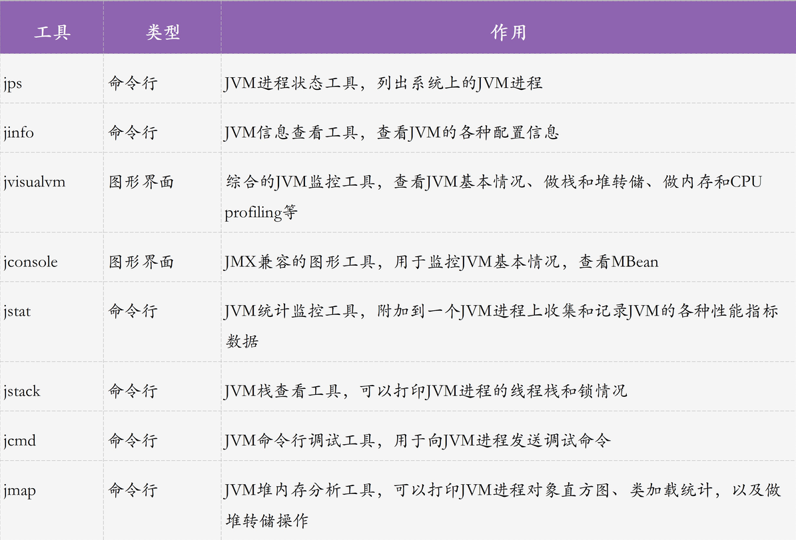
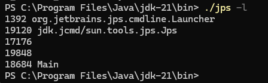
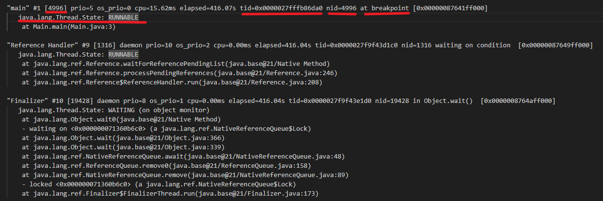

# JVM性能分析
JDK自带了很多性能监控工具，我们可以用这些工具来监测系统和排查内存性能问题。

## 利用 jps 找出进程
jps（Java Virtual Machine Process Status Tool）是JDK 1.5提供的一个显示当前所有java进程pid的命令，简单实用，非常适合在linux/unix平台上简单察看当前java进程的一些简单情况。

1. 查看Java进程PID

【jps -l】左边一列就是Java进程的PID

2. 输出传递给JVM的参数

【jps -vl】

## 利用 jstat 查看VM统计信息
使用 jstat 工具可以监测 Java 应用程序的实时运行情况，可以看到VM内的Eden、Survivor、老年代的内存使用情况，还有 YoungGC 和 FullGC 的执行次数以及耗时。通过这些指标，我们可以轻松的分析出当前系统的运行情况，判断当前系统的内存使用压力以及GC压力，还有内存分配是否合理。

查看内存使用和GC情况
> jstat -gc pid 
>

## 利用 jstack 分析线程栈
jstack 是一种线程堆栈分析工具，最常用的功能就是使用 jstack pid 命令查看线程的堆栈信息，通常会结合 top -Hp pid 或 pidstat -p pid -t 一起查看具体线程的状态，也经常用来排查一些死锁的异常、CPU占用高的线程等。

**jstack参数**：
- -l：长列表. 打印关于锁的附加信息，例如属于 java.util.concurrent 的 ownable synchronizers 列表。
- -F：当 jstack [-l] pid 没有响应的时候强制打印栈信息
- -m：打印 java 和 native c/c++ 框架的所有栈信息.
- -h | -help：打印帮助信息

### 查看线程堆栈信息
> jstack pid > pidstack.log

这个命令可以把程序的线程堆栈dump下来。每个线程堆栈的信息中，都可以查看到线程 ID、线程状态（wait、sleep、running 等状态）以及是否持有锁等。

- main：线程名
- 4996：线程编号
- prio=5：线程的优先级别
- os_prio=0：系统级别的线程优先级
- tid=0x0000027fffb86da0：线程ID
- pid=4996：native线程的id
- at breakpoint：线程当前状态