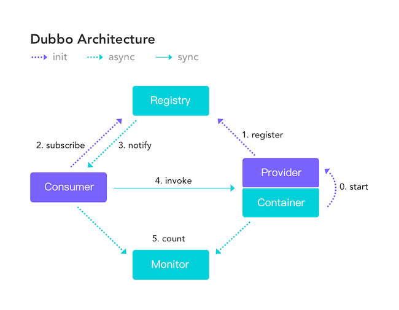

[CAP 理论/定理](https://zh.wikipedia.org/wiki/CAP%E5%AE%9A%E7%90%86)起源于 2000年，由加州大学伯克利分校的Eric Brewer教授在分布式计算原理研讨会（PODC）上提出，因此 CAP定理又被称作 **布鲁尔定理（Brewer's theorem）**

**CAP** 也就是 **Consistency（一致性）** 、**Availability（可用性）** 、**Partition Tolerance（分区容错性）**  这三个单词首字母组合。

在理论计算机科学中，CAP 定理（CAP theorem）指出对于一个分布式系统来说，当设计读写操作时，只能同时满足以下三点中的两个：

* **一致性（Consistency）**  : 所有节点访问同一份最新的数据副本
* **可用性（Availability）** : 非故障的节点在合理的时间内返回合理的响应（不是错误或者超时的响应）。
* **分区容错性（Partition tolerance）**  : 分布式系统出现网络分区的时候，仍然能够对外提供服务。

  **什么是网络分区？**

  > 分布式系统中，多个节点之前的网络本来是连通的，但是因为某些故障（比如部分节点网络出了问题）某些节点之间不连通了，整个网络就分成了几块区域，这就叫网络分区。
  >

大部分人解释这一定律时，常常简单的表述为："一致性、可用性、分区容忍性三者你只能同时达到其中两个，不可能同时达到”。实际上这是一个非常具有误导性质的说法，而且在 CAP 理论诞生 12 年之后，CAP 之父也在 2012 年重写了之前的论文。

> **当发生网络分区的时候，如果我们要继续服务，那么强一致性和可用性只能 2 选 1。也就是说当网络分区之后 P 是前提，决定了 P 之后才有 C 和 A 的选择。也就是说分区容错性（Partition tolerance）我们是必须要实现的。**
>
> 简而言之就是：CAP 理论中分区容错性 P 是一定要满足的，在此基础上，只能满足可用性 A 或者一致性 C。
>
> (网络分区某种程度上是必然发生，因为不可保障不发生

因此，**分布式系统理论上不可能选择 CA 架构，只能选择 CP 或者 AP 架构。**  比如 ZooKeeper、HBase 就是 CP 架构，Cassandra、Eureka 就是 AP 架构，Nacos 不仅支持 CP 架构也支持 AP 架构。

**为啥不可能选择 CA 架构呢？**  举个例子：若系统出现“分区”，系统中的某个节点在进行写操作。为了保证 C， 必须要禁止其他节点的读写操作，这就和 A 发生冲突了。如果为了保证 A，其他节点的读写操作正常的话，那就和 C 发生冲突了。

**选择 CP 还是 AP 的关键在于当前的业务场景，没有定论，比如对于需要确保强一致性的场景如银行一般会选择保证 CP 。**

另外，需要补充说明的一点是： **如果网络分区正常的话（系统在绝大部分时候所处的状态），也就说不需要保证 P 的时候，C 和 A 能够同时保证。**

### CAP 实际应用案例

我这里以注册中心来探讨一下 CAP 的实际应用。考虑到很多小伙伴不知道注册中心是干嘛的，这里简单以 Dubbo 为例说一说。

下图是 Dubbo 的架构图。**注册中心 Registry 在其中扮演了什么角色呢？提供了什么服务呢？**

注册中心负责服务地址的注册与查找，相当于目录服务，服务提供者和消费者只在启动时与注册中心交互，注册中心不转发请求，压力较小。

常见的可以作为注册中心的组件有：ZooKeeper、Eureka、Nacos...。

1. **ZooKeeper 保证的是 CP。**  任何时刻对 ZooKeeper 的读请求都能得到一致性的结果，但是， ZooKeeper 不保证每次请求的可用性比如在 Leader 选举过程中或者半数以上的机器不可用的时候服务就是不可用的。
2. **Eureka 保证的则是 AP。**  Eureka 在设计的时候就是优先保证 A （可用性）。在 Eureka 中不存在什么 Leader 节点，每个节点都是一样的、平等的。因此 Eureka 不会像 ZooKeeper 那样出现选举过程中或者半数以上的机器不可用的时候服务就是不可用的情况。 Eureka 保证即使大部分节点挂掉也不会影响正常提供服务，只要有一个节点是可用的就行了。只不过这个节点上的数据可能并不是最新的。
3. **Nacos 不仅支持 CP 也支持 AP。**

### 总结

在进行分布式系统设计和开发时，我们不应该仅仅局限在 CAP 问题上，还要关注系统的扩展性、可用性等等

在系统发生“分区”的情况下，CAP 理论只能满足 CP 或者 AP。要注意的是，这里的前提是系统发生了“分区”

如果系统没有发生“分区”的话，节点间的网络连接通信正常的话，也就不存在 P 了。这个时候，我们就可以同时保证 C 和 A 了。

总结：**如果系统发生“分区”，我们要考虑选择 CP 还是 AP。如果系统没有发生“分区”的话，我们要思考如何保证 CA 。**

# BASE
**BASE** 是 **Basically Available（基本可用）**  、**Soft-state（软状态）**  和 **Eventually Consistent（最终一致性）**  三个短语的缩写。BASE 理论是对 CAP 中一致性 C 和可用性 A 权衡的结果，核心思想是即使无法做到强一致性（CAP的一致性就是强一致性），但应用可以采用合适的方式达到最终一致性（Eventual Consistency）。

## **Basically Available 基本可用**

允许损失部分可用性：

* 响应时间上的损失
* 系统功能上的损失

## **Soft-state 软状态**

允许系统中存在中间状态，并认为中间状态的存在不会影响系统的整体可用性

## **Eventually Consistent 最终一致性**