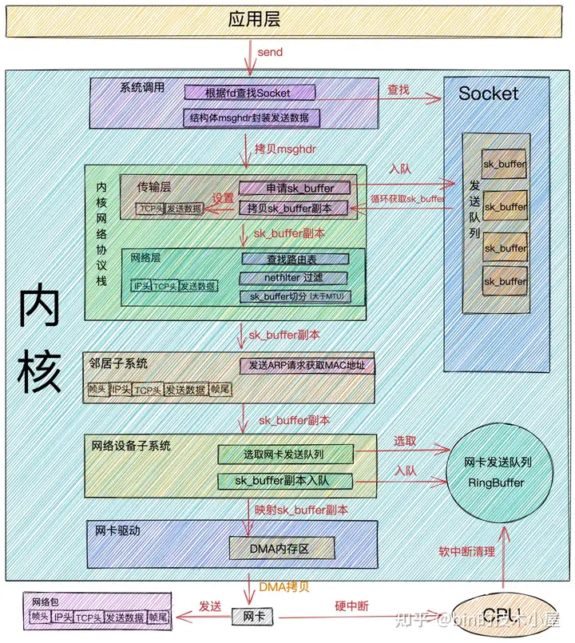
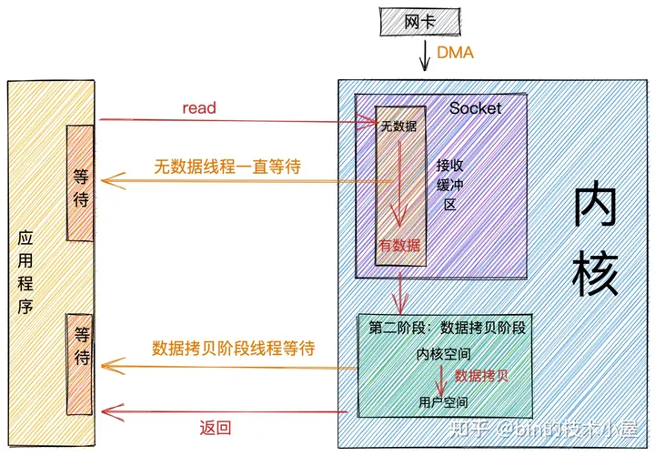
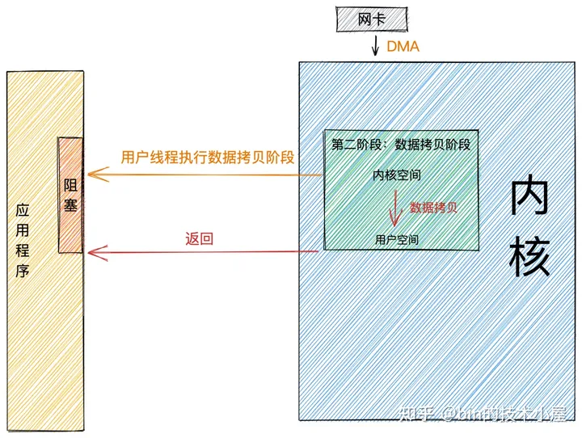
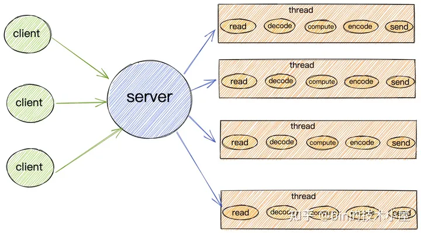

dubbo底层使用了netty作为网络框架
## 网络底层
### 接收流程

1. 当**网络数据帧**通过网络传输到达网卡时，网卡会将网络数据帧通过**DMA**的方式放到**环形缓冲区RingBuffer**中。
> RingBuffer是网卡在启动的时候分配和初始化的环形缓冲队列。当RingBuffer满的时候，新来的数据包就会被丢弃。我们可以通过ifconfig命令查看网卡收发数据包的情况。其中overruns数据项表示当RingBuffer满时，被丢弃的数据包。如果发现出现丢包情况，可以通过ethtool命令来增大RingBuffer长度。

2. 当DMA操作完成时，网卡会向CPU发起一个**硬中断**，告诉CPU有网络数据到达。CPU调用网卡驱动注册的**硬中断响应程序**。网卡硬中断响应程序会为网络数据帧创建内核数据结构**sk_buffer**，并将网络数据帧拷贝到sk_buffer中。然后发起软中断请求，通知内核有新的网络数据帧到达。
> sk_buff缓冲区，是一个维护网络帧结构的双向链表，链表中的每一个元素都是一个网络帧。虽然 TCP/IP 协议栈分了好几层，但上下不同层之间的传递，实际上只需要操作这个数据结构中的指针，而无需进行数据复制。

3. 内核线程ksoftirqd发现有软中断请求到来，随后调用网卡驱动注册的poll函数，poll函数将sk_buffer中的网络数据包送到内核协议栈中注册的ip_rcv函数中。

> 每个CPU会绑定一个ksoftirqd内核线程专门用来处理软中断响应。2个 CPU 时，就会有 ksoftirqd/0 和 ksoftirqd/1这两个内核线程。
> 这里有个事情需要注意下： 网卡接收到数据后，当DMA拷贝完成时，向CPU发出硬中断，这时哪个CPU上响应了这个硬中断，那么在网卡硬中断响应程序中发出的软中断请求也会在这个CPU绑定的ksoftirqd线程中响应。所以如果发现Linux软中断，CPU消耗都集中在一个核上的话，那么就需要调整硬中断的CPU亲和性，来将硬中断打散到不通的CPU核上去。

4. 在ip_rcv函数中也就是上图中的网络层，取出数据包的IP头，判断该数据包下一跳的走向，如果数据包是发送给本机的，则取出传输层的协议类型（TCP或者UDP)，并去掉数据包的IP头，将数据包交给上图中得传输层处理。
> 传输层的处理函数：TCP协议对应内核协议栈中注册的tcp_rcv函数，UDP协议对应内核协议栈中注册的udp_rcv函数。

5. 当我们采用的是TCP协议时，数据包到达传输层时，会在内核协议栈中的tcp_rcv函数处理，在tcp_rcv函数中去掉TCP头，根据四元组（源IP，源端口，目的IP，目的端口）查找对应的Socket，如果找到对应的Socket则将网络数据包中的传输数据拷贝到Socket中的接收缓冲区中。如果没有找到，则发送一个目标不可达的icmp包。
6. 内核在接收网络数据包时所做的工作我们就介绍完了，现在我们把视角放到应用层，当我们程序通过系统调用read读取Socket接收缓冲区中的数据时，如果接收缓冲区中没有数据，那么应用程序就会在系统调用上阻塞，直到Socket接收缓冲区有数据，然后CPU将内核空间（Socket接收缓冲区）的数据拷贝到用户空间，最后系统调用read返回，应用程序读取数据。

### 接收性能开销
从内核处理网络数据包接收的整个过程来看，内核帮我们做了非常之多的工作，最终我们的应用程序才能读取到网络数据。

随着而来的也带来了很多的性能开销，结合前面介绍的网络数据包接收过程我们来看下网络数据包接收的过程中都有哪些性能开销：

- 应用程序通过系统调用从用户态转为内核态的开销以及系统调用返回时从内核态转为用户态的开销。
- 网络数据从内核空间通过CPU拷贝到用户空间的开销。
- 内核线程ksoftirqd响应软中断的开销。
- CPU响应硬中断的开销。
- DMA拷贝网络数据包到内存中的开销。

### 发送流程

1. 当我们在应用程序中调用send系统调用发送数据时，由于是系统调用所以线程会发生一次用户态到内核态的转换，在内核中首先根据fd将真正的Socket找出，这个Socket对象中记录着各种协议栈的函数地址，然后构造struct msghdr对象，将用户需要发送的数据全部封装在这个struct msghdr结构体中。
2. 调用内核协议栈函数inet_sendmsg，发送流程进入内核协议栈处理。在进入到内核协议栈之后，内核会找到Socket上的具体协议的发送函数。
> 比如：我们使用的是TCP协议，对应的TCP协议发送函数是tcp_sendmsg，如果是UDP协议的话，对应的发送函数为udp_sendmsg。
3. 在TCP协议的发送函数tcp_sendmsg中，创建内核数据结构sk_buffer,将 struct msghdr结构体中的发送数据拷贝到sk_buffer中。调用tcp_write_queue_tail函数获取Socket发送队列中的队尾元素，将新创建的sk_buffer添加到Socket发送队列的尾部。
> Socket的发送队列是由sk_buffer组成的一个双向链表。
> 
> 发送流程走到这里，用户要发送的数据总算是从用户空间拷贝到了内核中，这时虽然发送数据已经拷贝到了内核Socket中的发送队列中，但并不代表内核会开始发送，因为TCP协议的流量控制和拥塞控制，用户要发送的数据包并不一定会立马被发送出去，需要符合TCP协议的发送条件。如果没有达到发送条件，那么本次send系统调用就会直接返回。

### 发送性能开销
前边我们提到了在网络包接收过程中涉及到的性能开销，现在介绍完了网络包的发送过程，我们来看下在数据包发送过程中的性能开销：

- 和接收数据一样，应用程序在调用系统调用send的时候会从用户态转为内核态以及发送完数据后，系统调用返回时从内核态转为用户态的开销。
- 用户线程内核态CPU quota用尽时触发NET_TX_SOFTIRQ类型软中断，内核响应软中断的开销。
- 网卡发送完数据，向CPU发送硬中断，CPU响应硬中断的开销。以及在硬中断中发送NET_RX_SOFTIRQ软中断执行具体的内存清理动作。内核响应软中断的开销。
- 内存拷贝的开销。我们来回顾下在数据包发送的过程中都发生了哪些内存拷贝：
- 在内核协议栈的传输层中，TCP协议对应的发送函数tcp_sendmsg会申请sk_buffer，将用户要发送的数据拷贝到sk_buffer中。
- 在发送流程从传输层到网络层的时候，会拷贝一个sk_buffer副本出来，将这个sk_buffer副本向下传递。原始sk_buffer保留在Socket发送队列中，等待网络对端ACK，对端ACK后删除Socket发送队列中的sk_buffer。对端没有发送ACK，则重新从Socket发送队列中发送，实现TCP协议的可靠传输。
- 在网络层，如果发现要发送的数据大于MTU，则会进行分片操作，申请额外的sk_buffer，并将原来的sk_buffer拷贝到多个小的sk_buffer中。
## 再谈(阻塞，非阻塞)与(同步，异步)
在我们聊完网络数据的接收和发送过程后，我们来谈下IO中特别容易混淆的概念：阻塞与同步，非阻塞与异步。

网上各种博文还有各种书籍中有大量的关于这两个概念的解释，但是笔者觉得还是不够形象化，只是对概念的生硬解释，如果硬套概念的话，其实感觉阻塞与同步，非阻塞与异步还是没啥区别，时间长了，还是比较模糊容易混淆。

所以笔者在这里尝试换一种更加形象化，更加容易理解记忆的方式来清晰地解释下什么是阻塞与非阻塞，什么是同步与异步。

经过前边对网络数据包接收流程的介绍，在这里我们可以将整个流程总结为两个阶段：

- **数据准备阶段**： 在这个阶段，网络数据包到达网卡，通过DMA 的方式将数据包拷贝到内存中，然后经过硬中断，软中断，接着通过内核线程ksoftirqd经过内核协议栈的处理，最终将数据发送到内核Socket的接收缓冲区中。
- **数据拷贝阶段**： 当数据到达内核Socket的接收缓冲区中时，此时数据存在于内核空间中，需要将数据拷贝到用户空间中，才能够被应用程序读取。
### 阻塞与非阻塞
阻塞与非阻塞的区别主要发生在第一阶段：**数据准备阶段**。

当应用程序发起系统调用read时，线程从用户态转为内核态，读取内核Socket的接收缓冲区中的网络数据。

#### 阻塞
如果这时内核Socket的接收缓冲区没有数据，那么线程就会一直等待，直到Socket接收缓冲区有数据为止。随后将数据从内核空间拷贝到用户空间，系统调用read返回。

从图中我们可以看出：阻塞的特点是在第一阶段和第二阶段都会等待。

#### 非阻塞
阻塞和非阻塞主要的区分是在第一阶段：数据准备阶段。

- 在第一阶段，当Socket的接收缓冲区中没有数据的时候，阻塞模式下应用线程会一直等待。非阻塞模式下应用线程不会等待，系统调用直接返回错误标志EWOULDBLOCK。
- 当Socket的接收缓冲区中有数据的时候，阻塞和非阻塞的表现是一样的，都会进入第二阶段等待数据从内核空间拷贝到用户空间，然后系统调用返回。

从上图中，我们可以看出：非阻塞的特点是第一阶段不会等待，但是在第二阶段还是会等待。

### 同步与异步
同步与异步主要的区别发生在第二阶段：数据拷贝阶段。

前边我们提到在数据拷贝阶段主要是将数据从内核空间拷贝到用户空间。然后应用程序才可以读取数据。

当内核Socket的接收缓冲区有数据到达时，进入第二阶段。
#### 同步
同步模式在数据准备好后，是由用户线程的内核态来执行第二阶段。所以应用程序会在第二阶段发生阻塞，直到数据从内核空间拷贝到用户空间，系统调用才会返回。

Linux下的 epoll和Mac 下的 kqueue都属于同步 IO。

#### 异步
异步模式下是由内核来执行第二阶段的数据拷贝操作，当内核执行完第二阶段，会通知用户线程IO操作已经完成，并将数据回调给用户线程。所以在异步模式下 数据准备阶段和数据拷贝阶段均是由内核来完成，不会对应用程序造成任何阻塞。

基于以上特征，我们可以看到异步模式需要内核的支持，比较依赖操作系统底层的支持。

在目前流行的操作系统中，只有Windows 中的 IOCP才真正属于异步 IO，实现的也非常成熟。但Windows很少用来作为服务器使用。

而常用来作为服务器使用的Linux，异步IO机制实现的不够成熟，与NIO相比性能提升的也不够明显。

但Linux kernel 在5.1版本由Facebook的大神Jens Axboe引入了新的异步IO库io_uring 改善了原来Linux native AIO的一些性能问题。性能相比Epoll以及之前原生的AIO提高了不少，值得关注。

## IO模型
在进行网络IO操作时，用什么样的IO模型来读写数据将在很大程度上决定了网络框架的IO性能。所以IO模型的选择是构建一个高性能网络框架的基础。

在《UNIX 网络编程》一书中介绍了五种IO模型：阻塞IO,非阻塞IO,IO多路复用,信号驱动IO,异步IO，每一种IO模型的出现都是对前一种的升级优化。

下面我们就来分别介绍下这五种IO模型各自都解决了什么问题，适用于哪些场景，各自的优缺点是什么？

### 阻塞IO（BIO）

经过前一小节对阻塞这个概念的介绍，相信大家可以很容易理解阻塞IO的概念和过程。

既然这小节我们谈的是IO，那么下边我们来看下在阻塞IO模型下，网络数据的读写过程。
#### 阻塞读
当用户线程发起read系统调用，用户线程从用户态切换到内核态，在内核中去查看Socket接收缓冲区是否有数据到来。

- Socket接收缓冲区中有数据，则用户线程在内核态将内核空间中的数据拷贝到用户空间，系统IO调用返回。
- Socket接收缓冲区中无数据，则用户线程让出CPU，进入阻塞状态。当数据到达Socket接收缓冲区后，内核唤醒阻塞状态中的用户线程进入就绪状态，随后经过CPU的调度获取到CPU quota进入运行状态，将内核空间的数据拷贝到用户空间，随后系统调用返回。
#### 阻塞写
当用户线程发起send系统调用时，用户线程从用户态切换到内核态，将发送数据从用户空间拷贝到内核空间中的Socket发送缓冲区中。

- 当Socket发送缓冲区能够容纳下发送数据时，用户线程会将全部的发送数据写入Socket缓冲区，然后执行在《网络包发送流程》这小节介绍的后续流程，然后返回。
- 当Socket发送缓冲区空间不够，无法容纳下全部发送数据时，用户线程让出CPU,进入阻塞状态，直到Socket发送缓冲区能够容纳下全部发送数据时，内核唤醒用户线程，执行后续发送流程。

阻塞IO模型下的写操作做事风格比较硬刚，非得要把全部的发送数据写入发送缓冲区才肯善罢甘休。

#### 阻塞IO模型
基于以上阻塞IO模型的特点，该模型只适用于连接数少，并发度低的业务场景。

比如公司内部的一些管理系统，通常请求数在100个左右，使用阻塞IO模型还是非常适合的。而且性能还不输NIO。

该模型在C10K之前，是普遍被采用的一种IO模型。

由于阻塞IO的读写特点，所以导致在阻塞IO模型下，每个请求都需要被一个独立的线程处理。一个线程在同一时刻只能与一个连接绑定。来一个请求，服务端就需要创建一个线程用来处理请求。

当客户端请求的并发量突然增大时，服务端在一瞬间就会创建出大量的线程，而创建线程是需要系统资源开销的，这样一来就会一瞬间占用大量的系统资源。

如果客户端创建好连接后，但是一直不发数据，通常大部分情况下，网络连接也并不总是有数据可读，那么在空闲的这段时间内，服务端线程就会一直处于阻塞状态，无法干其他的事情。CPU也无法得到充分的发挥，同时还会导致大量线程切换的开销。
#### 适用场景
基于以上阻塞IO模型的特点，该模型只适用于连接数少，并发度低的业务场景。

比如公司内部的一些管理系统，通常请求数在100个左右，使用阻塞IO模型还是非常适合的。而且性能还不输NIO。

该模型在C10K之前，是普遍被采用的一种IO模型。
## netty为什么高性能低延时
- **非阻塞IO**

Netty采用了IO多路复用技术，让多个IO的阻塞复用到一个select线程阻塞上，能够有效的应对大量的并发请求

- **高效的Reactor线程模型**

Netty服务端采用Reactor主从多线程模型
1. 主线程：Acceptor 线程池用于监听Client 的TCP 连接请求
2. 从线程：Client 的IO 操作都由一个特定的NIO 线程池负责，负责消息的读取、解码、编码和发送
3. Client连接有很多，但是NIO 线程数是比较少的，一个NIO 线程可以同时绑定到多个Client，同时一个Client只能对应一个线程，避免出现线程安全问题

- **无锁化串行设计**

串行设计：消息的处理尽可能在一个线程内完成，期间不进行线程切换，避免了多线程竞争和同步锁的使用

- **高效的并发编程**

Netty 的高效并发编程主要体现在如下几点

1. volatile 的大量、正确使用
2. CAS 和原子类的广泛使用
3. 线程安全容器的使用
4. 通过读写锁提升并发性能

- **高性能的序列化框架**

Netty 默认提供了对Google Protobuf 的支持，通过扩展Netty 的编解码接口，可以实现其它的高性能序列化框架

- **零拷贝**

1. Netty 的接收和发送ByteBuffer 采用DirectByteBuffer，使用堆外直接内存进行Socket 读写，不需要进行字节缓冲区的二次拷贝。如果使用传统的堆内存（HeapByteBuffer）进行Socket 读写，JVM 会将堆内存Buffer 拷贝一份到直接内存中，然后才写入Socket 中。相比于堆外直接内存，消息在发送过程中多了一次缓冲区的内存拷贝

2. Netty 提供了组合Buffer 对象，可以聚合多个ByteBuffer 对象，用户可以像操作一个Buffer 那样方便的对组合Buffer进行操作，避免了传统通过内存拷贝的方式将几个小Buffer 合并成一个大的Buffer。

3. Netty 的文件传输采用了transferTo()方法，它可以直接将文件缓冲区的数据发送到目标Channel，避免了传统通过循环write()方式导致的内存拷贝问题。

- **内存池**

基于对象池的 ByteBuf可以重用 ByteBuf对象，内部维护了一个内存池，可以循环利用已创建的 ByteBuf，提升内存的使用效率，降低由于高负载导致的频繁GC。测试表明使用内存池后的Nety在高负载、大并发的冲击下内存和GC更加平稳

- **灵活的TCP参数配置能力**

合理设置TCP 参数在某些场景下对于性能的提升可以起到显著的效果，例如SO_RCVBUF 和SO_SNDBUF。如果设置不当，对性能的影响是非常大的

1. SO_RCVBUF 和SO_SNDBUF：通常建议值为128K 或者256K；

2. SO_TCPNODELAY：NAGLE 算法通过将缓冲区内的小封包自动相连，组成较大的封包，阻止大量小封包的发送阻塞网络，从而提高网络应用效率。但是对于时延敏感的应用场景需要关闭该优化算法；

3. 软中断：如果Linux 内核版本支持RPS（2.6.35 以上版本），开启RPS 后可以实现软中断，提升网络吞吐量。RPS根据数据包的源地址，目的地址以及目的和源端口，计算出一个hash 值，然后根据这个hash 值来选择软中断运行的cpu，从上层来看，也就是说将每个连接和cpu 绑定，并通过这个hash 值，来均衡软中断在多个cpu 上，提升网络并行处理性能