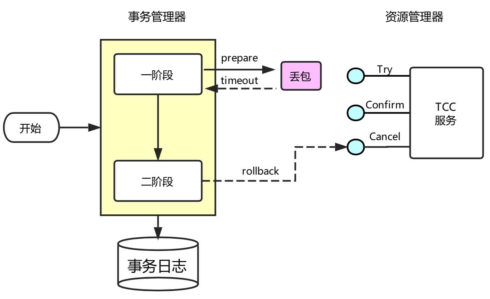
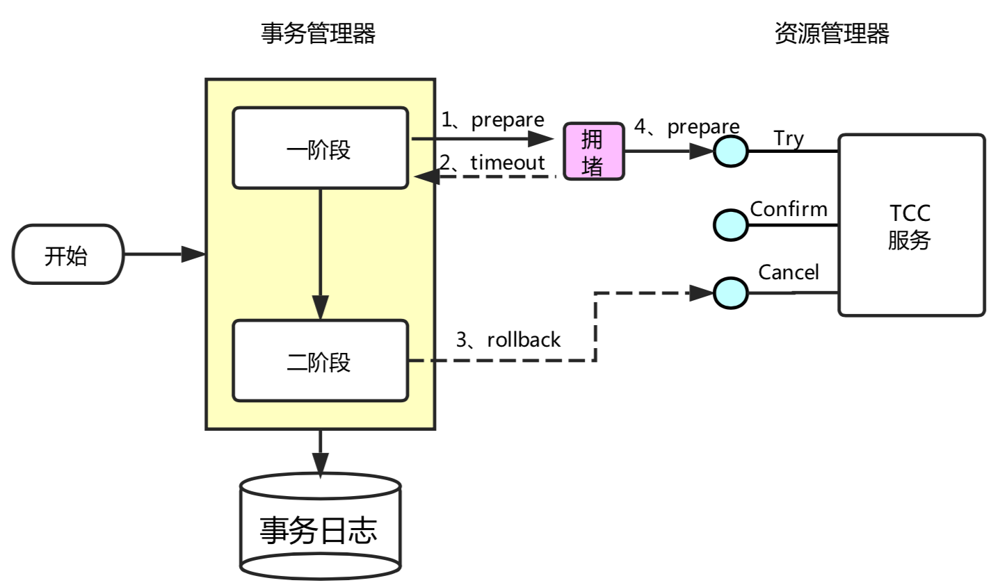

Try - Confirm - Cancel

- Try 指的是预留，即资源的预留和锁定，注意是预留
- Confirm 指的是确认操作，这一步其实就是真正的执行了
- Cancel 指的是撤销操作，可以理解为把预留阶段的动作撤销了

三个角色：调用者，事务管理者，服务提供方
1. 调用者发起事务
2. 调用者调用try
3. 调用者收到返回结果
4. 调用者给事务管理者提交或回滚
5. 事务管理者调用confirm或cancel

可以看到流程还是很简单的，难点在于业务上的定义，对于每一个操作你都需要定义三个动作分别对应Try - Confirm - Cancel。

因此 TCC **对业务的侵入较大和业务紧耦合**，需要根据特定的场景和业务逻辑来设计相应的操作。

还有一点要注意，撤销和确认操作的执行可能需要重试，因此还需要保证操作的幂等。

## 允许空回滚
如下图所示，事务协调器在调用 TCC 服务的一阶段 Try 操作时，可能会出现因为丢包而导致的网络超时，此时事务管理器会触发二阶段回滚，调用 TCC 服务的 Cancel 操作，而 Cancel 操作调用未出现超时。

TCC 服务在未收到 Try 请求的情况下收到 Cancel 请求，这种场景被称为空回滚；空回滚在生产环境经常出现，用户在实现TCC服务时，应允许允许空回滚的执行，即收到空回滚时返回成功。

## 防悬挂控制
如下图所示，事务协调器在调用 TCC 服务的一阶段 Try 操作时，可能会出现因网络拥堵而导致的超时，此时事务管理器会触发二阶段回滚，调用 TCC 服务的 Cancel 操作，Cancel 调用未超时；在此之后，拥堵在网络上的一阶段 Try 数据包被 TCC 服务收到，出现了二阶段 Cancel 请求比一阶段 Try 请求先执行的情况，此 TCC 服务在执行晚到的 Try 之后，将永远不会再收到二阶段的 Confirm 或者 Cancel ，造成 TCC 服务悬挂。

用户在实现  TCC 服务时，要允许空回滚，但是要拒绝执行空回滚之后 Try 请求，要避免出现悬挂。