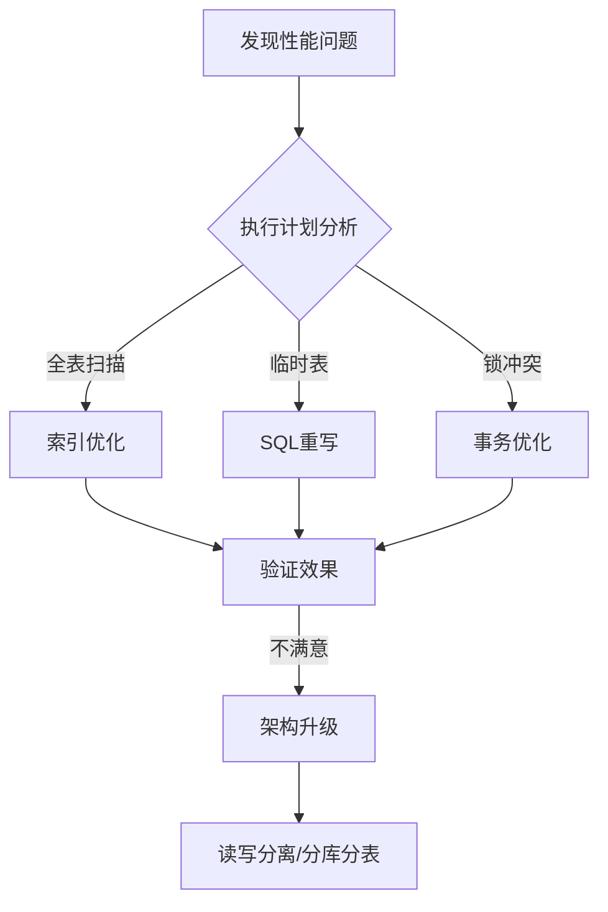

## InnoDB存储引擎
InnoDB采用MVCC机制来支持高并发， 并使用默认隔离级别：RR，通过间隙锁策略避免幻读

> 间隙锁使InnoDB不仅仅锁定查询涉及的行，还会对索引中的间隙强行锁定，以防止幻影行的插入

## 性能优化
优化的目的：
- 提高吞吐量（让服务器每秒执行更多的查询，因为每条查询执行的时间变得更短了）
- 降低响应时间（先测量为什么需要这么多时间，再减少或消除那些对查询结果不重要的工作）
  - 1.测量
    - 执行时间
    - 等待时间
  - 2.分析

# SQL优化实践指南

SQL优化是提升数据库性能的关键环节，下面我将从多个维度详细介绍SQL优化的方法和技巧。


## SQL优化方法论
### 1. 查询分析与诊断
#### 使用EXPLAIN分析执行计划
```sql
EXPLAIN SELECT * FROM users WHERE username = 'admin';
```

EXPLAIN输出解读：
- **type**: 访问类型，从好到差依次是: system > const > eq_ref > ref > range > index > ALL
- **key**: 实际使用的索引
- **rows**: 预估需要扫描的行数
- **Extra**: 额外信息，如"Using index"(覆盖索引)、"Using filesort"(需要额外排序)

#### 使用慢查询日志
```sql
-- 开启慢查询日志
SET GLOBAL slow_query_log = 1;
SET GLOBAL long_query_time = 1; -- 设置阈值为1秒
```

### 2. 索引优化

#### 合理创建索引
- 为WHERE、ORDER BY、GROUP BY子句中的列创建索引
- 选择区分度高的列作为索引
- 考虑列的基数(Cardinality)

```sql
-- 检查索引使用情况
SHOW INDEX FROM table_name;

-- 创建复合索引(注意列顺序)
CREATE INDEX idx_name_age ON users(name, age);
```

#### 避免索引失效
- 避免在索引列上使用函数或运算
  ```sql
  -- 错误示例(索引失效)
  SELECT * FROM users WHERE YEAR(create_time) = 2023;
  
  -- 正确示例
  SELECT * FROM users WHERE create_time BETWEEN '2023-01-01' AND '2023-12-31';
  ```

- 避免使用前缀模糊查询
  ```sql
  -- 索引失效
  SELECT * FROM users WHERE name LIKE '%张';
  
  -- 可以使用索引
  SELECT * FROM users WHERE name LIKE '张%';
  ```

- 避免隐式类型转换
  ```sql
  -- 错误示例(id是整数类型)
  SELECT * FROM users WHERE id = '1';
  
  -- 正确示例
  SELECT * FROM users WHERE id = 1;
  ```

### 3. 查询语句优化

#### 只查询需要的列
```sql
-- 避免
SELECT * FROM users;

-- 推荐
SELECT id, username, email FROM users;
```

#### 减少数据访问量
- 使用LIMIT限制结果集大小
- 使用覆盖索引避免回表

#### 优化JOIN操作
- 小表驱动大表(小的结果集驱动大的结果集)
- 使用JOIN代替子查询
- 确保JOIN条件列上有索引

```sql
-- 优化前
SELECT * FROM orders o 
WHERE o.customer_id IN (SELECT id FROM customers WHERE status = 'active');

-- 优化后
SELECT o.* FROM orders o 
JOIN customers c ON o.customer_id = c.id
WHERE c.status = 'active';
```

#### 避免使用SELECT DISTINCT
- 可以通过合理设计表结构避免使用DISTINCT

#### 合理使用子查询
- 尽量使用JOIN代替子查询
- 必要时使用临时表存储中间结果

### 4. 表结构优化

#### 选择合适的数据类型
- 使用可能的最小数据类型
- 整数类型: TINYINT, SMALLINT, MEDIUMINT, INT, BIGINT
- 字符串类型: 定长用CHAR，变长用VARCHAR
- 日期时间: DATE, TIME, DATETIME, TIMESTAMP

#### 表拆分
- 垂直拆分: 将不常用的列拆分到单独的表
- 水平拆分: 按照某个维度(如时间、地区)将数据分散到多个表

#### 使用适当的存储引擎
- InnoDB: 支持事务、行级锁、外键
- MyISAM: 适合读密集型应用

### 5. SQL编写规范

#### 使用批量操作
```sql
-- 避免
INSERT INTO users VALUES (1, 'user1');
INSERT INTO users VALUES (2, 'user2');

-- 推荐
INSERT INTO users VALUES 
(1, 'user1'),
(2, 'user2');
```

#### 避免使用OR条件
```sql
-- 避免
SELECT * FROM users WHERE name = 'Tom' OR email = 'tom@example.com';

-- 推荐
SELECT * FROM users WHERE name = 'Tom' 
UNION ALL
SELECT * FROM users WHERE email = 'tom@example.com' AND name != 'Tom';
```

#### 使用合适的锁策略
- 使用乐观锁代替悲观锁
- 减小锁粒度
- 减少锁持有时间

### 6. 实际案例分析

#### 案例1: 慢查询优化
```sql
-- 优化前(执行时间: 2.5秒)
SELECT u.*, o.order_id 
FROM users u 
LEFT JOIN orders o ON u.id = o.user_id
WHERE u.status = 'active'
ORDER BY u.create_time;

-- 优化后(执行时间: 0.1秒)
-- 1. 添加索引
CREATE INDEX idx_status_create_time ON users(status, create_time);
CREATE INDEX idx_user_id ON orders(user_id);

-- 2. 优化查询
SELECT u.id, u.username, u.email, u.status, u.create_time, o.order_id
FROM users u 
LEFT JOIN orders o ON u.id = o.user_id
WHERE u.status = 'active'
ORDER BY u.create_time;
```

#### 案例2: 分页查询优化
```sql
-- 优化前(深度分页问题)
SELECT * FROM products 
ORDER BY create_time DESC 
LIMIT 10000, 20;

-- 优化后(使用延迟关联)
SELECT p.* 
FROM products p
JOIN (
    SELECT id FROM products
    ORDER BY create_time DESC
    LIMIT 10000, 20
) AS tmp ON p.id = tmp.id;
```

### 7. 性能监控与维护

#### 定期分析表和优化表
```sql
-- 分析表
ANALYZE TABLE table_name;

-- 优化表
OPTIMIZE TABLE table_name;
```

#### 定期更新统计信息
```sql
-- 更新统计信息
ANALYZE TABLE table_name;
```

#### 监控关键指标
- 查询响应时间
- 锁等待时间
- 临时表使用情况
- 索引使用情况

## 总结

SQL优化是一个持续的过程，需要结合具体业务场景和数据特点进行针对性优化。通过合理的索引设计、查询语句优化、表结构优化和SQL编写规范，可以显著提升数据库性能。

记住优化的黄金法则：
1. 先测量，后优化
2. 避免过早优化
3. 针对瓶颈进行优化
4. 优化应该是可度量的
```


# 系统性SQL优化方法论

SQL优化是一个需要从全局视角出发的工程实践，以下是分层次的系统性优化框架：

## 一、架构设计层优化（事前预防）

### 1. 数据库选型策略
- **OLTP**：MySQL/PostgreSQL（高并发短事务）
- **OLAP**：ClickHouse/Greenplum（分析型场景）
- **混合负载**：TiDB/CockroachDB（HTAP架构）

### 2. 表设计规范
```sql
-- 反例：常见设计问题
CREATE TABLE orders (
  id INT,
  user_info VARCHAR(2000),  -- JSON大字段
  create_time DATETIME,
  INDEX (create_time)       -- 低效索引
);

-- 优化后
CREATE TABLE orders (
  id BIGINT UNSIGNED PRIMARY KEY,
  user_id INT NOT NULL,     -- 外键关联
  create_time TIMESTAMP DEFAULT CURRENT_TIMESTAMP,
  INDEX idx_user_create (user_id, create_time)  -- 复合索引
) ENGINE=InnoDB ROW_FORMAT=COMPRESSED;
```

### 3. 读写分离架构
```
[App] → [Proxy] → [Master]
             ↘ → [Read Replica1]
             ↘ → [Read Replica2]
```

## 二、查询优化层（事中控制）

### 1. EXPLAIN深度解读
```sql
EXPLAIN FORMAT=JSON
SELECT * FROM orders WHERE user_id = 100;
```
关键指标：
- **type**：ALL(全表) → range(范围) → ref(索引) → eq_ref(唯一) → const(常量)
- **Extra**：Using filesort/Using temporary需要重点优化

### 2. 索引优化矩阵
| 场景                | 优化方案                      | 示例                          |
|---------------------|-----------------------------|-------------------------------|
| 最左前缀            | 调整索引顺序                 | `INDEX(a,b)` → `WHERE a=1 AND b=2` |
| 范围查询            | 范围列放索引最后             | `INDEX(age,create_time)`      |
| 排序分组            | 索引覆盖排序                 | `INDEX(status,price)` → `ORDER BY status,price` |
| 模糊查询            | 前缀索引/ES辅助             | `INDEX(title(10))`            |

### 3. 执行计划改写技巧
```sql
-- 反例：索引失效
SELECT * FROM users WHERE DATE(create_time) = '2023-01-01';

-- 优化后（范围扫描）
SELECT * FROM users 
WHERE create_time >= '2023-01-01 00:00:00' 
  AND create_time < '2023-01-02 00:00:00';
```

## 三、性能分析层（事后监控）

### 1. 慢查询分析体系
```bash
# MySQL慢日志配置
slow_query_log = ON
long_query_time = 1
log_queries_not_using_indexes = ON
```

### 2. 性能分析工具栈
- **Percona Toolkit**：pt-query-digest分析慢日志
- **Prometheus+Grafana**：实时监控QPS/慢查询
- **SHOW PROFILE**：微观耗时分析
```sql
SET profiling = 1;
SELECT * FROM large_table;
SHOW PROFILE CPU, BLOCK IO FOR QUERY 1;
```

### 3. 压力测试方案
```bash
sysbench oltp_read_write \
--db-driver=mysql \
--mysql-host=127.0.0.1 \
--mysql-port=3306 \
--mysql-user=test \
--mysql-password=test \
--mysql-db=sbtest \
--tables=10 \
--table-size=1000000 \
--threads=32 \
--time=300 \
--report-interval=10 \
run
```

## 四、高级优化技巧

### 1. 分页优化方案
```sql
-- 反例：大偏移量分页
SELECT * FROM orders ORDER BY id LIMIT 1000000, 20;

-- 优化方案1：游标分页
SELECT * FROM orders WHERE id > 1000000 ORDER BY id LIMIT 20;

-- 优化方案2：延迟关联
SELECT t.* FROM orders t
JOIN (SELECT id FROM orders ORDER BY id LIMIT 1000000, 20) tmp
ON t.id = tmp.id;
```

### 2. 事务优化原则
- 短事务：减少锁持有时间
- 适当降低隔离级别（如RR→RC）
- 批量操作使用`BEGIN...COMMIT`替代自动提交

### 3. 连接池配置公式
```
最大连接数 = (核心数 * 2) + 有效磁盘数
```

## 五、优化checklist

1. [ ] 避免`SELECT *`，明确字段列表
2. [ ] 所有JOIN字段必须有索引
3. [ ] 单表数据量超过500万考虑分表
4. [ ] 频繁更新的字段不宜建索引
5. [ ] 使用`UNION ALL`替代`UNION`（无需去重时）
6. [ ] 统计类查询使用物化视图
7. [ ] TEXT/BLOB字段分离到扩展表

## 六、优化路线图



通过这套系统化方法，可以建立起从预防到治理的完整SQL优化体系。实际优化时需要结合业务特点，优先解决主要瓶颈（通常遵循80/20法则）。