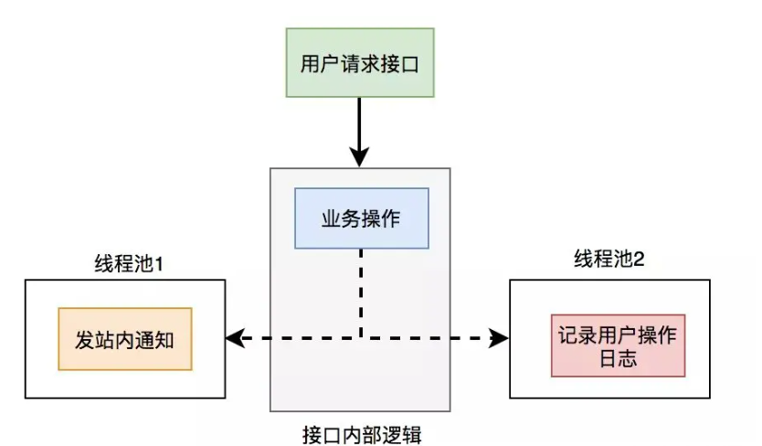
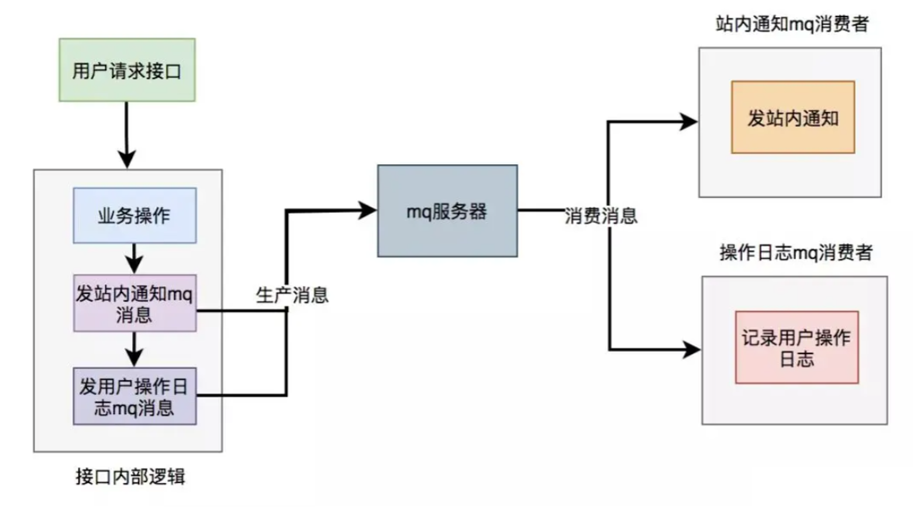

需求：
- 安全
- 性能

# 安全
## 发
### 数据加密
数据在传输过程中是很容易被抓包的，如果直接传输比如通过http协议，那么用户传输的数据可以被任何人获取；所以必须对数据加密，常见的做法对关键字段加密比如用户密码直接通过md5加密；现在主流的做法是使用https协议，在http和tcp之间添加一层加密层(SSL层)，这一层负责数据的加密和解密；

现在主流的加密方式有对称加密和非对称加密:

- 对称加密：对称密钥在加密和解密的过程中使用的密钥是相同的，常见的对称加密算法有DES，AES；优点是计算速度快，缺点是在数据传送前，发送方和接收方必须商定好秘钥，然后使双方都能保存好秘钥，如果一方的秘钥被泄露，那么加密信息也就不安全了；
- 非对称加密：服务端会生成一对密钥，私钥存放在服务器端，公钥可以发布给任何人使用；优点就是比起对称加密更加安全，但是加解密的速度比对称加密慢太多了；广泛使用的是RSA算法；RSA公钥每次加密得到的结果都不一样

两种方式各有优缺点，而https的实现方式正好是结合了两种加密方式，整合了双方的优点，在安全和性能方面都比较好；对称加密和非对称加密代码实现，jdk提供了相关的工具类可以直接使用；关于https如何配置使用相对来说复杂一些，可以参考本人的之前的文章HTTPS分析与实战

## 传
**appid+密钥(授权模式的传输，不适合需要首次登陆的模式)**

需要使用我的API的用户，你首先得到我这注册下信息，然后我发给你一个appid（或者叫appkey），然后给你个密钥，你传过来的数据中都要带这两个参数，并且把这两个参数放到body中，使用https传输，因为Body中的数据在https下是加密的。

但是不管是否全局唯一最好让生成的Id有如下属性：

- 趋势递增：这样在保存数据库的时候，使用索引性能更好；
- 信息安全：尽量不要连续的，容易发现规律；

关于全局唯一Id生成的方式常见的有类snowflake方式等

**token机制(首次认证后开绿灯)**

客户端使用用户名和密码请求登录。服务端收到请求，验证用户名和密码。验证成功后，服务端会生成一个token，然后把这个token发送给客户端。客户端收到token后把它存储起来，可以放在cookie或者Local Storage（本地存储）里。客户端每次向服务端发送请求的时候都需要带上服务端发给的token。服务端收到请求，然后去验证客户端请求里面带着token，如果验证成功，就向客户端返回请求的数据。token比较容易被截取，一般会有token的过期时间，或者每隔多长时间会生成新的token，token也要考虑下加密。

## 收
**限流**

限流机制是为了防止恶意频繁请求造成的服务器瘫痪。 常用的限流算法包括：令牌桶限流，漏桶限流，计数器限流；

1. 令牌桶限流（能允许刺突，但是不会爆炸，流入的请求都是在能处理的范围之内，请求多了的话就不给你牌子） 令牌桶算法的原理是系统以一定速率向桶中放入令牌，填满了就丢弃令牌；请求来时会先从桶中取出令牌，如果能取到令牌，则可以继续完成请求，否则等待或者拒绝服务；令牌桶允许一定程度突发流量，只要有令牌就可以处理，支持一次拿多个令牌；
2. 漏桶限流（只能匀速处理请求） 漏桶算法的原理是按照固定常量速率流出请求，流入请求速率任意，当请求数超过桶的容量时，新的请求等待或者拒绝服务；可以看出漏桶算法可以强制限制数据的传输速度；
3. 计数器限流（容易产生刺突） 计数器是一种比较简单粗暴的算法，主要用来限制总并发数，比如数据库连接池、线程池、秒杀的并发数；计数器限流只要一定时间内的总请求数超过设定的阀值则进行限流；

**时间戳机制**

数据是很容易被抓包的，但是经过如上的加密，加签处理，就算拿到数据也不能看到真实的数据；但是有不法者不关心真实的数据，而是直接拿到抓取的数据包进行恶意请求；这时候可以使用时间戳机制，在每次请求中加入当前的时间，服务器端会拿到当前时间和消息中的时间相减，看看是否在一个固定的时间范围内比如5分钟内；这样恶意请求的数据包是无法更改里面时间的，所以5分钟后就视为非法请求了；


**黑白名单**

拒绝黑名单请求，只允许白名单请求

## 验
**数据合法性校验**

只有在数据是合法的情况下才会进行数据处理；每个系统都有自己的验证规则，当然也可能有一些常规性的规则，比如身份证长度和组成，电话号码长度和组成等等；

合法性校验包括：常规性校验以及业务校验； 常规性校验：包括签名校验，必填校验，长度校验，类型校验，格式校验等； 业务校验：根据实际业务而定，比如订单金额不能小于0等；

## 1.数据加密
1. 对关键字段做对称/非对称加密
2. 如果要对所有字段加密，可以使用https协议
3. 数据加签验签
4. token机制

# 性能

## 1.批量思想
优化前：
```Java
//for循环单笔入库
for(TransDetail detail:transDetailList){
  insert(detail);  
}
```
优化后：
```Java
batchInsert(transDetailList);
```
大数据量：
```Java
List<List<TransDetail>> TransDetaillists = SplitList(transDetailList);// 将大批量分割成小批量
for(List<TransDetail> transDetailList : TransDetaillists){
    batchInsert(transDetailList);
}
```
这种方式同样适合调用类型，比如说如果是在某个接口中需要获取2000个用户的信息，它考虑的就需要更多一些。
## 2.异步思想
核心逻辑可以同步执行，同步写库。非核心逻辑，可以异步执行，异步写库。

异步的实现方式：线程池、消息队列

### 线程池

发送站内通知和用户操作日志的功能，被提交到了两个单独的线程池中。

这样接口中重点关注的是业务操作，把其他的逻辑交给线程异步执行，这样改造之后，让接口性能瞬间提升了。

> 如果服务器重启了，或者是需要被执行的功能出现异常了，无法重试，会丢数据，这个应该怎么处理呢？
>
> 1. 持久化数据： 在执行功能之前，将需要执行的数据进行持久化存储，比如写入到数据库中。当服务器重启后，可以从持久化存储中重新加载需要执行的数据，并进行处理。
> 2. 异常处理和重试机制： 在功能执行过程中，捕获可能出现的异常，并实现相应的重试机制。例如，可以在捕获到异常时将任务重新放回线程池队列中等待重新执行，直到执行成功为止。
> 3. 监控和报警系统： 建立监控系统，及时发现功能执行异常或服务器重启等情况，并通过报警系统通知相关人员进行处理。
> 4. 日志记录： 在功能执行过程中记录详细的日志信息，包括执行结果、异常信息等。当出现数据丢失时，可以通过日志进行故障排查和数据恢复。
> 5. 幂等性设计： 对于可能重复执行的操作，设计具有幂等性的功能。这样即使因重试或重复执行而导致数据重复，也不会产生业务上的影响。

### 消息队列

对于发站内通知和用户操作日志功能，在接口中并没真正实现，它只发送了mq消息到mq服务器。然后由mq消费者消费消息时，才真正的执行这两个功能。

这样改造之后，接口性能同样提升了，因为发送mq消息速度是很快的，我们只需关注业务操作的代码即可。

## 3.多线程思想
串行改并行

## 4.空间换时间思想：恰当使用缓存
**设计关键**

**什么时候更新缓存？如何保障更新的可靠性和实时性？**

更新缓存的策略，需要具体问题具体分析。基本的更新策略有两个：

1. 接收变更的消息，准实时更新。
2. 给每一个缓存数据设置5分钟的过期时间，过期后从DB加载再回设到DB。这个策略是对第一个策略的有力补充，解决了手动变更DB不发消息、接收消息更新程序临时出错等问题导致的第一个策略失效的问题。通过这种双保险机制，有效地保证了缓存数据的可靠性和实时性。

**缓存是否会满，缓存满了怎么办？**

对于一个缓存服务，理论上来说，随着缓存数据的日益增多，在容量有限的情况下，缓存肯定有一天会满的。如何应对？

1. 给缓存服务，选择合适的缓存逐出算法，比如最常见的LRU。
2. 针对当前设置的容量，设置适当的警戒值，比如10G的缓存，当缓存数据达到8G的时候，就开始发出报警，提前排查问题或者扩容。
3. 给一些没有必要长期保存的key，尽量设置过期时间。

**缓存是否允许丢失？丢失了怎么办？**

根据业务场景判断，是否允许丢失。如果不允许，就需要带持久化功能的缓存服务来支持，比如Redis。更细节的话，可以根据业务对丢失时间的容忍度，还可以选择更具体的持久化策略，比如Redis的RDB或者AOF。

**缓存问题**

缓存穿透

> 描述：缓存穿透是指缓存和数据库中都没有的数据，而用户不断发起请求，如发起为id为“-1”的数据或id为特别大不存在的数据。这时的用户很可能是攻击者，攻击会导致数据库压力过大。

解决方案：
1. 接口层增加校验，如用户鉴权校验，id做基础校验，id<=0的直接拦截。
2. 从缓存取不到的数据，在数据库中也没有取到，这时也可以将key-value对写为key-null，缓存有效时间可以设置短点，如30秒（设置太长会导致正常情况也没法使用），这样可以防止攻击用户反复用同一个id暴力攻击。

缓存击穿

>描述：缓存击穿是指缓存中没有但数据库中有的数据（一般是缓存时间到期），这时由于并发用户特别多，同时读缓存没读到数据，又同时去数据库去取数据，引起数据库压力瞬间增大，造成过大压力。

解决方案：
1. 设置热点数据永远不过期。
2. 加互斥锁，业界比较常用的做法，是使用mutex。简单地来说，就是在缓存失效的时候（判断拿出来的值为空），不是立即去load db，而是先使用缓存工具的某些带成功操作返回值的操作（比如Redis的SETNX）去set一个mutex key，当操作返回成功时，再进行load db的操作并回设缓存；否则，就重试整个get缓存的方法。类似下面的代码：

## 5.预取思想：提取初始化到缓存
对于访问量较低的接口来说，通常首次接口的响应时间较长。原因是JVM需要加载类、Spring Aop首次动态代理，以及新建连接等。这使得首次接口请求时间明显比后续请求耗时长。

然而在流量较低的接口中，这种影响会更大。用户可能尝试多次请求，但依然经常出现超时，严重影响了用户体验。每次服务发布完成后，接口超时失败率都会大量上升！

预取思想很容易理解，就是提前把要计算查询的数据，初始化到缓存。如果你在未来某个时间需要用到某个经过复杂计算的数据，才实时去计算的话，可能耗时比较大。这时候，我们可以采取预取思想，提前把将来可能需要的数据计算好，放到缓存中，等需要的时候，去缓存取就行。

场景举例：

- 例如地区数据或者一些数据字典数据，可以在项目启动时预加载到缓存中，在使用时从缓存获取，提升性能；
- 部分报表类数据，关联业务表很多，实时计算比较耗时，可以通过定时任务，在晚上业务不繁忙时，将数据生成好存放到ElasticSearch中，从Es中查询，提供性能。

在这里还有一个数据过期策略，其实也和该思想息息相关

参考阿里云社区文章，当一张表的数据量太大的情况下，如果不按照索引和日期进行部分扫描而出现全表扫描的情况，对DB的查询性能是非常有影响的，建议合理的设计数据过期策略，历史数据定期放入history表，或者备份到离线表中，减少线上大量数据的存储。