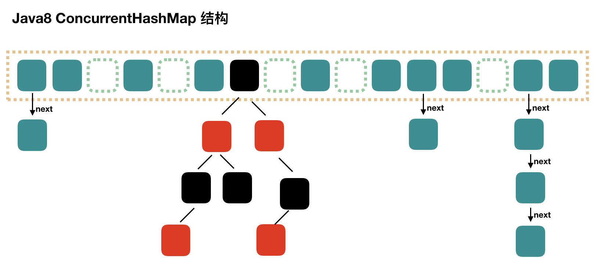

## ConcurrentHashMap
诞生的背景：多线程环境下，使用HashMap不安全，使用Hashtable有性能问题；

**1. **Hashtable** 的性能瓶颈
Hashtable 是 Java 早期提供的线程安全哈希表，它通过在所有方法上加锁（synchronized）来实现线程安全。这种方式存在以下问题：

粗粒度锁：Hashtable 使用单一的全局锁，所有操作都需要竞争锁，导致并发性能差。
高竞争：在多线程环境下，锁竞争会显著降低性能。 ConcurrentHashMap 通过更细粒度的锁机制解决了这些问题。

源码分析
```Java
// 内部采用Entry数组存储键值对数据，Entry实际为单向链表的表头
private transient Entry<?,?>[] table;
// HashTable里键值对个数
private transient int count;
// 扩容阈值，当超过这个值时，进行扩容操作，计算方式为：数组容量*加载因子
private int threshold;
// 加载因子
private float loadFactor;
// 用于快速失败
private transient int modCount = 0;

// 方法synchronized修饰，线程安全，多线程共享一个hashtable对象时，同一时刻只有一个线程能读取和修改Hashtable
public synchronized V put(K key, V value) {
    // Make sure the value is not null
    if (value == null) {
        throw new NullPointerException();
    }

    // Makes sure the key is not already in the hashtable.
    Entry<?,?> tab[] = table;
    // 得到key的哈希值
    int hash = key.hashCode();
    // 得到该key存在到数组中的下标
    int index = (hash & 0x7FFFFFFF) % tab.length;
    @SuppressWarnings("unchecked")
    // 得到该下标对应的Entry
    Entry<K,V> entry = (Entry<K,V>)tab[index];
    // 如果该下标的Entry不为null，则进行链表遍历
    for(; entry != null ; entry = entry.next) {
        // 遍历链表，如果存在key相等的节点，则替换这个节点的值，并返回旧值
        if ((entry.hash == hash) && entry.key.equals(key)) {
            V old = entry.value;
            entry.value = value;
            return old;
        }
    }
    // 如果数组下标对应的节点为空，或者遍历链表后发现没有和该key相等的节点，则执行插入操作
    addEntry(hash, key, value, index);
    return null;
}

private void addEntry(int hash, K key, V value, int index) {
    // 模数+1
    modCount++;

    Entry<?,?> tab[] = table;
    // 判断是否需要扩容
    if (count >= threshold) {
        // 如果count大于等于扩容阈值，则进行扩容
        rehash();

        tab = table;
        // 扩容后，重新计算该key在扩容后table里的下标
        hash = key.hashCode();
        index = (hash & 0x7FFFFFFF) % tab.length;
    }

    // Creates the new entry.
    @SuppressWarnings("unchecked")
    // 采用头插的方式插入，index位置的节点为新节点的next节点
    // 新节点取代inde位置节点
    Entry<K,V> e = (Entry<K,V>) tab[index];
    tab[index] = new Entry<>(hash, key, value, e);
    // count+1
    count++;
}

public synchronized V get(Object key) {
    Entry<?,?> tab[] = table;
    int hash = key.hashCode();
    // 根据key哈希得到index，遍历链表取值
    int index = (hash & 0x7FFFFFFF) % tab.length;
    for (Entry<?,?> e = tab[index] ; e != null ; e = e.next) {
        if ((e.hash == hash) && e.key.equals(key)) {
            return (V)e.value;
        }
    }
    return null;
}

protected void rehash() {
    // 暂存旧的table和容量
    int oldCapacity = table.length;
    Entry<?,?>[] oldMap = table;

    // 新容量为旧容量的2n+1倍
    int newCapacity = (oldCapacity << 1) + 1;
    // 判断新容量是否超过最大容量
    if (newCapacity - MAX_ARRAY_SIZE > 0) {
        // 如果旧容量已经是最大容量大话，就不扩容了
        if (oldCapacity == MAX_ARRAY_SIZE)
            // Keep running with MAX_ARRAY_SIZE buckets
            return;
        // 新容量最大值只能是MAX_ARRAY_SIZE
        newCapacity = MAX_ARRAY_SIZE;
    }
    // 用新容量创建一个新Entry数组
    Entry<?,?>[] newMap = new Entry<?,?>[newCapacity];
    // 模数+1
    modCount++;
    // 重新计算下次扩容阈值
    threshold = (int)Math.min(newCapacity * loadFactor, MAX_ARRAY_SIZE + 1);
    // 将新Entry数组赋值给table
    table = newMap;
    // 遍历数组和链表，进行新table赋值操作
    for (int i = oldCapacity ; i-- > 0 ;) {
        for (Entry<K,V> old = (Entry<K,V>)oldMap[i] ; old != null ; ) {
            Entry<K,V> e = old;
            old = old.next;

            int index = (e.hash & 0x7FFFFFFF) % newCapacity;
            e.next = (Entry<K,V>)newMap[index];
            newMap[index] = e;
        }
    }
}
```

**2. **HashMap** 的非线程安全
HashMap 是非线程安全的，在多线程环境下可能出现以下问题：

数据不一致：多线程同时修改 HashMap 可能导致内部结构破坏。
死循环：在扩容时，多线程可能引发死循环（JDK 1.7 中的经典问题）。 ConcurrentHashMap 提供了线程安全的实现，避免了这些问题。


## 线程安全的Map
在多线程环境下，Java 提供了几种线程安全的 Map 实现，可以安全地进行并发操作：
1. ConcurrentHashMap: 这是一个线程安全的哈希表实现，它通过将数据分为多个段，每个段都有自己的锁，从而允许多个线程同时访问不同段的数据。在 Java 8 中，ConcurrentHashMap 还引入了红黑树来处理哈希冲突严重的情况，进一步提高了查找效率。
2. Collections.synchronizedMap(): 这是一个工具方法，可以将任何 Map 包装成一个线程安全的 Map。这个包装后的 Map 通过在所有方法上使用 synchronized 关键字来实现线程安全。但是，这种方法的并发性能可能不如 ConcurrentHashMap，因为它在任何时候只允许一个线程访问整个 Map。
3. Hashtable: 这是一个旧的线程安全的哈希表实现，它也通过在所有方法上使用 synchronized 关键字来实现线程安全。但是，由于其设计和性能问题，现在通常推荐使用 ConcurrentHashMap 或 Collections.synchronizedMap() 代替 Hashtable。

除了使用这些线程安全的 Map 实现外，还可以通过使用锁或其他并发控制机制（如 ReentrantLock、Semaphore、CountDownLatch 等）来手动同步对 Map 的访问。但是，这通常需要更多的编程工作，并且如果不正确地使用这些机制，可能会导致死锁或数据不一致的问题。

## 与Hashtable的区别是什么？

- Hashtable也是线程安全的，但每次要锁住整个结构，并发性低。相比之下，ConcurrentHashMap获取size时才锁整个对象。

- Hashtable对get/put/remove都使用了同步操作。ConcurrentHashMap只对put/remove同步。

- Hashtable是快速失败的，遍历时改变结构会报错ConcurrentModificationException。ConcurrentHashMap是安全失败，允许并发检索和更新。

## ConcurrentHashmap的数据结构
结构上和 Java8 的 HashMap 基本上一样，不过它要保证线程安全性，所以在源码上确实要复杂一些。


## JDK1.8中线程安全的体现
### get
ConcurrentHashMap的get方法无锁，通过volatile关键字来保证可见性，避免脏数据

get方法的实现主要是通过volatile关键字和Unsafe类来保证的。在ConcurrentHashMap中，Node数组和Node节点的value字段都是用volatile关键字修饰的，这可以保证线程间的可见性，也就是说，当一个线程修改了数据，其他线程可以立即看到修改后的值。另外，Unsafe类提供了一种低级别的、直接操作内存的方式，可以用来实现无锁的并发操作。
### put
ConcurrentHashMap 使用的是 CAS + volatile 或 synchronized 的方式来保证线程安全的：
```Java
    final V putVal(K key, V value, boolean onlyIfAbsent) { 
        if (key == null || value == null) 
            throw new NullPointerException();
        int hash = spread(key.hashCode());
        int binCount = 0;
        for (Node<K,V>[] tab = table;;) {
            Node<K,V> f; int n, i, fh; K fk; V fv;
            if (tab == null || (n = tab.length) == 0)
                tab = initTable();
            else if ((f = tabAt(tab, i = (n - 1) & hash)) == null) { // 节点为空
                // 利用 CAS 去进行无锁线程安全操作，如果 bin 是空的
                if (casTabAt(tab, i, null, new Node<K,V>(hash, key, value)))
                    break;
            }
            else if ((fh = f.hash) == MOVED)
                tab = helpTransfer(tab, f);
            else if (onlyIfAbsent
                    && fh == hash
                    && ((fk = f.key) == key || (fk != null && key.equals(fk)))
                    && (fv = f.val) != null)
                return fv;
            else {
                V oldVal = null;
                synchronized (f) {
                    // 细粒度的同步修改操作... 
                }
            }
            // 如果超过阈值，升级为红黑树
            if (binCount != 0) {
                if (binCount >= TREEIFY_THRESHOLD)
                    treeifyBin(tab, i);
                if (oldVal != null)
                    return oldVal;
                break;
            }
        }
    addCount(1L, binCount);
    return null;
}
```
添加元素时首先会判断容器是否为空，如果为空则使用 volatile 加 CAS 来初始化。

如果容器不为空则根据存储的元素计算该位置是否为空，如果为空则利用 CAS 设置该节点；

如果不为空则使用 synchronize 加锁，遍历桶中的数据，替换或新增节点到桶中，最后再判断是否需要转为红黑树，这样就能保证并发访问时的线程安全了。

我们把上述流程简化一下，我们可以简单的认为在 JDK 1.8 中，ConcurrentHashMap 是在头节点加锁来保证线程安全的，锁的粒度相比 Segment 来说更小了，发生冲突和加锁的频率降低了，并发操作的性能就提高了。而且 JDK 1.8 使用的是红黑树优化了之前的固定链表，那么当数据量比较大的时候，查询性能也得到了很大的提升，从之前的 O(n) 优化到了 O(logn) 的时间复杂度。

### 扩容
