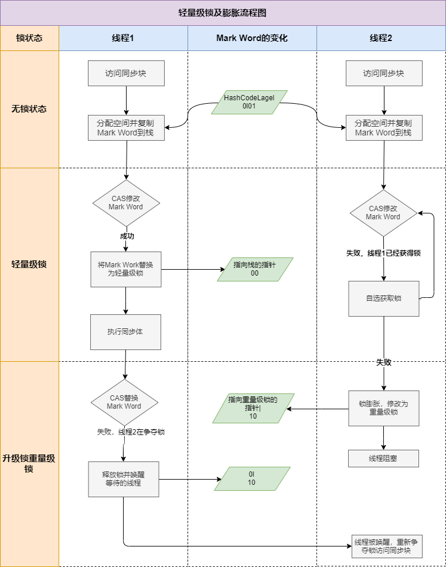

## CAS
CAS 即 Compare-And-Swap，是一种用于实现多线程同步的原子操作，在并发编程中被广泛使用，以下从基本概念、实现原理、应用场景、优缺点等方面详细介绍：

### 基本概念
CAS 操作包含三个操作数 —— 内存位置（V）、预期原值（A）和新值（B）。执行 CAS 操作时，会先将内存位置 V 中的值与预期原值 A 进行比较，如果两者相等，就将内存位置 V 的值更新为新值 B；如果不相等，则不进行更新操作，一般会返回当前内存位置的值。这个操作是原子性的，即在执行过程中不会被其他线程中断。

### 实现原理
- **硬件层面**：许多现代处理器都提供了对 CAS 操作的硬件支持，例如 x86 架构中的 `CMPXCHG` 指令。这种硬件支持确保了 CAS 操作的原子性，因为在执行该指令时，处理器会锁定内存总线，防止其他处理器对同一内存位置进行读写操作，从而保证了操作的原子性。
- **软件层面**：在 Java 中，`java.util.concurrent.atomic` 包下的类就是基于 CAS 实现的，例如 `AtomicInteger`。这些类通过调用本地方法（JNI）来调用底层操作系统的 CAS 指令，从而实现原子操作。

### 示例代码（Java）
```java
import java.util.concurrent.atomic.AtomicInteger;

public class CASTest {
    public static void main(String[] args) {
        // 创建一个 AtomicInteger 对象，初始值为 10
        AtomicInteger atomicInteger = new AtomicInteger(10);
        // 预期原值
        int expectedValue = 10;
        // 新值
        int newValue = 20;
        // 执行 CAS 操作
        boolean result = atomicInteger.compareAndSet(expectedValue, newValue);
        if (result) {
            System.out.println("CAS 操作成功，新值为: " + atomicInteger.get());
        } else {
            System.out.println("CAS 操作失败，当前值为: " + atomicInteger.get());
        }
    }
}
```
### 应用场景
- **实现无锁数据结构**：如无锁队列、无锁栈等。使用 CAS 可以避免传统锁机制带来的线程阻塞和上下文切换开销，提高并发性能。
- **多线程计数器**：多个线程同时对一个计数器进行递增或递减操作时，可以使用 CAS 来保证操作的原子性。

### 优缺点
#### 优点
- **高性能**：相比于传统的锁机制，CAS 操作不需要加锁和解锁的过程，避免了线程的阻塞和唤醒，减少了上下文切换的开销，因此在高并发场景下具有更高的性能。
- **避免死锁**：由于 CAS 操作是无锁的，不存在锁的竞争和死锁问题。

#### 缺点
- **ABA 问题**：如果一个值从 A 变为 B，再从 B 变回 A，CAS 操作会认为这个值没有发生变化，从而继续执行更新操作，可能会导致一些意外的结果。可以通过使用带有版本号的 CAS 操作（如 `AtomicStampedReference`）来解决这个问题。
- **自旋开销大**：如果 CAS 操作长时间不成功，线程会不断地进行自旋尝试，这会消耗大量的 CPU 资源。在竞争激烈的场景下，可能会导致性能下降。 

## 互斥同步（Mutual Exclusion & Synchronization）

同步是指在多个线程并发访问共享数据时，保证共享数据在同一个时刻只被一条（或者是一些，当使用信号量的时候）线程使用。而互斥是实现同步的一种手段，临界区（Critical Section）、互斥量（Mutex）和信号量（Semaphore）都是常见的互斥实现方式。因此在“互斥同步”这四个字里面，互斥是因，同步是果；互斥是方法，同步是目的。

## Java对象在内存中的布局

Java中通过new关键字创建一个类的实例对象，对象存于内存的堆中并给其分配一个内存地址，对象由以下三部分组成：

1. **对象头**（Object Header）。Hot Spot 虚拟机对象的对象头由两个**字**组成，包括两类信息：`Mark Word（标记字段） 和 Klass Pointer（类型指针）`。另外，如果对象是一个Java数组，那在对象头中还必须有一块用于记录数组长度的数据，因为虚拟机可以通过普通Java对象的元数据信息确定Java对象的大小，但是从数组的元数据中无法确定数组的大小。

    **Mark Word**：用于存储对象自身的运行时数据，如哈希码( Hash Code)、GC分代年龄、锁状态标志、线程持有的锁、偏向线程ID、偏向时间戳等，这部分数据的长度在32位和64位的虚拟机(未开启压缩指针)中分别为32个比特和64个比特，官方称它为“ Mark Word”。

    虽然它们在不同位数的JVM中长度不一样，但是基本组成内容是一致的。
    
    - 锁标志位（lock）：区分锁状态，11时表示对象待GC回收状态, 只有最后2位锁标识(11)有效。
    - biased_lock：是否偏向锁，由于无锁和偏向锁的锁标识都是 01，没办法区分，这里引入一位的偏向锁标识位。
    - 分代年龄（age）：表示对象被GC的次数，当该次数到达阈值的时候，对象就会转移到老年代。
    - 对象的hashcode（hash）：运行期间调用System.identityHashCode()来计算，延迟计算，并把结果赋值到这里。当对象加锁后，计算的结果31位不够表示，在偏向锁，轻量锁，重量锁，hashcode会被转移到Monitor中。
    - 偏向锁的线程ID（JavaThread）：偏向模式的时候，当某个线程持有对象的时候，对象这里就会被置为该线程的ID。 在后面的操作中，就无需再进行尝试获取锁的动作。
    - epoch：偏向锁在CAS锁操作过程中，偏向性标识，表示对象更偏向哪个锁。
    - ptr_to_lock_record：轻量级锁状态下，指向栈中锁记录的指针。当锁获取是无竞争的时，JVM使用原子操作而不是OS互斥。这种技术称为轻量级锁定。在轻量级锁定的情况下，JVM通过CAS操作在对象的标题字中设置指向锁记录的指针。
    - ptr_to_heavyweight_monitor：重量级锁状态下，指向对象监视器Monitor的指针。如果两个不同的线程同时在同一个对象上竞争，则必须将轻量级锁定升级到Monitor以管理等待的线程。在重量级锁定的情况下，JVM在对象ptr_to_heavyweight_monitor设置指向Monitor的指针。

    **Klass Point**：对象指向它的类元数据的指针，虚拟机通过这个指针来确定这个对象是哪个类的实例。

2. **实例数据**（Instance Data）。实例数据部分是对象真正存储的有效信息，即我们在程序代码里面所定义的各种类型的字段内容，无论是从父类继承下来的，还是在子类中定义的字段都必须记录起来。

3. **对齐填充**。并不是必然存在的，由于 Hotspot 虚拟机的自动内存管理系统要求对象起始地址必须是 8 字节的整数倍，如果对象实例数据部分没有对齐的话，就需要通过对齐填充来补全。

整体布局如下图所示


和锁相关的显然就是对象头里存储的那几个内容：

* 其中的重量级锁也就是通常说 synchronized 的对象锁，其中指针指向的是 monitor 对象（也称为管程或监视器锁）的起始地址。每个对象都存在着一个 monitor 与之关联，monitor 是由ObjectMonitor 实现的，C++实现。

## synchronized关键字

synchronized关键字经过Javac编译之后，会在同步块的前后分别形成monitorenter和monitorexit这两个字节码指令。这两个字节码指令都需要一个reference类型的参数来指明要锁定和解锁的对象。如果Java源码中的synchronized明确指定了对象参数，那就以这个对象的引用作为reference；如果没有明确指定，那将根据synchronized修饰的方法类型（如实例方法或类方法），来决定是取代码所在的对象实例还是取类型对应的Class对象来作为线程要持有的锁。

* 如果修饰的是`具体对象`：锁的是`对象`
* 如果修饰的是`成员方法`：那锁的就是 `this`
* 如果修饰的是`静态方法`：锁的就是这个`对象.class`

从功能上看，我们可以得出两个直接推论

1. 可重入：被synchronized修饰的同步块对同一条线程来说是可重入的。这意味着同一个线程反复进入同步块也不会出现自己把自己锁死的情况。
2. 被synchronized修饰的同步块在持有锁的线程执行完毕并释放锁之前，会无条件地阻塞后面其他线程的进入。这意味着无法像处理某些数据库中的锁那样，强制已获取锁的线程释放锁；也无法强制正在等待锁的线程中断等待或超时退出。

## Synchronized的锁升级
按照下面顺序，锁的重量依次增加，锁可以升级但不能降级，目的是为了提高获得锁和释放锁的效率

1. 无锁：无锁的特点是修改操作会在循环内进行，线程会不断的尝试修改共享资源。如果没有冲突就修改成功并退出，否则就会继续循环尝试。如果有多个线程修改同一个值，必定会有一个线程能修改成功，而其他修改失败的线程会不断重试直到修改成功。**程序不会有锁的竞争**。
2. 偏向锁：这个锁会偏向于第一个获得它的线程，当这个线程再次请求锁的时候不需要进行任何同步操作，从而提高性能。那么处于偏向锁模式的时候，对象头的Mark Word 的结构会变为偏向锁结构。

    如果在运行过程中，同步锁只有一个线程访问，不存在多线程争用的情况，则线程是不需要触发同步的，这种情况下，就会给线程加一个偏向锁。线程第二次到达同步代码块时，会判断此时持有锁的线程是否就是自己，如果是则正常往下执行。由于之前没有释放锁，这里也就不需要重新加锁。如果自始至终使用锁的线程只有一个，很明显偏向锁几乎没有额外开销，性能极高。

    如果在运行过程中，遇到了其他线程抢占锁，则持有偏向锁的线程会被挂起，JVM会消除它身上的偏向锁，将锁恢复到标准的轻量级锁。偏向锁通过消除资源无竞争情况下的同步原语，进一步提高了程序的运行性能。一旦有第二个线程加入`锁竞争`，偏向锁就升级为轻量级锁（自旋锁）。升级为轻量级锁的时候需要撤销偏向锁，撤销偏向锁的时候会导致`STW(stop the word)`操作；

    > 锁竞争：如果多个线程轮流获取一个锁，但是每次获取锁的时候都很顺利，没有发生阻塞，那么就不存在锁竞争。只有当某线程尝试获取锁的时候，发现该锁已经被占用，只能等待其释放，这才发生了锁竞争。
    >
3. 轻量级锁（自旋锁）：当偏向锁的条件不满足，亦即的确有多线程并发争抢同一锁对象时，但并发数不大时，优先使用轻量级锁。一般只有两个线程争抢锁标记时，优先使用轻量级锁。其他线程会通过自旋的形式尝试获取锁，线程不会阻塞，从而提高性能。

    轻量级锁的获取主要由两种情况：
    ① 当关闭偏向锁功能时；
    ② 由于多个线程竞争偏向锁导致偏向锁升级为轻量级锁。

    自旋锁原理非常简单，如果持有锁的线程能在很短时间内释放锁资源，那么那些等待竞争锁的线程就不需要做内核态和用户态之间的切换进入阻塞挂起状态，它们只需要等一等（自旋），等持有锁的线程释放锁后即可立即获取锁，这样就避免用户线程和内核的切换的消耗。

    * 在轻量级锁状态下继续锁竞争，如果成功就成功获取轻量级锁。否则进入**锁膨胀**阶段，**没有抢到锁的线程将自旋**，即不停地循环判断锁是否能够被成功获取。长时间的自旋操作是非常消耗资源的，一个线程持有锁，其他线程就只能在原地空耗CPU，执行不了任何有效的任务，这种现象叫做**忙等（busy-waiting）** 。如果锁竞争情况严重，某个达到最大自旋次数的线程，会将轻量级锁升级为`重量级锁`。

    * 自旋锁:**竞争锁失败的线程**，并不会真实的在操作系统层面挂起等待，而是JVM会让线程做几个空循环(基于预测在不久的将来就能获得)，在经过若干次循环后，如果可以获得锁，那么进入临界区，如果还不能获得锁，才会真实的将线程在操作系统层面进行挂起。这样的好处就是快，坏处就是消耗cpu资源。
4. 重量级锁：当后续线程尝试获取锁时，发现被占用的锁是重量级锁，则直接将自己挂起，等待将来被唤醒。在JDK1.6之前，synchronized直接加重量级锁，很明显现在得到了很好的优化。

    > 重量级锁的特点：其他线程试图获取锁时，都会被阻塞，只有持有锁的线程释放锁之后才会唤醒这些线程。
    >



---

## 问题合集

### **1. Synchronized的作用是什么？**
- **答**：用于控制多线程对共享资源的并发访问，确保同一时刻只有一个线程执行同步代码，防止数据竞争，保证线程安全。

---

### **2. Synchronized的用法有哪些？对应的锁对象是什么？**
- **答**：
  - **修饰实例方法**：锁是当前实例对象（`this`）。
  - **修饰静态方法**：锁是当前类的`Class`对象。
  - **同步代码块**：需显式指定锁对象（如`Object lock = new Object(); synchronized(lock){}`）。

---

### **3. Synchronized的底层实现原理？**
- **答**：
  - 通过字节码指令`monitorenter`和`monitorexit`实现，每个对象关联一个监视器锁（Monitor）。
  - 线程进入同步代码时尝试获取Monitor所有权，成功则计数器+1；退出时计数器-1，归零时释放锁。

---

### **4. 锁升级的过程是怎样的？**
- **答**：Java 6后引入锁膨胀机制：
  1. **无锁**：初始状态。
  2. **偏向锁**：单线程访问时，通过CAS标记线程ID，避免同步开销。
  3. **轻量级锁**：多线程轻度竞争时，通过自旋尝试获取锁。
  4. **重量级锁**：竞争激烈时，升级为基于操作系统互斥量（Mutex）的阻塞锁。

---

### **5. Synchronized是否可重入？为什么？**
- **答**：是的。线程持有锁后，可重复进入同一锁保护的代码（如递归调用），通过Monitor计数器记录重入次数。

---

### **6. Synchronized和ReentrantLock的区别？**
- **答**：
  - **实现**：Synchronized是JVM原生支持；ReentrantLock是JDK API（基于AQS）。
  - **功能**：ReentrantLock支持可中断、超时获取、公平锁、多个条件变量；Synchronized仅支持非公平锁。
  - **释放**：Synchronized自动释放；ReentrantLock需手动`unlock()`。

---

### **7. 什么是锁粗化（Lock Coarsening）和锁消除（Lock Elimination）？**
- **答**：
  - **锁粗化**：JVM将相邻的同步块合并，减少频繁加锁/解锁的开销。
  - **锁消除**：JVM通过逃逸分析，若发现锁对象无逃逸（仅局部使用），则直接移除锁。

---

### **8. 如何用Synchronized导致死锁？如何避免？**
- **答**：
  - **示例**：线程A持有锁1请求锁2，线程B持有锁2请求锁1。
  - **避免**：按固定顺序获取锁；使用`tryLock()`设置超时；通过工具（如jstack）检测死锁。

---

### **9. wait()/notify()为什么必须在Synchronized块中调用？**
- **答**：调用前需获取对象Monitor锁，否则抛出`IllegalMonitorStateException`。这些方法依赖Monitor机制实现线程间通信。

---

### **10. Synchronized是否能保证可见性？**
- **答**：是的。遵循“管程锁定规则”，释放锁时会将变量刷新到主内存，获取锁时从主内存读取，保证可见性。

---

### **11. 静态同步方法和实例同步方法是否互斥？**
- **答**：不互斥。静态方法锁的是Class对象，实例方法锁的是实例对象，二者互不影响。

---

### **12. Synchronized是否是公平锁？**
- **答**：默认非公平锁，但重量级锁（进入等待队列后）可能由操作系统调度表现出近似公平性。

---

### **13. 异常对Synchronized锁的影响？**
- **答**：同步代码中抛出异常会释放锁，需在`catch`块中处理异常，避免数据不一致。

---

### **14. 如何选择Synchronized和Lock？**
- **答**：优先Synchronized（简单、自动释放）；若需高级功能（如超时、可中断），选择Lock。

---

### **15. 偏向锁是否一定提高性能？**
- **答**：未必。在高度竞争场景下，偏向锁的撤销（如批量重偏向）可能增加开销，此时直接使用轻量级锁更高效。

---

## AQS
Java的AQS（AbstractQueuedSynchronizer）是一个位于 `java.util.concurrent.locks` 包下的抽象类，由Doug Lea大神编写，是构建锁和同步器的基础框架，许多我们常用的同步工具类都基于它实现。以下从几个方面详细介绍AQS：

### 核心思想
AQS的核心思想是使用一个 `volatile int` 类型的变量 `state` 来表示同步状态，通过 `CAS`（Compare-And-Swap）操作来原子性地修改这个状态，以此来实现对共享资源的独占或共享访问。同时，它维护了一个FIFO（先进先出）的双向队列，用于管理那些获取锁失败而进入等待状态的线程。

### 主要属性
- **`state`**：`volatile` 修饰的整数，用于表示同步状态。例如，在 `ReentrantLock` 中，`state` 为 0 表示锁未被占用，大于 0 表示锁已被占用，且可以根据 `state` 的值判断重入的次数。
- **`head` 和 `tail`**：分别指向双向队列的头节点和尾节点，这个队列存储了等待获取锁的线程。

### 重要方法
#### 独占式获取与释放
- **`acquire(int arg)`**：以独占模式获取资源，忽略中断。如果当前线程获取资源失败，会被加入到等待队列中，直到获取到资源为止。
```java
public final void acquire(int arg) {
    if (!tryAcquire(arg) &&
        acquireQueued(addWaiter(Node.EXCLUSIVE), arg))
        selfInterrupt();
}
```
- **`release(int arg)`**：以独占模式释放资源。如果释放成功，会唤醒队列中等待的线程。
```java
public final boolean release(int arg) {
    if (tryRelease(arg)) {
        Node h = head;
        if (h != null && h.waitStatus != 0)
            unparkSuccessor(h);
        return true;
    }
    return false;
}
```
- **`tryAcquire(int arg)`**：尝试以独占模式获取资源，需要子类去实现具体的逻辑。
- **`tryRelease(int arg)`**：尝试以独占模式释放资源，同样需要子类实现。

#### 共享式获取与释放
- **`acquireShared(int arg)`**：以共享模式获取资源，忽略中断。
- **`releaseShared(int arg)`**：以共享模式释放资源。
- **`tryAcquireShared(int arg)`**：尝试以共享模式获取资源，由子类实现。
- **`tryReleaseShared(int arg)`**：尝试以共享模式释放资源，由子类实现。

### 基于AQS实现的类
- **`ReentrantLock`**：可重入的独占锁，支持公平锁和非公平锁。其内部使用AQS的独占模式，通过 `state` 记录锁的重入次数。
- **`CountDownLatch`**：允许一个或多个线程等待其他线程完成操作。它使用AQS的共享模式，通过 `state` 表示需要等待的线程数量。
- **`Semaphore`**：用于控制同时访问某个资源的线程数量。同样基于AQS的共享模式，`state` 表示可用的许可数量。

### 示例代码（简单自定义锁）
```java
import java.util.concurrent.locks.AbstractQueuedSynchronizer;
import java.util.concurrent.locks.Lock;

// 自定义锁，基于AQS实现
class MyLock implements Lock {
    private final Sync sync = new Sync();

    // 自定义同步器
    private static class Sync extends AbstractQueuedSynchronizer {
        @Override
        protected boolean tryAcquire(int arg) {
            if (compareAndSetState(0, 1)) {
                setExclusiveOwnerThread(Thread.currentThread());
                return true;
            }
            return false;
        }

        @Override
        protected boolean tryRelease(int arg) {
            if (getState() == 0) {
                throw new IllegalMonitorStateException();
            }
            setExclusiveOwnerThread(null);
            setState(0);
            return true;
        }

        @Override
        protected boolean isHeldExclusively() {
            return getState() == 1;
        }
    }

    @Override
    public void lock() {
        sync.acquire(1);
    }

    @Override
    public void unlock() {
        sync.release(1);
    }

    // 其他方法省略...
}

// 使用自定义锁
public class MyLockExample {
    public static void main(String[] args) {
        MyLock lock = new MyLock();
        lock.lock();
        try {
            System.out.println("Lock acquired, doing some work...");
        } finally {
            lock.unlock();
        }
    }
}
```
在这个示例中，我们自定义了一个简单的锁 `MyLock`，它基于AQS实现。`Sync` 类继承自 `AbstractQueuedSynchronizer`，并重写了 `tryAcquire`、`tryRelease` 和 `isHeldExclusively` 方法，分别实现了获取锁、释放锁和判断锁是否被当前线程持有的逻辑。

### 总结
AQS通过对同步状态的管理和等待队列的维护，为Java并发编程提供了一个强大而灵活的基础框架，使得开发者可以方便地实现各种复杂的同步工具。 


## ReentrantLock

`ReentrantLock` 是 Java 中 `java.util.concurrent.locks` 包提供的一个可重入的互斥锁实现，它是 `Lock` 接口的一个具体实现。`ReentrantLock` 提供了比 `synchronized` 关键字更灵活、功能更丰富的锁机制，适用于需要更高控制力和扩展性的并发编程场景。

---

### **1. ReentrantLock 的核心特性**
#### **（1）可重入性**
- 同一个线程可以多次获取同一把锁，而不会被自己阻塞。
- 例如，线程 A 已经持有锁 A，它可以再次获取锁 A 而不会死锁。

#### **（2）公平性与非公平性**
- **公平锁（Fair Lock）**：按照线程请求锁的顺序获取锁，避免线程饥饿。
- **非公平锁（Non-Fair Lock）**：允许线程插队获取锁，可能提高吞吐量，但可能导致线程饥饿。
- `ReentrantLock` 默认是非公平锁，可以通过构造函数指定为公平锁：
  ```java
  // 默认非公平锁
  ReentrantLock lock = new ReentrantLock();
  
  // 公平锁
  ReentrantLock fairLock = new ReentrantLock(true);
  ```

#### **（3）条件变量（Condition）**
- `ReentrantLock` 提供了 `newCondition()` 方法，可以创建条件变量，用于实现线程间的等待/通知机制。
- 条件变量类似于 `Object` 的 `wait()` 和 `notify()` 方法，但更灵活。

#### **（4）灵活性**
- 提供了 `lock()`、`unlock()`、`tryLock()` 等方法，可以更灵活地控制锁的获取和释放。
- 支持线程中断和超时等待。

---

### **2. ReentrantLock 的使用示例**
以下是 `ReentrantLock` 的基本使用示例：
```java
import java.util.concurrent.locks.Lock;
import java.util.concurrent.locks.ReentrantLock;

public class ReentrantLockExample {
    private final Lock lock = new ReentrantLock();
    private int count = 0;

    public void increment() {
        lock.lock(); // 加锁
        try {
            count++;
        } finally {
            lock.unlock(); // 释放锁
        }
    }

    public int getCount() {
        return count;
    }

    public static void main(String[] args) {
        ReentrantLockExample example = new ReentrantLockExample();
        Runnable task = () -> {
            for (int i = 0; i < 1000; i++) {
                example.increment();
            }
        };

        Thread thread1 = new Thread(task);
        Thread thread2 = new Thread(task);
        thread1.start();
        thread2.start();

        try {
            thread1.join();
            thread2.join();
        } catch (InterruptedException e) {
            e.printStackTrace();
        }

        System.out.println("Final count: " + example.getCount());
    }
}
```
- `lock.lock()` 获取锁，`lock.unlock()` 释放锁。
- 使用 `try-finally` 块确保锁一定会被释放，避免死锁。

---

### **3. ReentrantLock 的常见方法**
#### **（1）加锁与解锁**
- `lock()`：获取锁，如果锁已被其他线程持有，则当前线程进入阻塞状态。
- `unlock()`：释放锁。
- `tryLock()`：尝试获取锁，如果锁未被其他线程持有，则返回 `true`，否则返回 `false`。
- `tryLock(long timeout, TimeUnit unit)`：尝试在指定时间内获取锁，如果超时则返回 `false`。

#### **（2）条件变量**
- `newCondition()`：返回一个与当前锁关联的条件变量。
  ```java
  Condition condition = lock.newCondition();
  condition.await(); // 等待
  condition.signal(); // 唤醒
  ```

#### **（3）其他方法**
- `isLocked()`：判断锁是否被持有。
- `isHeldByCurrentThread()`：判断锁是否被当前线程持有。
- `getQueueLength()`：返回等待获取锁的线程数量。

---

### **4. ReentrantLock 与 synchronized 的比较**
| **特性**               | **ReentrantLock**                             | **synchronized**                     |
|------------------------|----------------------------------------------|--------------------------------------|
| **锁的获取与释放**     | 需要显式调用 `lock()` 和 `unlock()`          | 自动管理，进入块时加锁，退出时释放   |
| **可中断性**           | 支持 `lockInterruptibly()`                   | 不支持                               |
| **超时等待**           | 支持 `tryLock(long timeout, TimeUnit unit)`   | 不支持                               |
| **公平性**             | 支持公平锁和非公平锁                         | 不支持公平锁（默认为非公平锁）       |
| **条件变量**           | 支持通过 `newCondition()` 创建条件变量       | 仅支持 `wait()` 和 `notify()`        |
| **性能**               | 在高竞争场景下，性能优于 `synchronized`      | 在低竞争场景下，性能较好             |

---

### **5. ReentrantLock 的使用场景**
- **需要更高的并发控制**：如细粒度的锁控制、超时等待、可中断性等。
- **需要条件变量的复杂同步**：如生产者-消费者模型。
- **需要公平锁的场景**：如避免线程饥饿。

---

### **总结**
`ReentrantLock` 是 Java 中 `synchronized` 的替代方案，提供了更灵活、功能更丰富的锁机制。它支持可重入性、公平锁、条件变量等功能，适用于需要更高控制力的并发编程场景。然而，`ReentrantLock` 需要显式地加锁和释放锁，容易出错，因此在使用时需要格外小心。

### 跟synchronized的区别
1. synchronized是独占锁，加锁和解锁的过程自动进行，易于操作，但不够灵活。ReentrantLock也是独占锁，加锁和解锁的过程需要手动进行，不易操作，但非常灵活。
2. synchronized可重入，因为加锁和解锁自动进行，不必担心最后是否释放锁；ReentrantLock也可重入，但加锁和解锁需要手动进行，且次数需一样，否则其他线程无法获得锁。
3. synchronized是非公平锁，不可响应中断，一个线程获取不到锁就一直等着；使用 ReentrantLock 可以响应中断并释放锁，从而解决死锁的问题
4. synchronized 是 JVM 层面通过监视器（Monitor）实现的，而 ReentrantLock 是通过 AQS（AbstractQueuedSynchronizer）程序级别的 API 实现。


## CopyOnWriteArrayList
`CopyOnWriteArrayList` 是 Java 并发包 (`java.util.concurrent`) 中的一个线程安全的集合类，它是 `List` 接口的一个实现。它的设计目标是解决在多线程环境下对 `List` 的并发读写问题，适用于**读多写少**的场景。

### CopyOnWriteArrayList发明的原因
- **解决并发读写问题**：在多线程环境下，传统的ArrayList不是线程安全的，当多个线程同时对其进行读写操作时，可能会出现数据不一致、并发修改异常等问题。CopyOnWriteArrayList通过写时复制的策略，允许在多线程环境下进行无锁的并发读操作，大大提高了并发性能。
- **提高读操作性能**：在很多实际应用场景中，对集合的读操作远远多于写操作。CopyOnWriteArrayList使得读操作几乎不会被写操作阻塞，读操作可以直接读取当前的数组，不需要获取锁，从而提高了读操作的效率。
- **实现最终一致性**：它能够保证在一段时间内，所有线程看到的集合数据是一致的，满足了一些对数据一致性要求不是非常严格，但更注重性能和并发访问的场景需求。

### 在CopyOnWriteArrayList出现前保证并发安全的方式
- **使用Vector**：这是ArrayList的线程安全版本，它通过对几乎所有的方法都进行了同步处理，即使用`synchronized`关键字来实现线程安全。但这种方式在并发度较高的情况下，由于所有读写操作都需要竞争锁，会导致性能下降。
- **使用Collections.synchronizedList**：可以将一个普通的List转换为线程安全的List。它也是通过在方法调用时进行同步来保证线程安全，内部使用了一个互斥锁。本质上和Vector类似，在高并发场景下性能也会受到限制。
- **手动加锁**：程序员可以使用`synchronized`代码块或者`ReentrantLock`等锁机制来手动控制对List的访问。通过在对List进行读写操作的代码段前后加锁，保证同一时间只有一个线程能够访问List。这种方式虽然灵活，但需要程序员自己管理锁的获取和释放，容易出现死锁等问题，并且在高并发下也会因为锁的竞争而影响性能。

---

### **1. 核心特点**
`CopyOnWriteArrayList` 的核心特点是 **写时复制**（Copy-On-Write）：
- **读操作**：不需要加锁，直接读取当前数组的内容。
- **写操作**（如添加、删除、修改）：会创建一个新的数组副本，在新数组上进行修改，然后将底层数组的引用指向新数组。
- **读写分离**：读操作和写操作分别作用于不同的数组，因此读写之间不会互相阻塞。

---

### **2. 底层实现**
`CopyOnWriteArrayList` 的底层使用一个 `volatile` 数组来存储数据。当写操作发生时，会创建一个新数组，将原数组的内容复制到新数组中，然后在新数组上进行修改，最后将底层数组的引用指向新数组。

```java
public class CopyOnWriteArrayList<E> implements List<E>, RandomAccess, Cloneable, Serializable {
    private transient volatile Object[] array;
    // 其他方法和字段
}
```

#### **写操作步骤**
1. **加锁**：写操作需要加锁，确保同一时间只有一个线程进行写操作。
2. **复制**：创建一个新数组，将原数组的内容复制到新数组中。
3. **修改**：在新数组上进行修改。
4. **更新引用**：将 `array` 的引用指向新数组。
5. **释放锁**：释放锁，其他线程可以读取新数组的内容。

#### **读操作步骤**
1. **直接读取**：不需要加锁，直接读取当前数组的内容。

---

### **3. 适用场景**
`CopyOnWriteArrayList` 适用于以下场景：
- **读多写少**：如果写操作非常频繁，会导致频繁创建新数组，性能会下降。
- **数据一致性要求不高**：由于写操作是发生在副本上，读操作可能会读到旧数据，因此不适合对实时性要求很高的场景。

常见的应用场景包括：
- 事件监听器列表。
- 配置信息的存储。
- 缓存数据的读取。

---

### **4. 优点**
- **线程安全**：写操作通过加锁确保线程安全，读操作不需要加锁。
- **读写分离**：读操作和写操作互不干扰，适用于高并发场景。
- **简单易用**：不需要额外的手动同步。

---

### **5. 缺点**
- **内存占用高**：每次写操作都会创建一个新数组，增加了内存开销。
- **数据一致性延迟**：读操作可能会读到旧数据，不能保证数据的实时一致性。
- **写性能低**：写操作需要复制整个数组，性能较低，不适合频繁写操作。

---

### **6. 常见方法**
`CopyOnWriteArrayList` 提供了一些常用的方法：
- **`add(E e)`**：添加元素到列表末尾。
- **`remove(Object o)`**：删除指定元素。
- **`get(int index)`**：获取指定位置的元素。
- **`set(int index, E element)`**：修改指定位置的元素。
- **`iterator()`**：返回一个迭代器，该迭代器不会抛出 `ConcurrentModificationException`。

---

### **7. 示例代码**
以下是一个简单的示例，展示了 `CopyOnWriteArrayList` 的基本用法：

```java
import java.util.concurrent.CopyOnWriteArrayList;

public class CopyOnWriteArrayListExample {
    public static void main(String[] args) {
        CopyOnWriteArrayList<String> list = new CopyOnWriteArrayList<>();

        // 添加元素
        list.add("A");
        list.add("B");
        list.add("C");

        // 读取元素
        for (String s : list) {
            System.out.println(s); // 输出 A, B, C
        }

        // 修改元素
        list.set(1, "D"); // 将 "B" 修改为 "D"

        // 删除元素
        list.remove("C"); // 删除 "C"

        // 最终列表内容
        System.out.println(list); // 输出 [A, D]
    }
}
```

---

### **8. 与 `Collections.synchronizedList` 的对比**
| 特性                   | `CopyOnWriteArrayList`                | `Collections.synchronizedList`      |
|------------------------|--------------------------------------|-------------------------------------|
| **读写分离**           | 支持，读操作不加锁                   | 不支持，读写都需要加锁              |
| **写性能**             | 较低，需要复制整个数组               | 较高，直接修改原数组                |
| **读性能**             | 高，不需要加锁                       | 较低，需要加锁                      |
| **内存占用**           | 高，每次写操作都会创建新数组          | 低，直接修改原数组                  |
| **适用场景**           | 读多写少                             | 读写均衡                            |

---

### **9. 总结**
- `CopyOnWriteArrayList` 是一种线程安全的集合类，基于写时复制（Copy-On-Write）机制实现。
- 它适用于读多写少的场景，如事件监听器列表、缓存数据等。
- 优点：线程安全、读写分离、简单易用。
- 缺点：内存占用高、写性能低、数据一致性延迟。

如果你需要在高并发场景下使用一个线程安全的 `List`，并且写操作较少，`CopyOnWriteArrayList` 是一个不错的选择。

### CopyOnWriteArrayList 的 `add` 方法源码

下面是 Java 中 `CopyOnWriteArrayList` 的 `add(E e)` 方法的源码（基于 JDK 17）：
```java
import java.util.concurrent.locks.ReentrantLock;

public class CopyOnWriteArrayList<E> {
    /** 可重入锁，用于保护写操作 */
    final transient ReentrantLock lock = new ReentrantLock();
    /** 存储元素的数组 */
    private transient volatile Object[] array;

    /**
     * 添加一个元素到列表的末尾
     * @param e 要添加的元素
     * @return 总是返回 true
     */
    public boolean add(E e) {
        // 获取锁
        final ReentrantLock lock = this.lock;
        lock.lock();
        try {
            // 获取当前数组
            Object[] elements = getArray();
            int len = elements.length;
            // 复制当前数组到一个新数组，新数组长度比原数组大 1
            Object[] newElements = Arrays.copyOf(elements, len + 1);
            // 将新元素添加到新数组的末尾
            newElements[len] = e;
            // 将新数组设置为当前数组
            setArray(newElements);
            return true;
        } finally {
            // 释放锁
            lock.unlock();
        }
    }

    /**
     * 获取当前存储元素的数组
     * @return 当前数组
     */
    final Object[] getArray() {
        return array;
    }

    /**
     * 设置存储元素的数组
     * @param a 要设置的数组
     */
    final void setArray(Object[] a) {
        array = a;
    }
}
```

### 线程安全分析

`CopyOnWriteArrayList` 的 `add` 方法之所以是线程安全的，主要基于以下几个方面：

#### 1. 锁机制
在 `add` 方法中，使用了 `ReentrantLock` 来保证同一时间只有一个线程能够执行写操作。当一个线程调用 `add` 方法时，首先会调用 `lock.lock()` 获取锁，如果此时锁已经被其他线程持有，那么当前线程会被阻塞，直到锁被释放。只有获取到锁的线程才能继续执行后续的添加元素操作，这样就避免了多个线程同时修改数组而导致的数据不一致问题。

#### 2. 写时复制（Copy-On-Write）策略
在获取到锁之后，`add` 方法并不会直接在原数组上进行修改，而是先将原数组复制一份到一个新数组中，新数组的长度比原数组大 1。然后将新元素添加到新数组的末尾，最后将新数组设置为当前数组。这种写时复制的策略保证了在添加元素的过程中，原数组不会被修改，其他线程可以继续对原数组进行读操作，不会受到写操作的影响。

#### 3. 可见性保证
`array` 字段被声明为 `volatile`，这保证了一个线程将新数组设置为当前数组后，其他线程能够立即看到这个更新。也就是说，当一个线程完成添加元素操作并将新数组设置为当前数组后，其他线程在后续的读操作中能够读取到最新的数组内容。

综上所述，通过锁机制、写时复制策略和可见性保证，`CopyOnWriteArrayList` 的 `add` 方法能够在多线程环境下安全地添加元素。