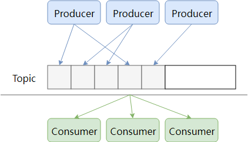
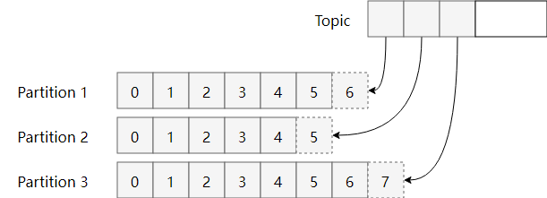
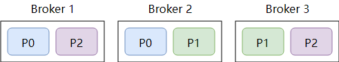
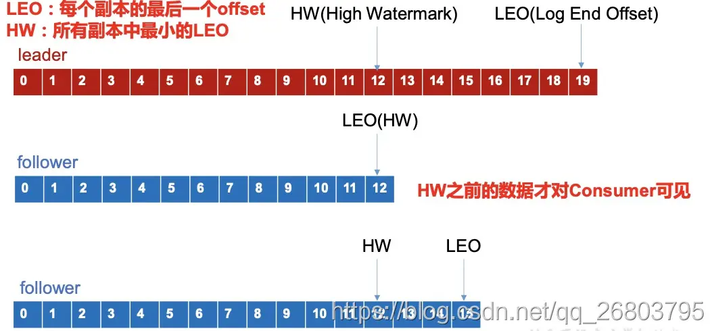

特点、高可用、扩展性
<!--more-->

## 什么是Kafka

Kafka 是一种**分布式**的，基于发布 / 订阅的消息系统

优点：

* 高性能
* 低延时
* 可用性

缺点：

* 无法弹性扩容
* 扩容成本高
* 消费者新加入或退出触发rebalance
* partition过多会使得性能显著下降

跟其他的MQ相比，Kafka有什么更好的优势？
- 单机吞吐量大
- 分布式架构带来的可用性高（多副本、鼓掌转移）、分区机制支持横向扩展

> 基于消息的投递可靠（消息不丢）是优先级更高的，所以消息不重的任务就会转移到应用程序自我实现，这也是为什么RocketMQ的文档里强调的，消费逻辑需要自我实现幂等。背后的逻辑其实就是：不丢和不重是矛盾的（在分布式场景下），但消息重复是有解决方案的，而消息丢失是很麻烦的。

## Kafka为什么快

### 写入数据优化

Kafka 的高性能写入主要得益于以下几个关键设计：

#### 1. 顺序写入策略
- 采用追加写入（append）方式，所有数据都顺序写入分区文件末尾
- 避免了随机写入导致的磁盘寻址开销
- 充分利用了磁盘的顺序读写性能（顺序读写可达到600MB/s，而随机读写仅有100KB/s）

#### 2. 页缓存机制
- 利用操作系统的页缓存（Page Cache）
- 数据写入时先进入页缓存，再由操作系统异步刷盘
- 避免了JVM堆内存的占用和GC压力
- 即使Kafka重启，页缓存依然存在，加快恢复速度

#### 3. 零拷贝技术
- 数据写入时避免在用户态和内核态之间的数据拷贝
- 减少了不必要的CPU和内存消耗
- 显著提升了写入性能
> 什么是零拷贝技术？
> #### 传统数据传输流程
> 在传统的数据传输过程中，一次数据从磁盘读取到网络发送需要经过以下步骤：
>
> 1. 磁盘 -> 内核缓冲区：DMA拷贝
> 2. 内核缓冲区 -> 用户缓冲区：CPU拷贝
> 3. 用户缓冲区 -> Socket缓冲区：CPU拷贝
> 4. Socket缓冲区 -> 网卡：DMA拷贝
>
> 这个过程涉及：
> - 4次数据拷贝（2次DMA拷贝，2次CPU拷贝）
> - 4次上下文切换（用户态与内核态切换）
>
> #### Kafka的零拷贝实现
> Kafka使用了两种零拷贝技术：
>
> 1. mmap（内存映射）
> ```plaintext
> 应用场景：小数据量传输
> 工作原理：
> - 将文件映射到内核缓冲区
> - 用户空间和内核空间共享内核缓冲区
> - 减少了内核空间到用户空间的数据拷贝
> ```
> 2. sendfile
> 应用场景：大文件传输
> 工作原理：
> - 数据通过DMA从磁盘拷贝到内核缓冲区
> - 再通过DMA从内核缓冲区拷贝到网卡接口
> - 完全绕过了用户态，只在内核态完成所有操作
#### 4. 分区并行处理
- 一个主题可以分多个分区，分布在不同的broker上
- 多个分区可以并行写入，提升整体吞吐量
- 分区数量可以水平扩展，理论上可以无限提升写入性能

这些优化策略使得Kafka在写入操作上具有极高的性能，能够轻松支持高并发的数据写入场景。唯一的代价是：由于采用追加写入，删除数据比较困难，因此Kafka采用了基于时间的数据保留策略，而不是立即删除已消费的数据。

### **读取数据**

Kafka在读取磁盘时做了哪些优化？

#### **基于sendfile实现Zero Copy**

传统模式下，当需要对一个文件进行传输的时候，其具体流程细节如下：

1. 基于sendfile实现Zero Copy调用read函数，文件数据被copy到内核缓冲区

2. read函数返回，文件数据从内核缓冲区copy到用户缓冲区

3. write函数调用，将文件数据从用户缓冲区copy到内核与socket相关的缓冲区。

4. 数据从socket缓冲区copy到相关协议引擎。

以上细节是传统read/write方式进行网络文件传输的方式，我们可以看到，在这个过程当中，文件数据实际上是经过了四次copy操作：

> 硬盘—>内核buf—>用户buf—>socket相关缓冲区—>协议引擎

而sendfile系统调用则提供了一种减少以上多次copy，提升文件传输性能的方法。

在内核版本2.1中，引入了sendfile系统调用，以简化网络上和两个本地文件之间的数据传输。sendfile的引入不仅减少了数据复制，还减少了上下文切换。

> sendfile(socket, file, len);

运行流程如下：

1. sendfile系统调用，文件数据被copy至内核缓冲区

2. 再从内核缓冲区copy至内核中socket相关的缓冲区

3. 最后再socket相关的缓冲区copy到协议引擎

相较传统read/write方式，2.1版本内核引进的sendfile已经减少了内核缓冲区到user缓冲区，再由user缓冲区到socket相关缓冲区的文件copy，而在内核版本2.4之后，文件描述符结果被改变，sendfile实现了更简单的方式，再次减少了一次copy操作。

在Apache、Nginx、lighttpd等web服务器当中，都有一项sendfile相关的配置，使用sendfile可以大幅提升文件传输性能。

Kafka把所有的消息都存放在一个一个的文件中，当消费者需要数据的时候Kafka直接把文件发送给消费者，配合mmap作为文件读写方式，直接把它传给sendfile。

#### **批量压缩**

在很多情况下，系统的瓶颈不是CPU或磁盘，而是网络IO，对于需要在广域网上的数据中心之间发送消息的数据流水线尤其如此。进行数据压缩会消耗少量的CPU资源，不过对于kafka而言，网络IO更应该需要考虑。

1. 如果每个消息都压缩，但是压缩率相对很低，所以Kafka使用了批量压缩，即将多个消息一起压缩而不是单个消息压缩

2. Kafka允许使用递归的消息集合，批量的消息可以通过压缩的形式传输并且在日志中也可以保持压缩格式，直到被消费者解压缩

3. Kafka支持多种压缩协议，包括Gzip和Snappy压缩协议

### 总结

Kafka速度的秘诀在于，它把所有的消息都变成一个批量的文件，并且进行合理的批量压缩，减少网络IO损耗，通过mmap提高I/O速度，写入数据的时候由于单个Partion是末尾添加所以速度最优；读取数据的时候配合sendfile直接暴力输出。

## 关于topic与partition

> Topic是一个存储消息的**逻辑概念**，可认为为一个消息的集合。
>
> 物理上，不同Topic的消息分开存储，每个Topic可划分多个partition，同一个Topic下的不同的partition包含不同消息。每个消息被添加至分区时，分配唯一offset，以此保证partition内消息的顺序性。 
>
> Kafka以broker区分集群内服务器，同一个topic下，多个partition经hash到不同的broker。

一个 Topic（主题）对应一个消息队列。Kafka 支持多生产者，多消费者，对应下图：



多个生产者将数据发送到 Kafka 中，Kafka 将它们顺序存储，消费者的行为留到下面讨论。我们知道 Kafka 的目标是大数据，如果将消息存在一个“中心”队列中，势必缺少可伸缩性。无论是生产者/消费者数目的增加，还是消息数量的增加，都可能耗尽机器的性能或存储。

因此，Kafka 在概念上将一个 Topic 分成了多个 Partition，写入 topic 的消息会被（平均）分配到其中一个 Partition。Partition 中会为消息保存一个 Partition 内唯一的 ID ，一般称为偏移量(offset)。这样当性能/存储不足时 Kafka 就可以通过增加 Partition 实现横向扩展。



> Partition 中的消息可以被（不同的 Consumer Group）多次消费，那 Partition中被消费的消息是何时删除的？ Partition 又是如何知道一个 Consumer Group 当前消费的位置呢？

1. 无论消息是否被消费，除非消息到期 Partition 从不删除消息。例如设置保留时间为 2 天，则消息发布 2 天内任何 Group 都可以消费，2 天后，消息自动被删除。
2. Partition 会为每个 Consumer Group 保存一个偏移量，记录 Group 消费到的位置。如下图：


## 物理存储

上面提到的 Topic, Partition 都是抽象的概念。每个 Partition 最终都需要存储在物理机器上，在 Kafka 中一般把这样的物理机器称为 `Broker`，可以是一台物理机，也可以是一个集群。

在讲概念的时候我们没有考虑到物理机可能会损坏的问题，这会导致某个 Partition 失效，上面存储的消息丢失，那还说什么高可用？所以一般需要对数据做冗余 (replication)。换言之，需要存储多份 Partition 在不同的 Broker 上，并为它们的数据进行同步。那么从物理的视角：



上图中，某个 Topic 分成了 3 个 Partition，每个 Partition 保存了两个副本，副本平均分配到 3 个 Broker 上。图中即使有一个 Broker 挂了，剩余的两个 Broker 依旧能正常工作。这也是分布式系统的常用设计。

同一个 Partition 有多个副本，并分布在不同的 Broker 上，那么 Producer 应该写入到哪一个副本上呢？Consumer 又应该从哪个副本上读取呢？

1. Kafka 的各个 Broker 需要与 Zookeeper 进行通信，每个 Partition 的多个副本之间通过 Zookeeper 的 Leader 选举机制选出主副本。所有该 Partition 上的读写都通过这个主副本进行。
2. 其它的冗余副本会从主副本上同步新的消息。就像其它的 Consumer 一样。

# 生产

## 发布消息如何指定Partition

默认的分区策略

* 如果在发消息的时候指定了分区，则消息投递到指定的分区
* 如果没有指定分区，但是消息的key不为空，则基于key的哈希值来选择一个分区
* 如果既没有指定分区，且消息的key也是空，则用轮询的方式选择一个分区

# 消费

## Partition如何分配给消费者
### 1.Range策略（默认）


这是默认的分配策略，对于每个主题，我们以数字顺序排列可用分区，以字典顺序排列消费者。然后，将分区数量除以消费者总数，以确定分配给每个消费者的分区数量。如果没有平均划分（PS：除不尽），那么最初的几个消费者将有一个额外的分区。
简而言之，就是，

range分配策略针对的是主题（PS：也就是说，这里所说的分区指的某个主题的分区，消费者值的是订阅这个主题的消费者组中的消费者实例）
首先，将分区按数字顺序排行序，消费者按消费者名称的字典序排好序
然后，用分区总数除以消费者总数。如果能够除尽，则皆大欢喜，平均分配；若除不尽，则位于排序前面的消费者将多负责一个分区

### 2.RoundRobin轮询策略
RoundRobin策略的原理是将消费组内所有消费者以及消费者所订阅的所有topic的partition按照字典序排序，然后通过轮询算法逐个将分区以此分配给每个消费者。

使用RoundRobin分配策略时会出现两种情况：

1. 如果同一消费组内，所有的消费者订阅的消息都是相同的，那么 RoundRobin 策略的分区分配会是均匀的。
2. 如果同一消费者组内，所订阅的消息是不相同的，那么在执行分区分配的时候，就不是完全的轮询分配，有可能会导致分区分配的不均匀。如果某个消费者没有订阅消费组内的某个 topic，那么在分配分区的时候，此消费者将不会分配到这个 topic 的任何分区。
### 3.StickyAssignor策略
Kafka从0.11.x版本开始引入这种分配策略，它主要有两个目的：
- 分区的分配要尽可能的均匀
- 分区的分配尽可能的与上次分配的保持相同

当两者发生冲突时，第一个目标优先于第二个目标。鉴于这两个目标，StickyAssignor策略的具体实现要比RangeAssignor和RoundRobinAssignor这两种分配策略要复杂很多。

如果发生分区重分配，那么对于同一个分区而言有可能之前的消费者和新指派的消费者不是同一个，对于之前消费者进行到一半的处理还要在新指派的消费者中再次复现一遍，这显然很浪费系统资源。StickyAssignor策略如同其名称中的“sticky”一样，让分配策略具备一定的“粘性”，尽可能地让前后两次分配相同，进而减少系统资源的损耗以及其它异常情况的发生。

## rebalance
rebalance是指分区的所有权从一个消费者转移到另一个消费者

常见的触发场景：
1. 同一个消费者组新增消费者
2. topic新增分区
3. 同一个消费者组减少消费者

## offset的维护
在现实情况下，消费者在消费数据时可能会出现各种会导致宕机的故障问题，这个时候，如果消费者后续恢复了，它就需要从发生故障前的位置开始继续消费，而不是从头开始消费。所以消费者需要实时的记录自己消费到了哪个offset，便于后续发生故障恢复后继续消费。Kafka 0.9版本之前，consumer默认将offset保存在Zookeeper中，从0.9版本开始，consumer默认将offset保存在Kafka一个内置的topic中，该topic为 __consumer_offsets 。

offset的维护很简单，之所以单独列出来，是因为offset维护针对不同的kafka版本进行的处理是不同的，这点需要注意。

## 消费者组

> 同一个Partition内的消息只能被一个消费者消费，当消费者数量多于分区数量时，多余的消费者空闲

消费者与消费组这种模型可以让整体的消费能力具备横向伸缩性，我们可以增加（或减少）消费者的个数来提高（或降低）整体的消费能力。对于分区数固定的情况，一味地增加消费者并不会让消费能力一直得到提升，如果消费者过多，出现了消费者的个数大于分区个数的情况，就会有消费者分配不到任何分区

Consumer Group实现P2P与发布订阅

* 如果所有的消费者都隶属于同一个消费组，那么所有的消息都会被均衡地投递给每一个消费者，即每条消息只会被一个消费者处理，这就相当于点对点模式的应用。
* 如果所有的消费者都隶属于不同的消费组，那么所有的消息都会被广播给所有的消费者，即每条消息会被所有的消费者处理，这就相当于发布/订阅模式的应用。

## 关于提交

consumer调用poll方法后，offset何时发生变化？

> 为了保证调用`KafkaConsumer.poll()`方法时总能返回未被被消费者读取过的记录，消费者需要维护每个分区中已读消息对应的**偏移量**​`offset`。
> 一旦消费者发生崩溃或者有新的消费者加入群组，就会触发**再均衡**​`rebalance`，每个消费者可能分配到新的分区，而不是之前处理的那个。为了能够继续之前的工作，消费者需要知道每个分区的已读偏移量，然后从偏移量指定的地方继续处理。
> 为了保证这些信息不丢失，消费者需要定期向一个名为 `_consumer_offset` 的特殊主题发送消息，消息里包含每个分区的偏移量。Kafka 中将这一更新的操作称作**提交**​`commit`。


# 如何保证数据可靠性和数据一致性

当我们讨论**可靠性**的时候，我们总会提到**保证**这个词语。可靠性保证是基础，我们基于这些基础之上构建我们的应用。比如关系型数据库的可靠性保证是ACID，也就是原子性（Atomicity）、一致性（Consistency）、隔离性（Isolation）和持久性（Durability）。

Kafka 中的可靠性保证有如下四点：

* 对于一个分区来说，它的消息是有序的。如果一个生产者向一个分区先写入消息A，然后写入消息B，那么消费者会先读取消息A再读取消息B。
* 当消息写入所有in-sync状态的副本后，消息才会认为**已提交（committed）** 。这里的写入有可能只是写入到文件系统的缓存，不一定刷新到磁盘。生产者可以等待不同时机的确认，比如等待分区主副本写入即返回，后者等待所有in-sync状态副本写入才返回。
* 一旦消息已提交，那么只要有一个副本存活，数据不会丢失。
* 消费者只能读取到已提交的消息。

使用这些基础保证，我们构建一个可靠的系统，这时候需要考虑一个问题：究竟我们的应用需要多大程度的可靠性？可靠性不是无偿的，它与系统可用性、吞吐量、延迟和硬件价格息息相关，得此失彼。因此，我们往往需要做权衡，一味的追求可靠性并不实际。
3 
## ISR

分布式系统处理故障容错时，需要明确地定义节点是否处于存活状态。Kafka对节点的存活定义有两个条件：

1. 节点必须和ZK保持会话
2. 如果这个节点是某个分区的备份副本，它必须对分区主副本的写操作进行复制，并且复制的进度不能落后太多

满足这两个条件，叫作“正在同步中”（in-sync）。每个分区的主副本会跟踪正在同步中的备份副本节点（In Sync Replicas，即ISR）。如果一个备份副本挂掉、没有响应或者落后太多，主副本就会将其从同步副本集合中移除。反之，如果备份副本重新赶上主副本，它就会加入到主副本的同步集合中。

在Kafka中，一条消息只有被ISR集合的所有副本都运用到本地的日志文件，才会认为消息被成功提交了。任何时刻，只要ISR至少有一个副本是存活的，Kafka就可以保证“一条消息一旦被提交，就不会丢失”。只有已经提交的消息才能被消费者消费，因此消费者不用担心会看到因为主副本失败而丢失的消息。下面我们举例分析Kafka的消息提交机制如何保证消费者看到的数据是一致的。

## **1、ISR 是什么**

首先，ISR 的全称叫做：In-Sync Replicas （同步副本集）, 我们可以理解为和 leader 保持同步的所有副本的集合。

一个分区的所有副本集合叫做 AR（ Assigned Repllicas ） ，与 leader-replica 未能保持同步的副本集叫做 OSR（ Out-Sync Relipcas ）。

因此我们就能得到这么一个表示：AR = ISR + OSR，翻译一下就是一个分区的副本集分为同步集合和非同步集合两部分。

那么我们可以假设一个场景，一个分区的 AR 集合为【0,1,2,3,4,5】，其中 leader-replica 是 0，其中【1,2,3】作为 follower 和 leader 的数据保持同步，而【4,5】未能和 leader 保持同步。

那么此时，ISR=【0,1,2,3】，OSR=【4,5】

如果此时副本 4 追上了 leader-replica，也就是和 leader 保持到了同步 那么此时，ISR=【0,1,2,3,4】，OSR=【5】

从上面的场景我们就可以明白，ISR 动态维护了一个和 leader 副本保持同步副本集合，ISR 中的副本全部都和 leader 的数据保持同步

# 如何保证数据可靠性和数据一致性

当我们讨论**可靠性**的时候，我们总会提到**保证**这个词语。可靠性保证是基础，我们基于这些基础之上构建我们的应用。比如关系型数据库的可靠性保证是ACID，也就是原子性（Atomicity）、一致性（Consistency）、隔离性（Isolation）和持久性（Durability）。

Kafka 中的可靠性保证有如下四点：

* 对于一个分区来说，它的消息是有序的。如果一个生产者向一个分区先写入消息A，然后写入消息B，那么消费者会先读取消息A再读取消息B。
* 当消息写入所有in-sync状态的副本后，消息才会认为**已提交（committed）** 。这里的写入有可能只是写入到文件系统的缓存，不一定刷新到磁盘。生产者可以等待不同时机的确认，比如等待分区主副本写入即返回，后者等待所有in-sync状态副本写入才返回。
* 一旦消息已提交，那么只要有一个副本存活，数据不会丢失。
* 消费者只能读取到已提交的消息。

使用这些基础保证，我们构建一个可靠的系统，这时候需要考虑一个问题：究竟我们的应用需要多大程度的可靠性？可靠性不是无偿的，它与系统可用性、吞吐量、延迟和硬件价格息息相关，得此失彼。因此，我们往往需要做权衡，一味的追求可靠性并不实际。

## 分布式主从结构怎么做数据同步

分布式系统处理故障容错时，需要明确地定义节点是否处于存活状态。Kafka对节点的存活定义有两个条件：

1. 节点必须和ZK保持会话
2. 如果这个节点是某个分区的备份副本，它必须对分区主副本的写操作进行复制，并且复制的进度不能落后太多

满足这两个条件，叫作“正在同步中”（in-sync）。每个分区的主副本会跟踪正在同步中的备份副本节点（In Sync Replicas，即ISR）。如果一个备份副本挂掉、没有响应或者落后太多，主副本就会将其从同步副本集合中移除。反之，如果备份副本重新赶上主副本，它就会加入到主副本的同步集合中。

在Kafka中，一条消息只有被ISR集合的所有副本都运用到本地的日志文件，才会认为消息被成功提交了。任何时刻，只要ISR至少有一个副本是存活的，Kafka就可以保证“一条消息一旦被提交，就不会丢失”。只有已经提交的消息才能被消费者消费，因此消费者不用担心会看到因为主副本失败而丢失的消息。下面我们举例分析Kafka的消息提交机制如何保证消费者看到的数据是一致的。

### ISR

首先，ISR 的全称叫做：In-Sync Replicas （同步副本集）, 我们可以理解为和 leader 保持同步的所有副本的集合。

一个分区的所有副本集合叫做 AR（ Assigned Repllicas ） ，与 leader-replica 未能保持同步的副本集叫做 OSR（ Out-Sync Relipcas ）。

因此我们就能得到这么一个表示：AR = ISR + OSR，翻译一下就是一个分区的副本集分为同步集合和非同步集合两部分。

那么我们可以假设一个场景，一个分区的 AR 集合为【0,1,2,3,4,5】，其中 leader-replica 是 0，其中【1,2,3】作为 follower 和 leader 的数据保持同步，而【4,5】未能和 leader 保持同步。

那么此时，ISR=【0,1,2,3】，OSR=【4,5】

如果此时副本 4 追上了 leader-replica，也就是和 leader 保持到了同步 那么此时，ISR=【0,1,2,3,4】，OSR=【5】

从上面的场景我们就可以明白，ISR 动态维护了一个和 leader 副本保持同步副本集合，ISR 中的副本全部都和 leader 的数据保持同步

### ACK应答机制
由于数据的重要程度是不一样的，有些可以少量允许丢失，希望快一点处理；有些不允许，希望稳妥一点处理，所以没必要所有的数据处理的时候都等ISR中的follower全部接收成功。因此kafka处理数据时为了更加灵活，给用户提供了三种可靠性级别，用户可以通过调节acks参数来选择合适的可靠性和延迟。

acks的参数分别可以配置为：0，1，-1。

它们的作用分别是：

- 配置为0：producer不等待broker的ack，这一操作提供了一个最低的延迟，broker一接收到还没有写入磁盘就已经返回，当broker故障时有可能丢失数据；
- 配置为1：producer等待broker的ack，partition的leader写入磁盘成功后返回ack，但是如果在follower同步成功之前leader故障，那么将会丢失数据；
- 配置为-1：producer等待broker的ack，partition的leader和follower全部写入磁盘成功后才返回ack。但是如果在follower同步完成后，broker发送ack之前，leader发生故障，此时会选举新的leader，但是新的leader已经有了数据，但是由于没有之前的ack，producer会再次发送数据，那么就会造成数据重复。

## 故障处理
- LEO：全称Log End Offset，代表每个副本的最后一条消息的offset
- HW：全称High Watermark，代表一个分区中所有副本最小的LEO，用来判定副本的备份进度，HW以外的消息不被消费者可见。

leader持有的HW即为分区的HW，同时leader所在broker还保存了所有follower副本的LEO。



注意：**只有HW之前的数据才对Consumer可见，也就是只有同一个分区下所有的副本都备份完成，才会让Consumer消费。**

由于partition是实际的存储数据的结构，因此kafka的故障主要分为两类：follower故障和leader故障。

### follower故障
通过前面我们已经知道follower发生故障后会被临时踢出ISR，其实待该follower恢复后，follower会读取本地磁盘记录的上次的HW，并将log文件高于HW的部分截取掉，从HW开始向leader进行同步。等该follower的LEO大于等于该分区的HW（leader的HW），即follower追上leader之后（追上不代表相等），就可以重新加入ISR了。

### Leader故障
leader发生故障之后，会从ISR中选出一个新的leader，之后，为保证多个副本之间的数据一致性，其余的follower会先将各自的log文件高于HW的部分截掉，然后从新的leader同步数据。

**这只能保证副本之间的数据一致性，并不能保证数据不丢失或者不重复。**

那怎么解决故障恢复后，数据丢失和重复的问题呢？

kafka在0.11版本引入了Lead Epoch来解决HW进行数据恢复时可能存在的数据丢失和重复的问题：

leader epoch实际是一对值（epoch, offset），epoch表示leader版本号，offset为对应版本leader的LEO，它在Leader Broker上单独开辟了一组缓存，来记录(epoch, offset)这组键值对数据，这个键值对会被定期写入一个检查点文件。Leader每发生一次变更epoch的值就会加1，offset就代表该epoch版本的Leader写入的第一条日志的位移。当Leader首次写底层日志时，会在缓存中增加一个条目，否则不做更新。这样就解决了之前版本使用HW进行数据恢复时可能存在的数据丢失和重复的问题

### 主流消息队列对比

1. RocketMQ
   优势：
   - 支持分布式事务
   - 适合金融级应用
   - 原生支持顺序消息
   - 支持消息过滤
   
   特点：
   - 适合业务复杂度高的场景
   - 适合需要事务支持的场景

2. RabbitMQ
   优势：
   - 支持多种协议
   - 社区活跃
   - 延迟低
   - 部署简单
   
   特点：
   - 适合中小型企业
   - 适合对延迟敏感的场景

3. Kafka
   优势：
   - 超高吞吐量
   - 良好的可扩展性
   - 持久化存储
   - 流处理能力
   
   特点：
   - 适合日志收集
   - 适合大数据场景
   - 适合流处理场景

4. ActiveMQ
   优势：
   - 完全支持JMS规范
   - 跨平台
   - 支持多种语言客户端
   
   特点：
   - 适合传统企业应用
   - 适合JMS规范要求的场景

### 选型建议

1. 大数据场景
   - 推荐：Kafka
   - 原因：高吞吐量、可扩展性好

2. 金融支付场景
   - 推荐：RocketMQ
   - 原因：支持事务、可靠性高

3. 微服务解耦
   - 推荐：RabbitMQ
   - 原因：轻量级、延迟低

4. 传统企业应用
   - 推荐：ActiveMQ