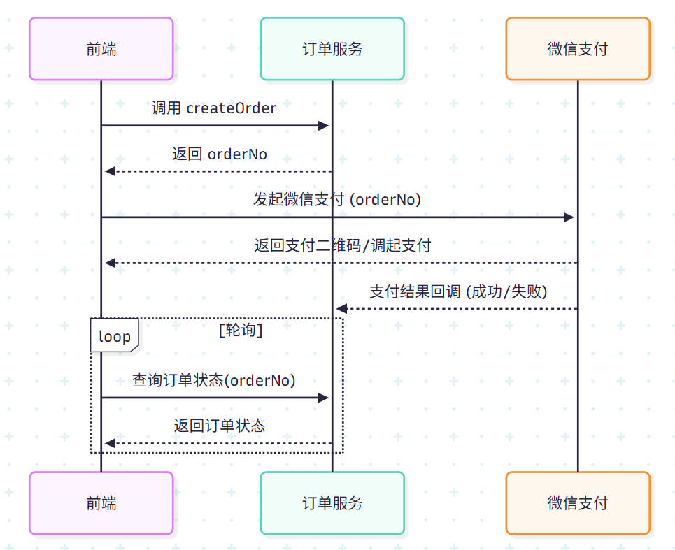

## 背景
在电商等业务场景中，**订单**与**支付**是核心环节。  

一个清晰、可扩展、具备容错性的订单支付架构，能确保业务高效运转，并支持未来快速迭代。

本文结合实际项目经验，从领域驱动设计 (DDD) 思想出发，介绍订单及支付的后端架构设计。

---

## 业务拆解

典型的订单支付流程包括以下几个阶段：

1. **下单**  
   - 用户选择商品/服务，生成订单草稿。  
   - 校验库存、用户资格、优惠券等。  

2. **支付**  
   - 订单冻结，生成支付单。  
   - 调用第三方支付渠道（如微信/支付宝）。  

3. **支付结果通知**  
   - 接收异步回调，确认支付状态。  
   - 更新订单状态。  

4. **后置处理**  
   - 发货、发票、权益发放、消息通知等。  

---

## 核心模型设计

从DDD角度来看，可以将系统拆解为以下几个聚合根：

- **订单 (Order)**  
  - 聚合根：Order  
  - 实体：OrderItem（子订单/明细）  
  - 值对象：OrderNo、Price、Discount  

- **支付 (Payment)**  
  - 聚合根：Payment  
  - 实体：PaymentChannel（支付渠道）  
  - 值对象：PaymentNo、PaymentStatus  

- **用户 (User)**  
  - 作为外部上下文，不在此处展开。  

**关系**：  
- 一个订单可以关联一个或多个支付单（部分支付、分期支付）。  
- 支付成功后，订单状态由 `待支付` → `已支付`。

---

## 一个例子

### 📌 架构说明

**核心实体**：订单表 (order)
- `orderNo` 是业务主键，贯穿整个流程
- 订单初始状态为 `待支付`，回调成功后更新为 `已支付` 或 `支付失败`

**前端职责**：
- 调用下单接口，获取 `orderNo`
- 发起支付，并通过轮询查询订单支付结果

**后端职责**：
- 提供下单接口，生成并持久化 `orderNo`
- 接收微信支付回调，更新订单状态
- 提供查询接口，供前端轮询订单状态

## 存在的问题和优化方案

1. 状态同步（前端依靠轮询获知支付状态） -> 主动通知
2. 并发安全（前端重复提交，支付多次回调） -> 接口幂等性
3. 订单与支付耦合 -> 支付单设计
4. 异常处理不完善（回调失败） -> 可靠消息与事件驱动
5. 监控与可观测性 -> 订单和支付全链路埋点，方便追踪支付失败、超时、漏单等问题
6. 

### 如何优雅避免前端轮询
