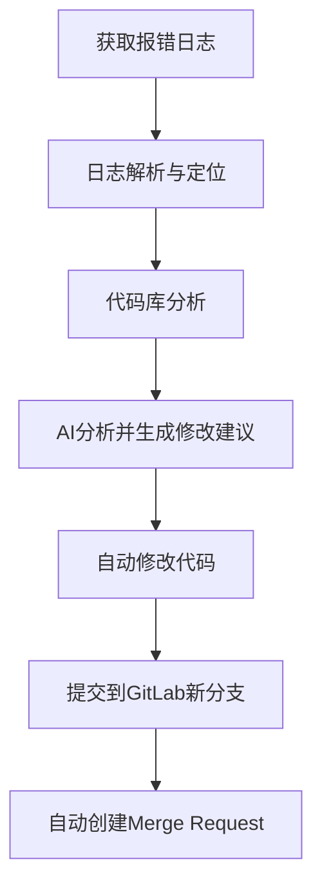

How AI Change My Work Flow
<!--more-->

## 研发目标

**我想要实现的目标：**

1. 接口自动化测试

* 读取接口设计文档（输入和输出）
* 拼接调用报文
* 测试环境接口调用
* 获取返回值
* 对比接口返回值和

2. 报错修复

* 获取线上或测试环境的报错日志
* 根据日志找到可能出问题的代码
* 生成修改建议
* 自动修改代码并提交 GitLab MR

---

## 报错修复
 
### 技术设计（高层级）

---

### 1. 获取报错日志

* 来源：
  * 邮箱（需要充钱获取额外权限，不通）
  * 钉钉群聊（Windows应用）
  * 云服务器
* AI作用：从原始报错中**提取关键信息**（异常类名、堆栈、请求参数等）

TODO ：

1. 怎么从钉钉群聊中获取报错信息？

> 使用AirTest自动化测试框架，获取最新的报错日志，存储在txt文件中

---

### 2. 日志解析与定位

**流水线说明**

1. 输入：原始日志（String，一整段文本）
2. 规则解析器：用正则、状态机，把日志拆成结构化字段。
3. 结构化数据：得到 JSON，里面包含时间、类名、方法、行号、异常类型等。
4. 规则过滤器：做一些优化，比如只保留最深的一行堆栈、去掉 Spring 框架内部无关的调用。
5. AI 分析器：基于结构化 JSON + 原始日志，做更高层次的分析，比如：
    - 给出“可能的根因”（比如手机号校验失败 vs SQL 超时）。
    - 输出“人类可读的摘要”，便于开发快速理解。
    - 给出“修复建议”（可能涉及业务逻辑）。

---

### 3. 代码库分析

* 需要本地有代码（Git 仓库）
* AI作用：

  * 打开日志提到的类
  * 阅读相关方法的上下文代码
  * 结合日志解释哪里可能有问题

---

### 4. AI分析并生成修改建议

* AI作用：

  * 给出可能的修复思路（例如加空指针校验、SQL加索引、补充配置等）
  * 生成对应的代码修改 diff

---

### 5. 自动修改代码

* 技术手段：

  * 在本地用 **JGit 或 shell 命令**
  * 创建一个 `fix-xxx` 分支
  * 应用 AI 提供的修改

---

### 6. 提交 GitLab MR

* 技术手段：

  * 调用 GitLab API
  * 提交分支并创建 MR
* AI作用：

  * 自动写 MR 描述（问题原因 + 修改方案）

---

