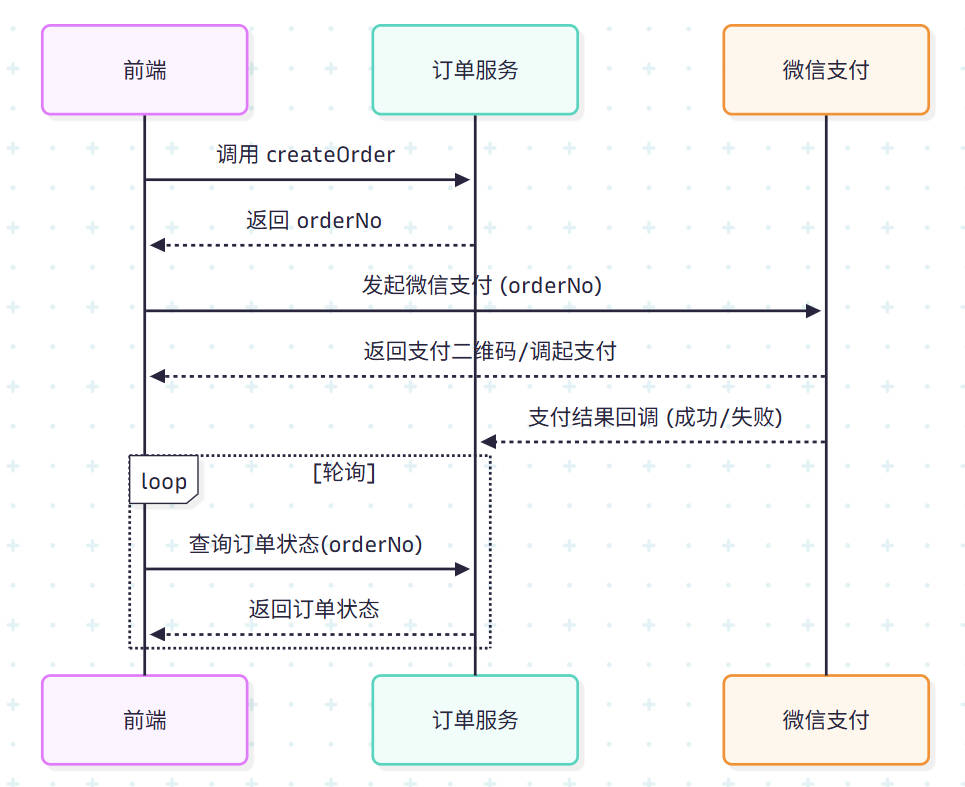

在任何电商或交易系统中，**订单与支付**都是最核心、最复杂的业务环节之一。随着业务场景的扩展，系统常常面临这些挑战：

- 订单状态多、流程长，逻辑耦合严重；

- 支付链路复杂，容错与幂等难以保证；

- 新增业务时，旧逻辑改动成本高。

要让系统既能稳定支撑交易，又能快速响应变化，我们需要一套**清晰、可扩展、具备容错性**的架构设计。

本文将结合实际项目经验，基于领域驱动设计（DDD）思想，介绍订单与支付系统的后端架构设计思路，从领域划分、聚合建模到接口与流程设计，逐步展示一个面向演进的技术实现路径。

<!--more-->

## 业务拆解

典型的订单支付流程包括以下几个阶段：

1. **下单**  
   - 用户选择商品/服务，生成订单草稿。  
   - 校验库存、用户资格、优惠券等。  

2. **支付**  
   - 订单冻结，生成支付单。  
   - 调用第三方支付渠道（如微信/支付宝）。  

3. **支付结果通知**  
   - 接收异步回调，确认支付状态。  
   - 更新订单状态。  

4. **后置处理**  
   - 发货、发票、权益发放、消息通知等。  

---

## 核心模型设计

从DDD角度来看，可以将系统拆解为以下几个聚合根：

- **订单 (Order)**  
  - 聚合根：Order  
  - 实体：OrderItem（子订单/明细）  
  - 值对象：OrderNo、Price、Discount  

- **支付 (Payment)**  
  - 聚合根：Payment  
  - 实体：PaymentChannel（支付渠道）  
  - 值对象：PaymentNo、PaymentStatus  

- **用户 (User)**  
  - 作为外部上下文，不在此处展开。  

**关系**：  
- 一个订单可以关联一个或多个支付单（部分支付、分期支付）。  
- 支付成功后，订单状态由 `待支付` → `已支付`。

---

## 一个简单实现



### 📌 架构说明

**核心实体**：订单表 (order)
- `orderNo` 是业务主键，贯穿整个流程
- 订单初始状态为 `待支付`，回调成功后更新为 `已支付` 或 `支付失败`

**前端职责**：
- 调用下单接口，获取 `orderNo`
- 发起支付，并通过轮询查询订单支付结果

**后端职责**：
- 提供下单接口，生成并持久化 `orderNo`
- 接收微信支付回调，更新订单状态
- 提供查询接口，供前端轮询订单状态

## 存在的问题和优化方案

1. 状态同步（前端依靠轮询获知支付状态） -> 主动通知
2. 并发安全（前端重复提交，支付多次回调） -> 接口幂等性
3. 订单与支付耦合 -> 支付单设计
4. 异常处理不完善（回调失败） -> 可靠消息与事件驱动
5. 监控与可观测性 -> 订单和支付全链路埋点，方便追踪支付失败、超时、漏单等问题


### 如何优雅避免前端轮询

前端通过轮询查询状态是一种简单直接的方案，但在用户量大的情况下，会产生大量无效请求，严重浪费服务器资源，并且用户体验也存在延迟。

更优雅的方案是**由服务端主动向前端推送支付结果**。这可以通过以下几种技术实现，其中 **WebSocket** 是最常用且效果最好的方案。

#### 方案：使用 WebSocket 进行实时通知

WebSocket 提供了一个全双工通信通道，允许服务器在任何时候主动向客户端发送消息。

**实现流程：**

1.  **建立连接**
    - 前端在进入订单支付页面后，与后端建立一个 WebSocket 连接。
    - 为了标识连接属于哪个用户或订单，前端可以在连接建立后，发送一条包含 `orderNo` 或用户凭证（Token）的初始化消息。

2.  **管理连接**
    - 后端需要一个 WebSocket 管理器，用于维护所有活跃的连接。它可以是一个简单的 `Map`，键为 `orderNo` 或 `userId`，值为对应的 WebSocket `Session` 对象。
    - 例如: `Map<String, Session> activeConnections;`

3.  **接收回调并推送**
    - 当后端接收到来自支付渠道（如微信）的异步支付成功回调时，它会执行以下操作：
      a. 更新数据库中的订单状态为 `已支付`。
      b. 从 `activeConnections` 中根据 `orderNo` 查找到对应的 WebSocket `Session`。
      c. 如果找到连接，则通过该 `Session` 向前端推送一条消息，例如：`{"status": "success", "message": "支付成功"}`。

4.  **前端响应**
    - 前端始终监听 WebSocket 的 `onmessage` 事件。
    - 一旦收到来自服务器的支付成功消息，立即更新UI，例如跳转到支付成功页面或显示成功状态，并关闭 WebSocket 连接。

**流程图：**

```mermaid
sequenceDiagram
    participant Client as 客户端
    participant Server as 后端服务
    participant PaymentGateway as 支付网关

    Client->>Server: 建立 WebSocket 连接 (携带 orderNo)
    Server-->>Client: 连接成功
    Note right of Server: 存储 orderNo 与连接的映射

    Client->>PaymentGateway: 发起支付
    ... 支付过程 ...
    PaymentGateway-->>Server: 发送异步支付成功回调

    Server->>Server: 更新订单状态为“已支付”
    Server->>Client: 通过 WebSocket 推送支付成功消息

    Client->>Client: 收到消息，更新UI，跳转成功页
    Client->>Server: 关闭 WebSocket 连接
```

**优势：**
- **实时性**：消息几乎是瞬时到达，用户体验极佳。
- **低开销**：一旦连接建立，后续通信开销很小，避免了大量 HTTP 请求头带来的浪费。
- **服务端主导**：由服务端在正确的时间点主动通知，逻辑清晰。

通过这种方式，我们彻底消除了前端轮询，构建了一个高效、实时、体验更佳的支付状态通知系统。

## 并发安全解决方案
怎么避免前端多次提交？支付结果多次回调？

幂等的几种实现方式

| 层级        | 机制                      | 本质作用        |
| --------- | ----------------------- | ----------- |
| **前端层**   | 防抖 + 按钮禁用               | 减少重复请求发生    |
| **接口层**   | 请求唯一标识（如 orderNo、token） | 标识同一业务请求    |
| **服务层**   | 幂等锁（Redis、DB 唯一约束）      | 确保执行一次业务逻辑  |
| **持久层**   | 唯一索引 + 状态检查             | 防止重复落库      |
| **外部回调层** | 状态机 + 幂等校验              | 防止重复通知或反复扣款 |


    


## 如何优雅的引入优惠券和折扣券

优惠券和折扣活动是营销的核心，但其逻辑复杂多变，如果直接耦合在订单代码中，将导致订单逻辑臃肿不堪，难以维护。

优雅的设计方案是**将价格计算与优惠逻辑剥离**，抽象出一个独立的**营销/定价中心**。

### 1. 引入营销领域 (Marketing Domain)

首先，我们建立独立的营销模型：

- **优惠券 (Coupon)**
  - 实体，拥有生命周期（`待使用` -> `已锁定` -> `已使用`/`已过期`）。
  - 属性：券码、面额、折扣率、使用门槛（如满100减10）、适用范围（指定商品/品类）、有效期等。

- **营销活动 (Promotion)**
  - 实体，代表一个营销规则，如“全场九折”、“买二赠一”。
  - 属性：活动ID、规则类型、作用范围、时间周期等。

### 2. 设计定价服务 (Pricing Service)

这是解耦的核心。定价服务是一个无状态的服务，它接收订单上下文（商品列表、用户ID等）和用户希望使用的优惠（优惠券码），返回一个计算结果。

**输入**：
- `List<OrderItem>`: 商品明细列表，包含原价、数量、商品ID等。
- `UserContext`: 用户信息。
- `List<CouponCode>`: 用户希望使用的优惠券码。

**输出**：
- `PricingResult`:
  - `totalAmount`: 商品总原价。
  - `discountAmount`: 总优惠金额。
  - `payableAmount`: 最终应付金额。
  - `List<AppliedDiscount>`: 一个列表，详细记录了本次计算命中了哪些优惠活动、使用了哪些优惠券，以及各自抵扣的金额。这对于后续的对账和数据分析至关重要。

### 3. 优惠券的生命周期管理

优惠券是资产，必须精确管理其状态，防止超用或用户支付失败后券被错误核销。

1. **锁定 (Lock)**
   - 当用户提交订单但**未支付**时，系统检查优惠券是否可用。
   - 如果可用，定价服务在计算价格后，将该优惠券状态置为 `已锁定`，并设置一个较短的自动解锁时间（例如15分钟，对应订单支付的有效期）。
   - 这确保了在用户支付期间，这张券不会被用在其他订单上。

2. **核销 (Use)**
   - 当系统收到**支付成功**的回调后，通过异步消息通知营销中心。
   - 营销中心将 `已锁定` 的优惠券状态更新为 `已使用`。

3. **释放 (Release)**
   - 如果订单支付超时或用户主动取消订单，系统同样通过异步消息或定时任务，将 `已锁定` 的优惠券状态恢复为 `待使用`，使其可以被再次使用。

### 4. 整合到下单流程

引入定价服务后，下单流程变为：

  
*(这里可以放一张更新后的流程图)*

1. **前端**：在下单前，可以调用试算接口（背后就是定价服务），实时展示优惠后的价格。
2. **后端-订单服务**：
   - 接收下单请求，请求中包含用户选择的优惠券码。
   - 调用**定价服务**，获取 `PricingResult`。
   - **校验** `PricingResult` 的合法性。
   - 创建订单，并将 `totalAmount`, `discountAmount`, `payableAmount` 以及 `AppliedDiscount` 列表持久化到订单数据库中。这样做的好处是**价格快照**，即使未来的营销活动规则改变，历史订单的金额和优惠明细也不会受影响。
   - **异步通知**营销中心锁定优惠券。
   - 返回订单号给前端，引导支付。

通过这种方式，订单服务只负责串联流程和存储结果，所有复杂的、易变的优惠计算逻辑都封装在独立的营销和定价中心，实现了高度的**可扩展性**和**关注点分离**。未来新增“满赠”、“捆绑销售”等复杂活动时，只需扩展定价服务，订单核心流程无需改动。