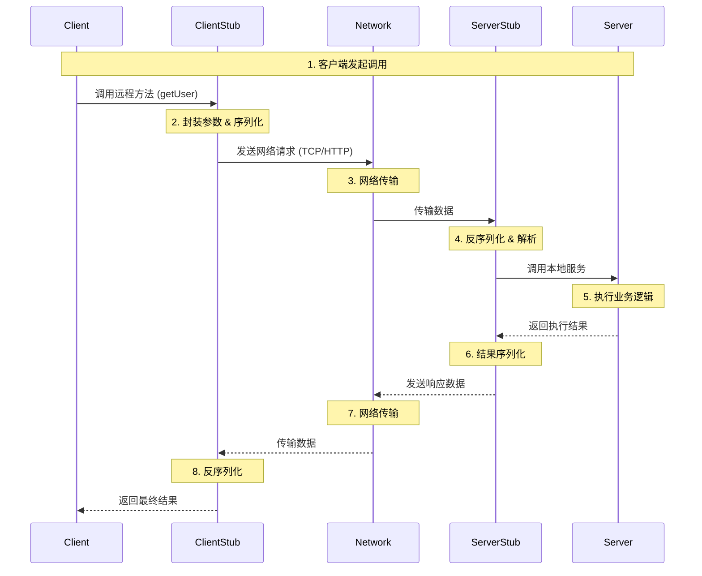

# 什么是 RPC？

RPC（Remote Procedure Call，远程过程调用）是一种计算机通信协议。该协议允许运行于一台计算机的程序调用另一台计算机的子程序，而程序员无需额外地为这个交互作用编程。

简单来说，RPC 的主要目标是**让远程服务调用看起来像本地调用一样简单**。

例如，在本地调用中，我们可能会这样写代码：

```java
// 本地调用
User user = userService.getUser(1001);
```

而在 RPC 中，`userService` 的实现可能部署在另一台服务器上，但客户端代码不需要关心网络传输、序列化等细节，依然可以保持上述的调用方式。

---

# RPC 的核心架构

一个典型的 RPC 架构主要包含以下五个核心组件：

1.  **Client（客户端）**：服务的调用方。
2.  **Client Stub（客户端存根/代理）**：存放服务端的地址消息，负责将客户端的请求参数打包成网络消息（序列化），然后通过网络发送给服务端。通常使用动态代理生成。
3.  **Network（网络传输）**：负责在客户端和服务端之间传输数据，通常基于 TCP 或 HTTP 协议。
4.  **Server Stub（服务端存根）**：接收客户端发送过来的消息，将消息解包（反序列化），并调用本地的方法。
5.  **Server（服务端）**：服务的真正提供方，执行具体的业务逻辑。

---

# RPC 调用流程

一次完整的 RPC 调用流程如下：



**详细步骤解析：**

1.  **服务消费方（Client）调用**：客户端以本地调用的方式调用服务。
2.  **消息封装（Client Stub）**：客户端存根接收到调用后，负责将方法名、参数等信息序列化（Marshal）成能够进行网络传输的消息体。
3.  **网络发送**：客户端存根找到服务地址，通过 Socket 或其他网络机制发送消息。
4.  **消息接收（Server Stub）**：服务端存根接收到消息。
5.  **消息解包**：服务端存根将消息进行反序列化（Unmarshal），解析出方法名和参数。
6.  **本地调用**：服务端存根根据解析结果，调用本地实际的服务实现类（Server）。
7.  **执行逻辑**：服务端执行业务逻辑，并得到返回值。
8.  **结果返回**：服务端存根将返回值序列化，并通过网络发送回客户端。
9.  **结果解析**：客户端存根接收到消息，进行反序列化。
10. **调用结束**：客户端得到最终结果。

---

# RPC 的关键技术点

要实现一个高性能、高可用的 RPC 框架，需要解决以下几个关键技术问题：

## 1. 动态代理（Dynamic Proxy）
为了让客户端“无感知”地调用远程服务，RPC 框架通常会为接口生成一个动态代理对象（Stub）。
*   Java 中常用的代理技术：JDK 动态代理、CGLIB、Javassist、ByteBuddy。
*   当我们在客户端注入一个 Interface 时，实际注入的是这个 Interface 的代理类。

## 2. 序列化与反序列化（Serialization）
网络只能传输二进制数据，因此必须将对象（方法参数、返回值）转换为二进制流。
*   **常用序列化协议**：
    *   **JDK 原生序列化**：性能较差，且即构臃肿，通常不推荐。
    *   **JSON (Jackson/Gson)**：可读性好，但体积大，性能一般。
    *   **Protobuf (Google)**：二进制协议，体积小，性能极高，IDL 定义跨语言。
    *   **Hessian**：Dubbo 默认序列化协议，兼容性好，适合 Java 生态。
    *   **Kryo/FST**：Java 领域的高性能序列化库。

## 3. 网络通信（Network Transport）
*   **IO 模型**：传统的 BIO（阻塞 IO）性能无法满足高并发需求，现代 RPC 框架大多基于 **NIO（非阻塞 IO）**。
*   **框架**：Java 领域最著名的网络通信框架是 **Netty**（Dubbo、gRPC 的底层常客）。
*   **协议**：可以是基于 TCP 的私有协议（如 Dubbo 协议），也可以是 HTTP/2（如 gRPC）。

## 4. 服务注册与发现（Service Registry & Discovery）
在微服务架构中，服务节点是动态变化的（上线、下线、扩容）。
*   **注册中心**：服务端启动时将自己的 IP:Port 注册到注册中心（如 Zookeeper, Nacos, Consul, Etcd）。
*   **服务发现**：客户端启动或运行时，从注册中心获取可用的服务列表，并缓存到本地。

## 5. 负载均衡（Load Balancing）
当服务端有多个节点时，客户端需要决定调用哪一个节点。
*   **常见算法**：轮询（Round Robin）、随机（Random）、加权轮询、最小活跃数（Least Active）、一致性 Hash。

---

# 常见 RPC 框架对比

| 特性 | Dubbo | gRPC | Thrift | Spring Cloud (OpenFeign) |
| :--- | :--- | :--- | :--- | :--- |
| **开发方** | 阿里巴巴 | Google | Facebook | Pivotal/Netflix |
| **通信协议** | TCP (Dubbo协议) | HTTP/2 | TCP | HTTP/1.1 (REST) |
| **序列化** | Hessian2 (默认) | Protobuf | Binary | JSON |
| **跨语言** | 弱 (主要 Java) | 强 | 强 | 强 (HTTP 通用) |
| **性能** | 高 | 极高 | 高 | 一般 (受限于 HTTP1.1 和 JSON) |
| **适用场景** | Java 内部微服务系统 | 多语言、高性能低延迟场景 | 早期的大型异构系统 | 业务迭代快、对性能要求不极端的 RESTful 架构 |

# 总结

RPC 的本质是**建立在网络通信基础上的方法调用抽象**。一个优秀的 RPC 框架不仅要解决通信问题，还要解决分布式环境下的**服务治理**问题（注册发现、负载均衡、熔断降级等）。如果是 Java 技术栈，**Dubbo** 是深入学习 RPC 原理的最佳范本；如果是跨语言场景，**gRPC** 则是目前的行业标准。
```
